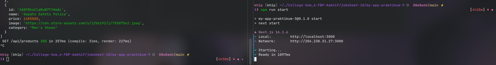
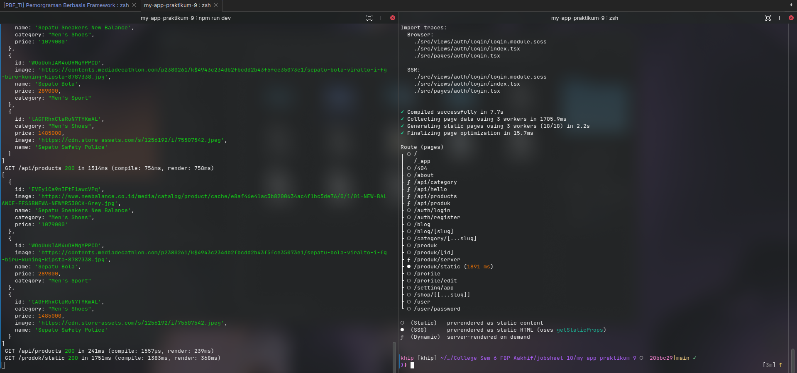

# C. Langkah Praktikum

## Bagian 1 – Setup Halaman Static

Jadi disini saya ingin membuat halaman baru dengan SSG (Static Site Generation). Pada langkah pertama yang saya lakukan adalah membuat file baru bernama `static.tsx` didalam folder `/pages/produk/` dan mengisinya dengan kode berikut,

## Bagian 3 – Build Production Mode

Untuk menghindari error pada saat melakukan build, saya memindahkan folder `views`, `utils`, `types` diluar folder pages. Sehingga tampilannya seperti berikut,

Setelah itu saya menjalankan `npm run build` untuk melakukan build dari project nextjs ini,

Terlihat jika saya selesai melakukan build (di sebelah kanan) juga sambil menjalankan npm run dev (di sebelah kiri).

Setelah melakukan build, saya menjalankan `npm run start` untuk menjalankan production ready seperti berikut (di sebelah kanan),

Lalu hasil dari halaman staticnya adalah seperti berikut,

Pada saat saya load halaman nya, proses memuatnya terasa sangat cepat, dikarenakan semua konten dari API nya sudah diambil dan digenerate langsung menjadi sebuah halaman statis.

## Bagian 4 – Pengujian Perubahan Data

### Uji 1 – Tambah Data di Database

Saya mencoba menambahkan data dari database untuk mengetest apakah masing masing halaman yang sudah saya buat bisa menangkap perubahan data baru dari database,

jadi saya menambahkan data berikut,

dan hasilnya untuk di halaman `/produk` (CSR) adalah sebagai berikut,

dan hasilnya untuk di halaman `/produk/server` (SSR) adalah sebagai berikut,

dan hasilnya untuk di halaman `/produk/static` (SSG) adalah sebagai berikut,

Terlihat jika halaman yang menggunakan Static Generated tidak memperbarui tampilannya, karena dia sudah digenerate secara statis tadi.

Sehingga dapat disimpulkan jika pada saat sudah mencapai tahap produksi menggunakan SSG (Static-Site Generation) itu datanya tidak akan diperbarui lagi.

Kecuali jika kita menjalankan project nya di lingkungan development (menggunakan `npm run dev` bukan `npm run start`, maka data baru bisa termuat)

### Uji 2 – Build Ulang

Sehingga untuk memperbarui halaman yang digenerate dengan Static-Site Generation, project harus dibuild lagi terlebih dahulu (di build ke production menggunakan `npm run build` sembari menjalankan `npm run dev`) seperti berikut,

Setelah itu saya coba jalankan `npm run start` untuk menjalankan environment prouction, dan hasilnya seperti berikut,

Terlihat jika data dari halaman staticnya sudah terupdate.
