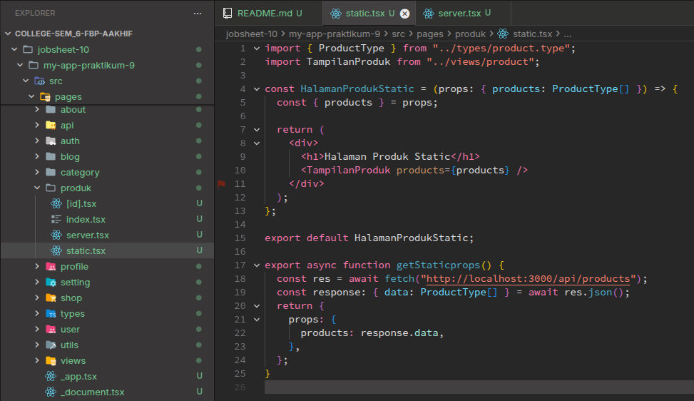
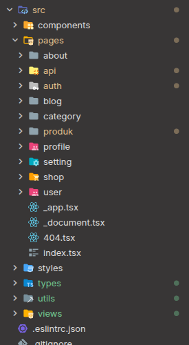
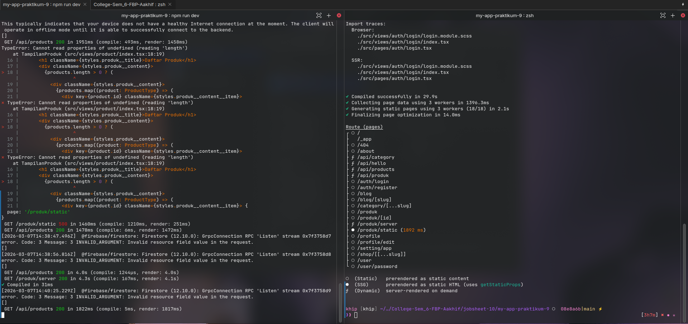
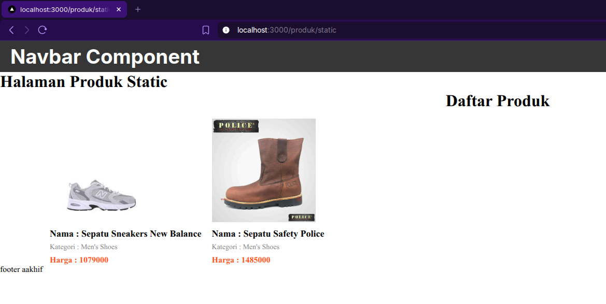
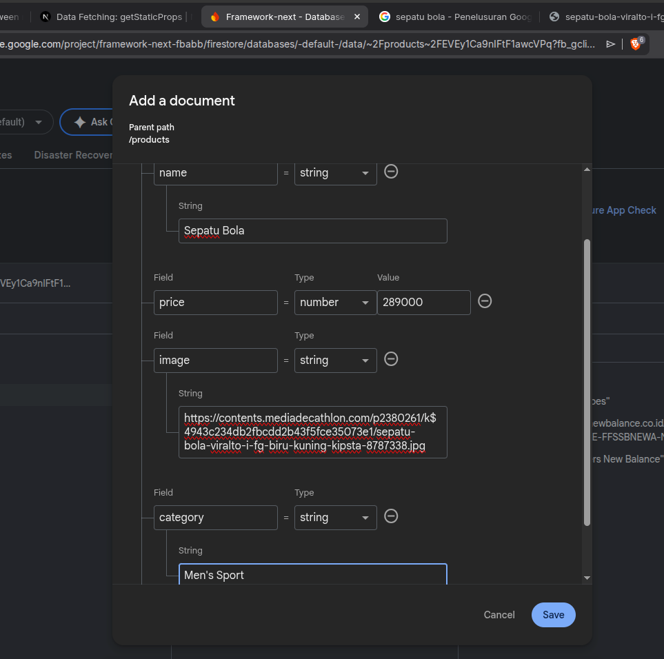
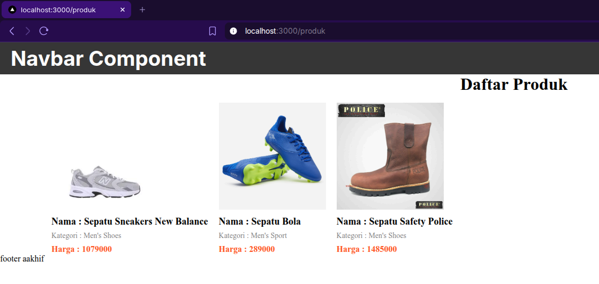
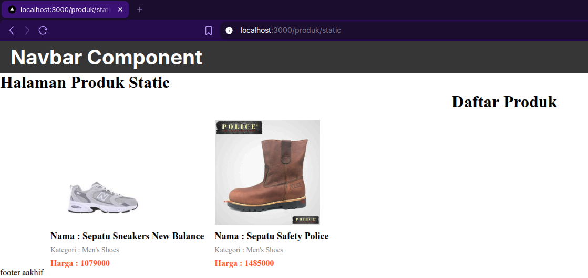
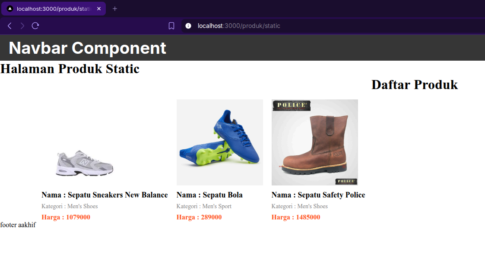

# C. Langkah Praktikum

## Bagian 1 – Setup Halaman Static

Jadi disini saya ingin membuat halaman baru dengan SSG (Static Site Generation). Pada langkah pertama yang saya lakukan adalah membuat file baru bernama `static.tsx` didalam folder `/pages/produk/` dan mengisinya dengan kode berikut,

## Bagian 3 – Build Production Mode

Untuk menghindari error pada saat melakukan build, saya memindahkan folder `views`, `utils`, `types` diluar folder pages. Sehingga tampilannya seperti berikut,

Setelah itu saya menjalankan `npm run build` untuk melakukan build dari project nextjs ini,

Terlihat jika saya selesai melakukan build (di sebelah kanan) juga sambil menjalankan npm run dev (di sebelah kiri).

Setelah melakukan build, saya menjalankan `npm run start` untuk menjalankan production ready seperti berikut (di sebelah kanan),

Lalu hasil dari halaman staticnya adalah seperti berikut,

Pada saat saya load halaman nya, proses memuatnya terasa sangat cepat, dikarenakan semua konten dari API nya sudah diambil dan digenerate langsung menjadi sebuah halaman statis.

## Bagian 4 – Pengujian Perubahan Data

### Uji 1 – Tambah Data di Database

Saya mencoba menambahkan data dari database untuk mengetest apakah masing masing halaman yang sudah saya buat bisa menangkap perubahan data baru dari database,

jadi saya menambahkan data berikut,

dan hasilnya untuk di halaman `/produk` (CSR) adalah sebagai berikut,

dan hasilnya untuk di halaman `/produk/server` (SSR) adalah sebagai berikut,

dan hasilnya untuk di halaman `/produk/static` (SSG) adalah sebagai berikut,

Terlihat jika halaman yang menggunakan Static Generated tidak memperbarui tampilannya, karena dia sudah digenerate secara statis tadi.

Sehingga dapat disimpulkan jika pada saat sudah mencapai tahap produksi menggunakan SSG (Static-Site Generation) itu datanya tidak akan diperbarui lagi.

Kecuali jika kita menjalankan project nya di lingkungan development (menggunakan `npm run dev` bukan `npm run start`, maka data baru bisa termuat)

### Uji 2 – Build Ulang

Sehingga untuk memperbarui halaman yang digenerate dengan Static-Site Generation, project harus dibuild lagi terlebih dahulu (di build ke production menggunakan `npm run build` sembari menjalankan `npm run dev`) seperti berikut,

Setelah itu saya coba jalankan `npm run start` untuk menjalankan environment prouction, dan hasilnya seperti berikut,

Terlihat jika data dari halaman staticnya sudah terupdate.

# D. Tugas Praktikum

## Tugas Individu

### 1. Buat 3 halaman:

- CSR
- SSR
- SSG

#### **Jawab**

Saya sudah membuat 3 halaman untuk menguji perbedaan load data di halaman CSR, SSR, dan SSG, seperti berikut,

### 2. Lakukan pengujian:

- Tambah data
- Hapus data
- Bandingkan hasil

#### **Jawab**

Saya sudah mencoba menambahkan data pada percobaan praktikum, dan hasilnya memang hanya halaman dengan metode render SSG saja yang datanya tidak berubah walaupuun data di database ditambah/dikurangi.

# E. Studi Analisis

Jawab pertanyaan berikut:

### 1. Mengapa SSG tidak menampilkan data terbaru?

#### **Jawab**

Karena dari namanya sudah terlihat, yaitu "Static". Yang dimana itu karena metode SSG memiliki teknik render halaman dengan cara digenerate pada saat build menjadi website statis (alias kontennya sudah full digenerate dan tidak bisa diganti ganti lagi alias statis).

### 2. Mengapa SSG lebih cepat?

#### **Jawab**

Karena dari awal pengguna ingin mengakses halaman, isi konten halamannya sudah siap dan lengkap, semua datanya sudah diunduh dan siap untuk ditampilkan, sehingga pada saat mengunjungi halaman SSG seperti mengunjungi halaman html css statis biasa.

### 3. Kapan SSG tidak cocok digunakan?

#### **Jawab**

SSG sangat cocok digunakan pada saat tampilan halamannya tidak banyak butuh melakukan perubahan secara realtime/tidak butuh banyak perubahan konten yang dinamis. Cocok digunakan juga pada saat kita ingin sekali mengejar kualitas SEO yang bagus, dan performa load website yang lancar, sehingga itu memperbagus UX pengguna pada saat mengunjungi halaman kita.

### 4. Mengapa e-commerce tidak cocok menggunakan SSG murni?

#### **Jawab**

Karena data/isi konten yang ada di website e-commerce itu banyak melakukan perubahan secara realtime, atau bahkan butuh melakukan perubahan data sehingga isi konten dapat berubah sewaktu-waktu.

### 5. Apa perbedaan build mode dan development mode?

#### **Jawab**

Jika build mode seperti `npm run build` adalah perintah untuk melakukan build/pembuatan project ke tahap production ready/final produksi, jadi feel pada saat mengaksesnya adalah feel mengakses halaman pada saat sudah di publik/di release.

Jika development mode seperti `npm run dev`, adalah mode tampilan web di tahap pengembangan, maka bisa saja masih terjadi pengubahan kode/perubahan isi konten sesuai dengan isi database/isinya masih bisa berubah2 untuk tahap pengujian dan pengembangan website.
