# C. Langkah Praktikum

## Bagian 1 – Membuat Dynamic Route

Saya menambahkan link pada masing masing item, sehingga item bisa ditekan,

## Bagian 2 – Implementasi CSR (Client Rendering)

Saya sudah memodifikasi halaman `detail product` agar bisa mengambil data produk dari database berdasarkan id yang diterima,

Melakukan rename file `produk.ts` -> [[...produk]].ts di folder api,

Melakukan modifikasi `serviceirebase.ts`,

Melakukan modifikasi juga ke file `[[...produk]].ts`

Sehingga pada saat saya coba api nya, hasilnya seperti ini,

Setelah itu saya membuat file `detailProduk.module.scss` dan `index.tsx` baru beserta isinya,

Dan hasilnya adalah seperti berikut,

## Bagian 3 – Implementasi SSR

Lalu saya mencoba untuk mengubah kode CSR yang ada di `/produk/[id].tsx dan menggantinya ke penggunaan SSR,

Dan tampilannya adalah sebagai berikut,

Terlihat jika hasilnya memang tidak ada load image pada saat melihat detial image/load sudah dilakukan di sisi server sebelum tampil ke pengguna.

## Bagian 4 – Implementasi Static Site Generation (Dynamic SSG)

Sekarang saya memodifikasi lagi halaman detail produk untuk menggunakan SSG (Static Site Generation) dengan mengedit file

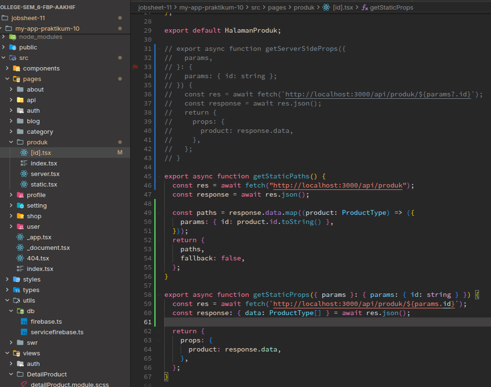

Tak lupa juga untuk memodifikasi views dari halaman detail produk,

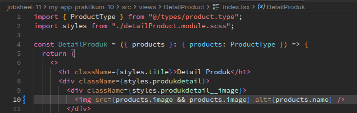

Setelah itu tak lupa saya untuk melakukan build halaman SSG yang sudah dimodifkasi tadi,

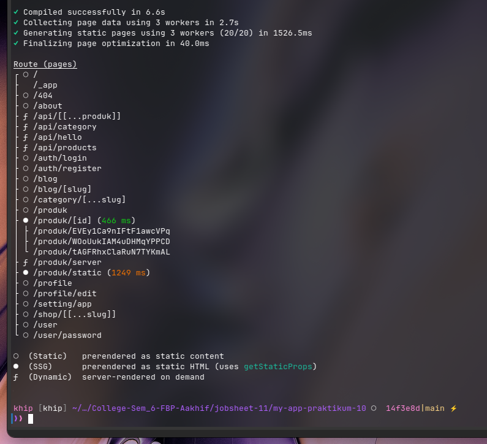

Setelah itu saya mencoba menjalankan browser di halaman produk dan mencoba melihat detail produknya hasil dari modifikasi menggunakan SSG,

# D. Pengujian

### Uji 1 – CSR

- Refresh halaman detail
- Perhatikan loading
- Periksa Network → XHR → API request terlihat

#### Jawab

Saya mencoba mengunjungi halaman detail produk dan memperhatikan bagian API request seperti berikut,

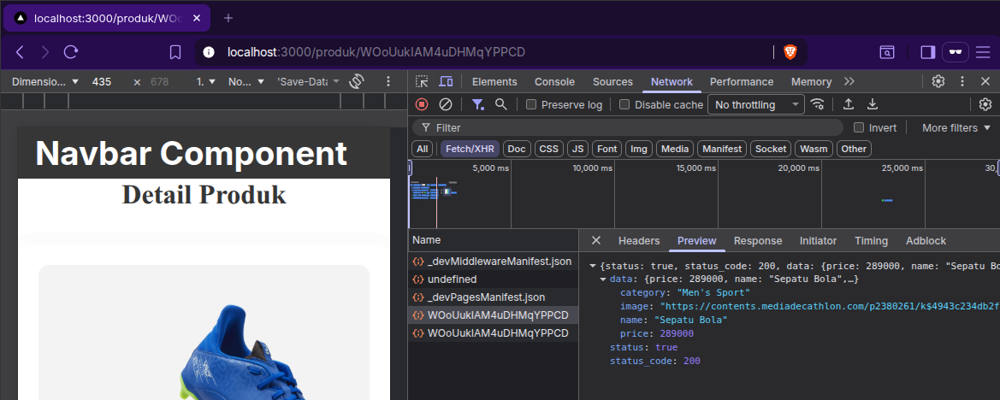

Terlihat jika nextjs sempat melakukan request data produk terlebih dahulu.

### Uji 2 – SSR

- Refresh halaman detail
- Tidak ada loading
- Periksa Network → tidak terlihat fetch detail

#### Jawab

Saya mencoba untuk memuat kembali halaman dengan menggunakan metode rendering SSR dan hasilnya seperti berikut,

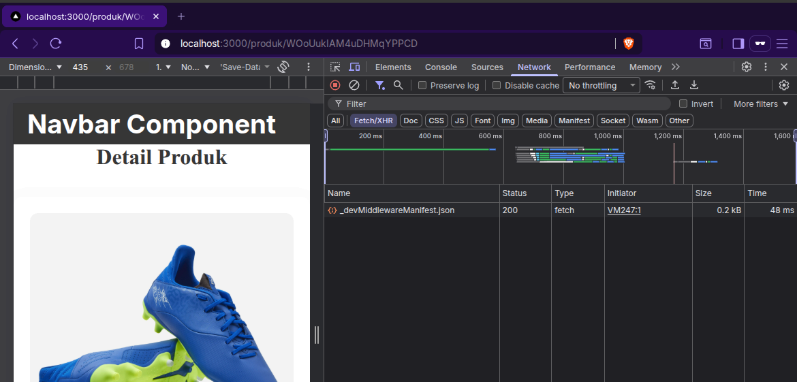

Terlihat disini jika di sisi client, nextjs tidak terlihat melakukan request apapun.

### Uji 3 – SSG ( Lakukan seperti langkah sebelumya pada Jobsheet 10)

1. Jalankan:
   - npm run build
   - npm run start
2. Tambahkan produk baru di database.
3. Buka halaman detail produk baru:
   > Hasil: Tidak muncul.
4. Build ulang:
   - npm run build
   - npm run start
     > Hasil: Baru muncul.

#### Jawab

Saya sekarang mencoba untuk memuat halaman produk kembali dengan menggunakan metode SSG,

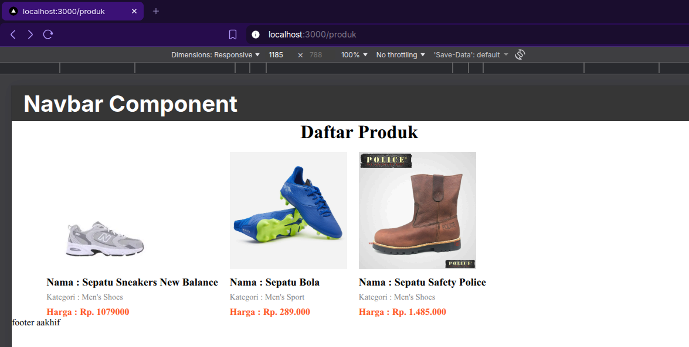

Terlihat awalnya hanya 3 produk saja, setelah itu saya mencoba menambahkan produk baru dari database firebase,

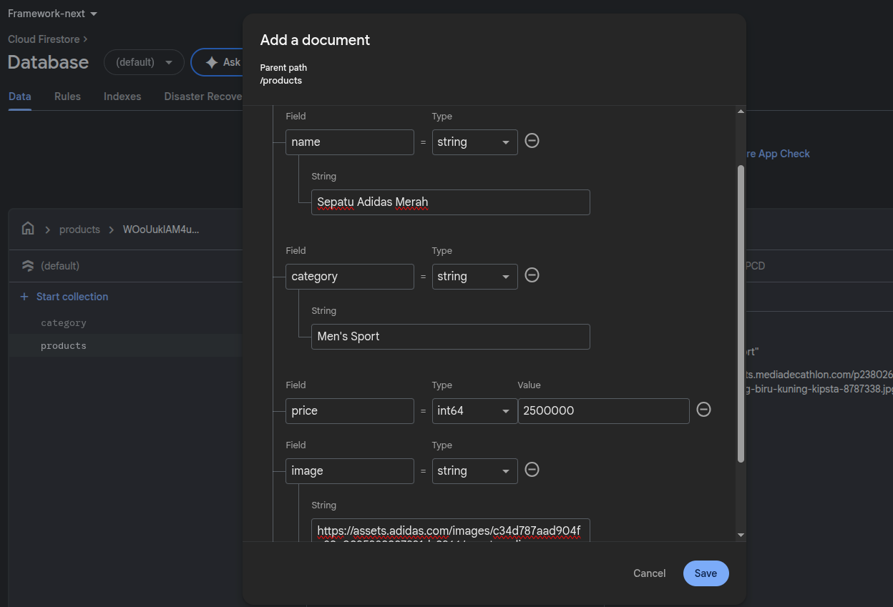

Dan pada saat saya cek di halaman `/produk` hasilnya seperti ini,

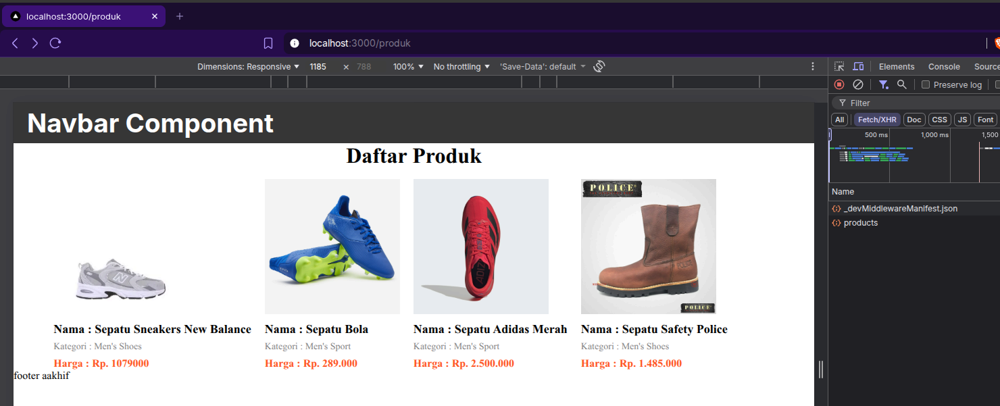

Terlihat sudah ada 4 item, tetapi jika kita mencoba membuka item baru yang telah kita tambahkan barusan (belum melakukan build SSG kembali setelah melakukan penambahan) hasilnya seperti berikut,

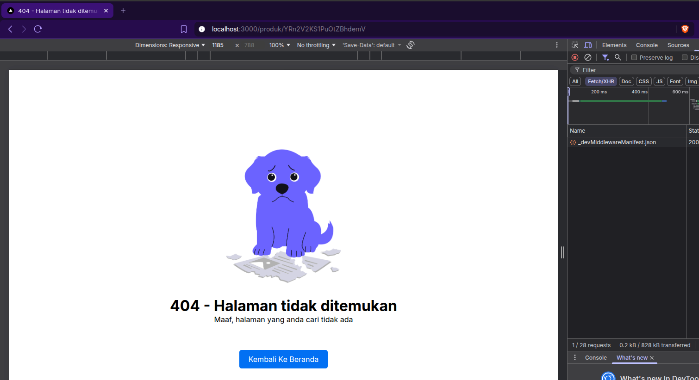

Telrihat jika produknya tidak ditemukan, karena kita belum melakukan build SSG ulang setelah melakukan penambahan data baru untuk halaman produk detail. Setelah itu saya melakukan build ulang (dengan `npm run dev` masih dijalankan) seperti berikut,

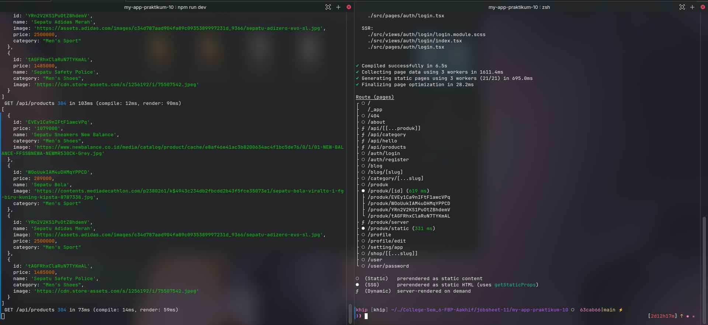

Dan hasilnya adalah seperti berikut,

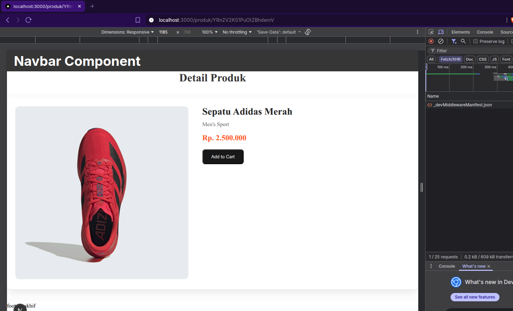

Terlihat jika kita berhasil menampilkan produk baru yang barusan ditambahkan, itu karena kita melakukan build ulang SSG dari nextjs.

# E. Tugas Praktikum

### 1. Implementasikan halaman detail dengan:

- CSR
- SSR
- SSG

Saya sudah mengimmplementasikan beberapa metode renderer diantaranya CSR, SSR, dan SSg di praktikum dan pengujian sebelumnya.

### 2.Buat tabel perbandingan:

| Aspek          | CSR | SSR | SSG |
| -------------- | --- | --- | --- |
| Loading        | ✅  | ❌  | ❌  |
| Build Required | ❌  | ❌  | ✅  |
| SEO            | ❌  | ✅  | ✅  |
| Perubahan Data | ✅  | ✅  | ❌  |

### 3. Dokumentasikan:

- Screenshot
- Network tab
- Build result

Saya sudah mencoba dan berikut adalah hasilnya,

#### CSR

#### SSR

#### SSG

