# C. Langkah Praktikum

## Bagian 1 – Membuat Dynamic Route

Saya menambahkan link pada masing masing item, sehingga item bisa ditekan,

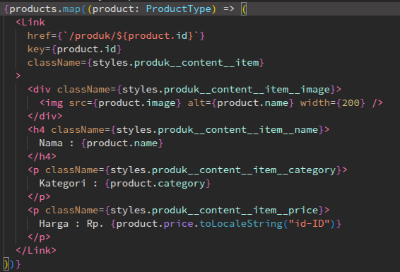

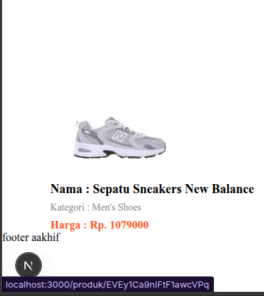

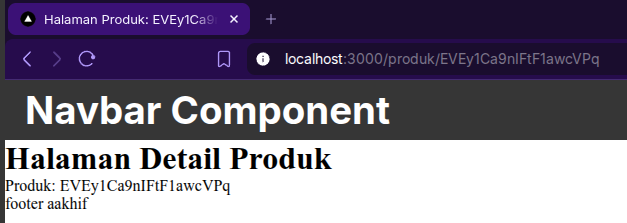

## Bagian 2 – Implementasi CSR (Client Rendering)

Saya sudah memodifikasi halaman `detail product` agar bisa mengambil data produk dari database berdasarkan id yang diterima,

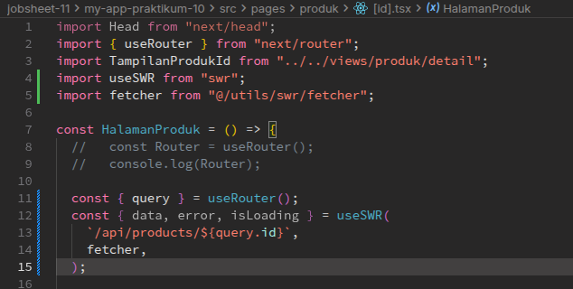

Melakukan rename file `produk.ts` -> [[...produk]].ts di folder api,

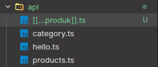

Melakukan modifikasi `serviceirebase.ts`,

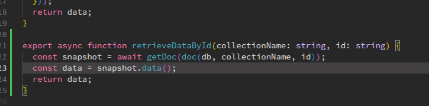

Melakukan modifikasi juga ke file `[[...produk]].ts`

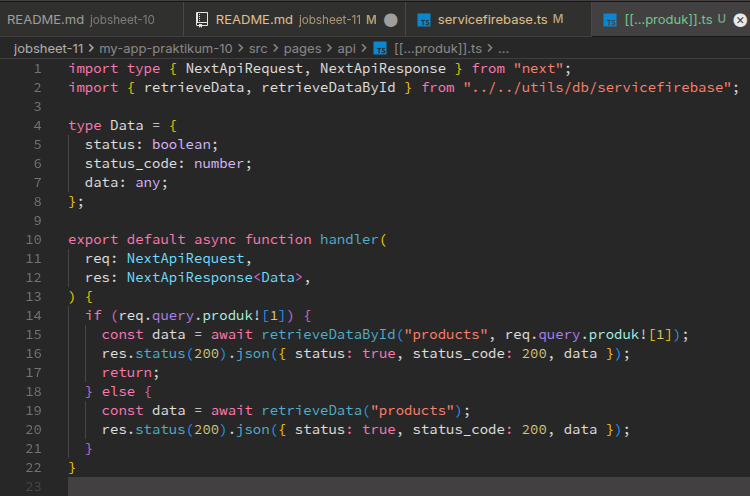

Sehingga pada saat saya coba api nya, hasilnya seperti ini,

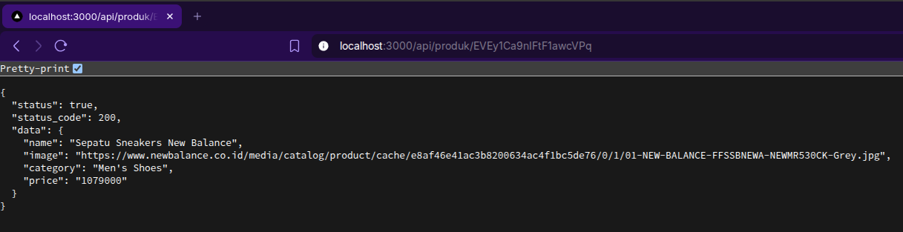

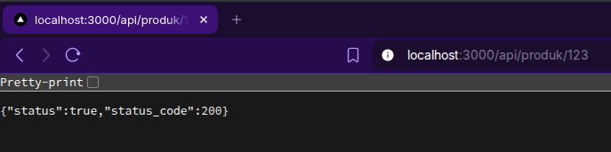

Setelah itu saya membuat file `detailProduk.module.scss` dan `index.tsx` baru beserta isinya,

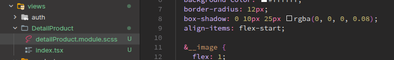

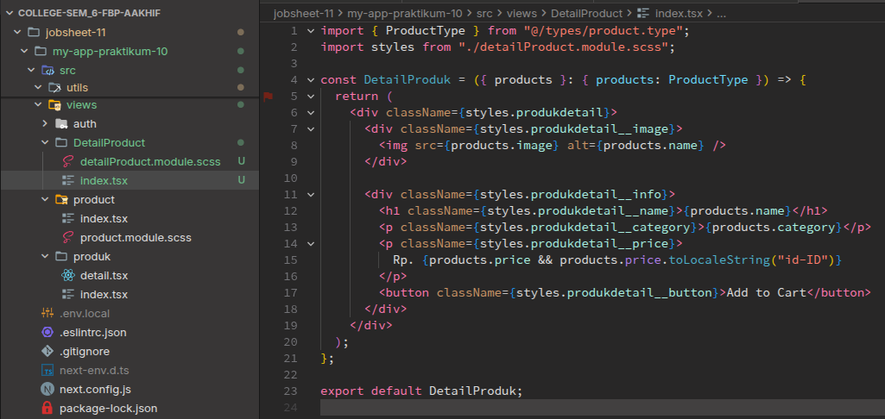

Dan hasilnya adalah seperti berikut,

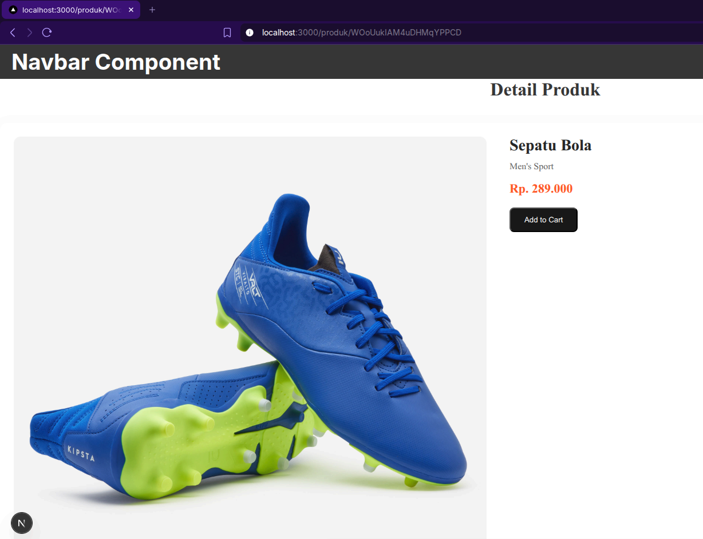

## Bagian 3 – Implementasi SSR

Lalu saya mencoba untuk mengubah kode CSR yang ada di `/produk/[id].tsx dan menggantinya ke penggunaan SSR,

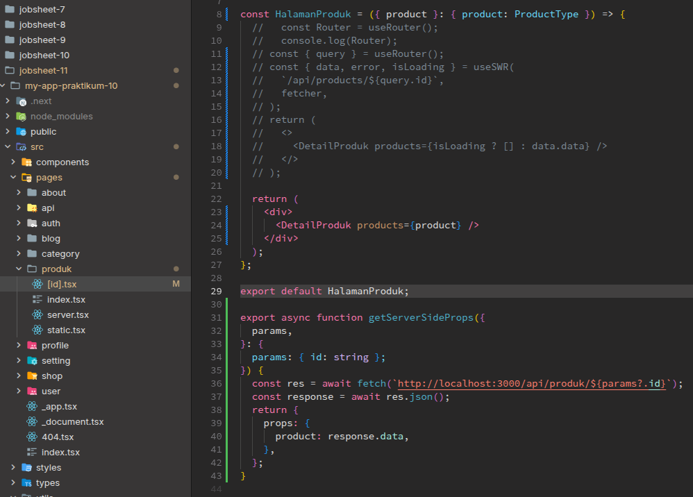

Dan tampilannya adalah sebagai berikut,

Terlihat jika hasilnya memang tidak ada load image pada saat melihat detial image/load sudah dilakukan di sisi server sebelum tampil ke pengguna.
