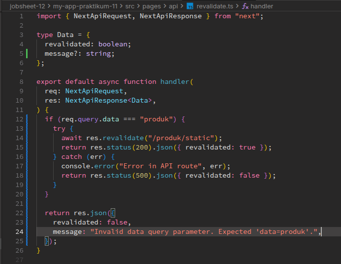
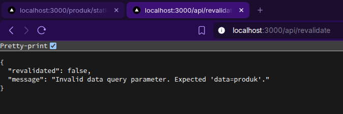
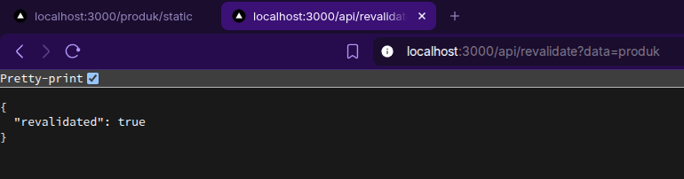
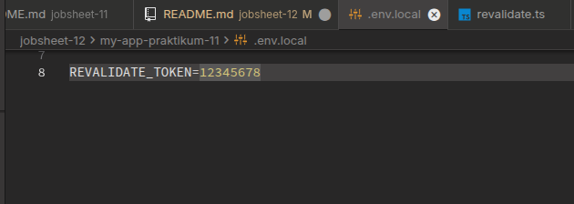
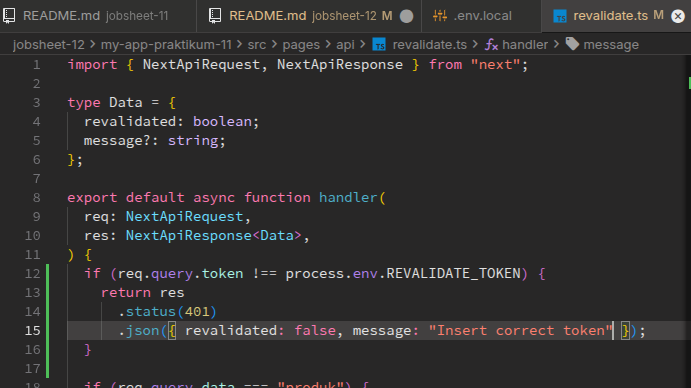
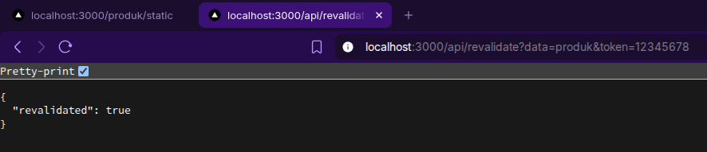
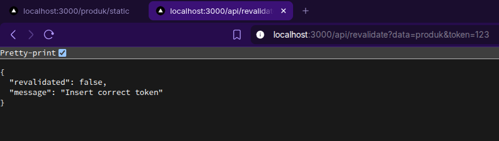
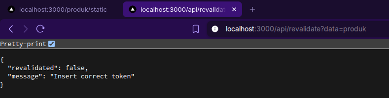

# C. Implementasi ISR Otomatis

## Bagian 1 – Tambahkan revalidate

Di bagian tampilan halaman rute `/produk/static` saya menambahkan kode relaidate seperti berikut,

Yang fungsinya untuk melakukan pengecekan cache setiap 10 detik.

## Bagian 2 – Pengujian ISR

Lalu setelah menambahkan kode revalidate tersebut, saya melakukan build SSG project nextjs ini seperti berikut,

Setelah itu saya mengecek tampilan halaman statis nya, awalnya seperti berikut,

Lalu saya mencoba menambahkan data baru di database firebase seperti berikut,

Lalu saya coba lihat tampilannya di web, setelah dilakukan penambahan data tampilannya seperti berikut,

Terlihat jika data baru berhasil ditampilkan walaupun ini menggunakan Site Generation.

# D. On-Demand Revalidation

## Bagian 1 – Buat API Revalidate

Sekarang saya ingin membuat ISR manual dengan trigger, jadi ada sesuatu yang di trigger terlebih dahulu maka data di website akan diperbarui.Untuk langkah pertama ini saya coba membuat file baru di `pages/api/` bernama `revalidate.ts` seperti berikut,

Sehingga untuk melakukan revalidate/merefresh data produk di halaman static, kita bisa tinggal mengakses rute url `/api/revalidate`

> [!NOTE]
> UNtuk mengenguji nya, pastikan kita menjalankan `npm start` alih-alih menggunakan `npm run dev`

Misalnya jika kita hapus salah satu item produk seperti berikut (Nama Produk: Sepatu Adidas Merah),

Tampilan awalnya sebelum dilakukan revalidate adalah seperti ini,

Setelah itu saya akses endpoint `api/revalidate`

Sehingga pada saat halaman direfresh, produknya sudah hilang seperti berikut,

## Bagian 2 – Tambahkan Parameter Data

Setelah itu saya juga bisa menambahkan kondisi haklaman apa yang ingin di revalidate menggunakan query parameter, sehingga saya ubah kode nya menjadi seperti berikut,

Sehingga pada saat dicoba, hasilnya akan seperti berikut,

tampilan tanpa query data:

tampilan dengan query data:

## Bagian 3 – Tambahkan Token Security

Sekarang saya ingin menambahkan token security di query parameter revalidate sebagai pengaman agar tidak sembarang user bsal melakukan revalidate. Pertama-tama saya memperbarui file `.env.local` dengan menambahkan variabel env baru bernama `REVALIDATE_TOKEN` seperti berikut,

Setelah itu saya modifikasi lagi file `revalidate.ts` dengan menambahkan pengkondisian token seperti berikut,

# E. Pengujian Manual Revalidation

Sekarang saya mencoba mengakses endpoint revalidate dengan menggunakan token yang benar,

sekarang dengan menggunakan token yang salah,

# F. Perbandingan SSG vs ISR

| Aspek       | SSG               | ISR                 |
| ----------- | ----------------- | ------------------- |
| Update Data | Harus build ulang | Otomatis / Trigger  |
| Cache       | Static permanen   | Static + Refresh    |
| Cocok untuk | Konten tetap      | Konten semi-dinamis |

# G. Tugas Praktikum

Tugas Individu

### 1. Tambahkan lagi produk pada firebase

#### **Jawab**

Saya sudah melakukannya di praktikum sebelumnya, seperti berikut,

### 2. Implementasikan ISR dengan revalidate: 10.

#### **Jawab**

Saya sudah mengimplementasikannya sebelumnnya, seperti berikut,

### 3. Tambahkan endpoint On-Demand Revalidation.

#### **Jawab**

Seperti berikut adalah kode on demand revalidation yang ada di endpoint `/api/revalidate`

### 4. Tambahkan validasi token.

#### **Jawab**

Saya sudah mencoba untuk menambahkan validasi dengan menggunakan token,

### 5. Uji dengan:

    - Token benar
    - Token salah
    - Tanpa token

#### **Jawab**

sudah dan seperti ini hasilnya,

mengakses endpoint revalidate dengan menggunakan token yang benar,

sekarang dengan menggunakan token yang salah,

akses revalidate endpoint tanpa menggunakan token,

