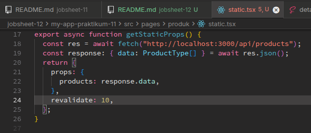
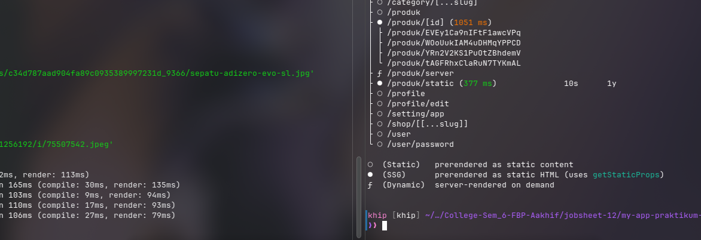
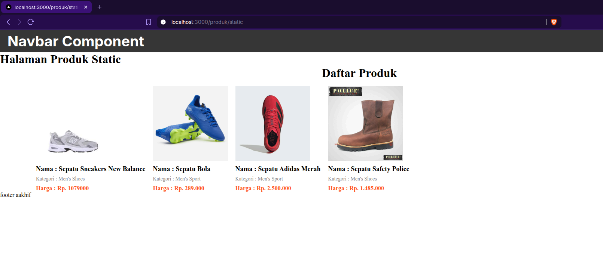
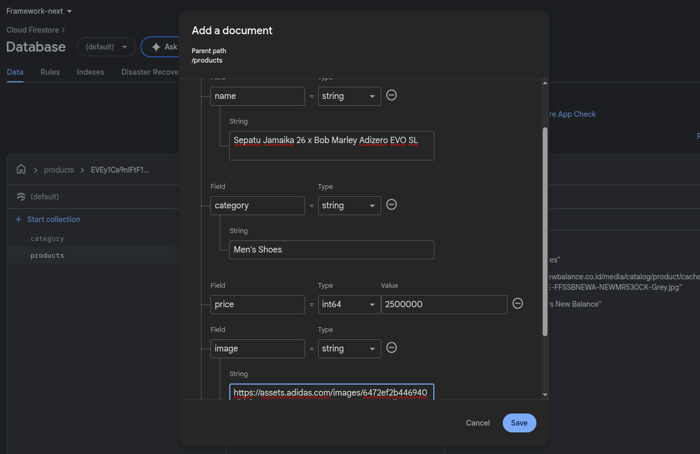
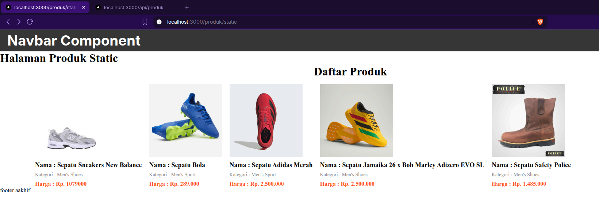
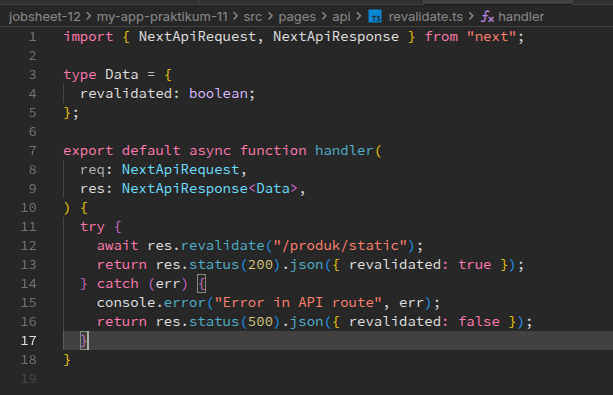
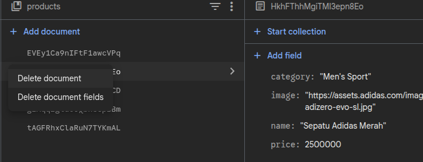
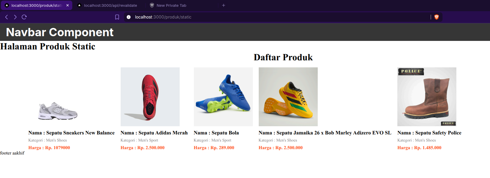
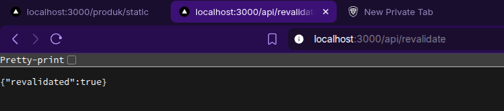
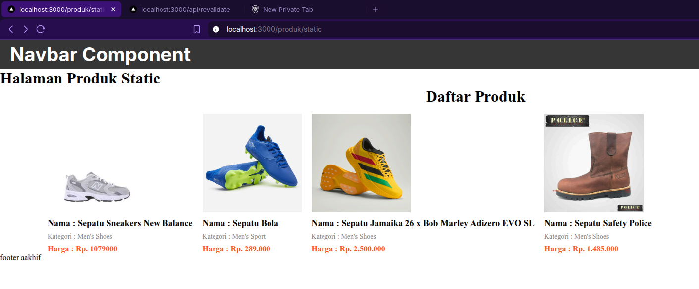

# C. Implementasi ISR Otomatis

## Bagian 1 – Tambahkan revalidate

Di bagian tampilan halaman rute `/produk/static` saya menambahkan kode relaidate seperti berikut,

Yang fungsinya untuk melakukan pengecekan cache setiap 10 detik.

## Bagian 2 – Pengujian ISR

Lalu setelah menambahkan kode revalidate tersebut, saya melakukan build SSG project nextjs ini seperti berikut,

Setelah itu saya mengecek tampilan halaman statis nya, awalnya seperti berikut,

Lalu saya mencoba menambahkan data baru di database firebase seperti berikut,

Lalu saya coba lihat tampilannya di web, setelah dilakukan penambahan data tampilannya seperti berikut,

Terlihat jika data baru berhasil ditampilkan walaupun ini menggunakan Site Generation.

# D. On-Demand Revalidation

## Bagian 1 – Buat API Revalidate

Sekarang saya ingin membuat ISR manual dengan trigger, jadi ada sesuatu yang di trigger terlebih dahulu maka data di website akan diperbarui.Untuk langkah pertama ini saya coba membuat file baru di `pages/api/` bernama `revalidate.ts` seperti berikut,

Sehingga untuk melakukan revalidate/merefresh data produk di halaman static, kita bisa tinggal mengakses rute url `/api/revalidate`

> [!NOTE]
> UNtuk mengenguji nya, pastikan kita menjalankan `npm start` alih-alih menggunakan `npm run dev`

Misalnya jika kita hapus salah satu item produk seperti berikut (Nama Produk: Sepatu Adidas Merah),

Tampilan awalnya sebelum dilakukan revalidate adalah seperti ini,

Setelah itu saya akses endpoint `api/revalidate`

Sehingga pada saat halaman direfresh, produknya sudah hilang seperti berikut,

