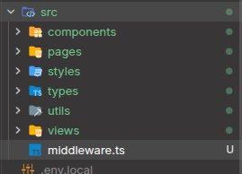
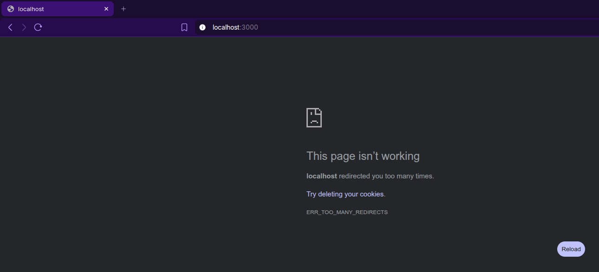
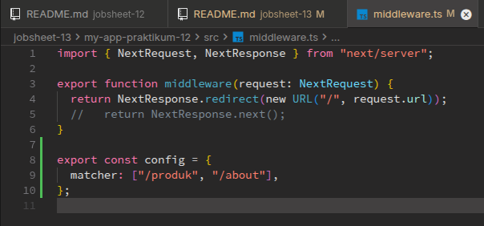

# C. Langkah Praktikum

## Bagian 1 – Membuat Middleware

Saya akan mengubah redirect otomatis (autentikasi) menggunakan middleware, jadi yang pertama saya lakukan adalah membuat file baru bernama `middleware.ts` sejajar dengan folder pages seperti berikut,

## Bagian 2 – Struktur Dasar Middleware

Jadi saya mencoba mengisi file `middleware.ts` yang sudah dibuat tadi dengan kode seperti berikut,

## Bagian 3 – Redirect Sederhana

Jadi sekarang saya mencoba untuk menambahkan eksperimen ke middleware, yaitu dengan melakukan redirect ke home `/` seperti berikut,

Sehingga pada saat saya jalankan di browser hasilnya seperti ini,

Terlihat jika alasan not workingnya karena "...redirected you too many times.", itu artinya kita terus terusan diredirect tanpa henti.

## Bagian 4 – Batasi Route Tertentu

Lalu untuk mengatasi masalah ini, saya melakukan konfigurasi route, dengan membatasi rute tertentu saja yang dapat menerapkan middleware ini. Disini middleware akan saya terapkan di rute `/produk` dan `/about` saja,

