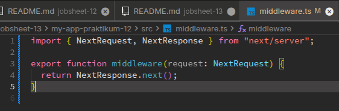
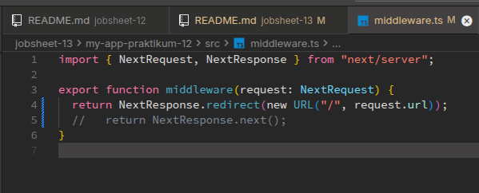
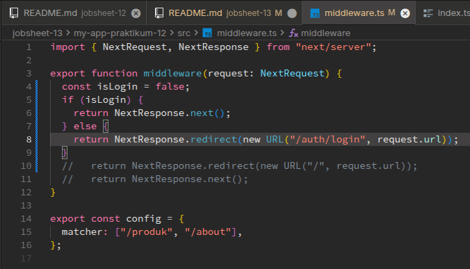
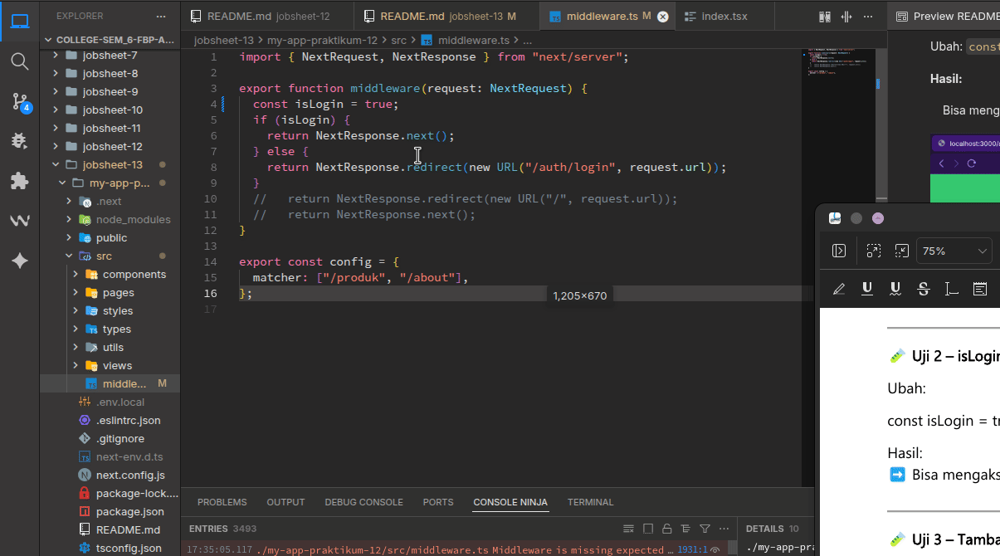
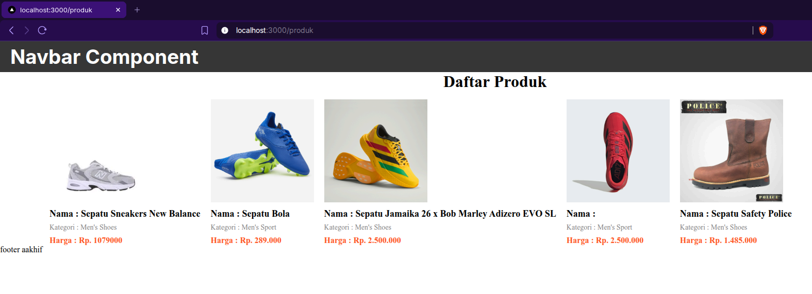
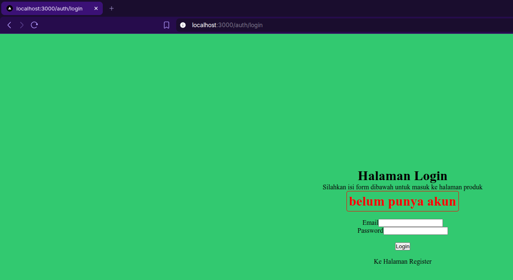
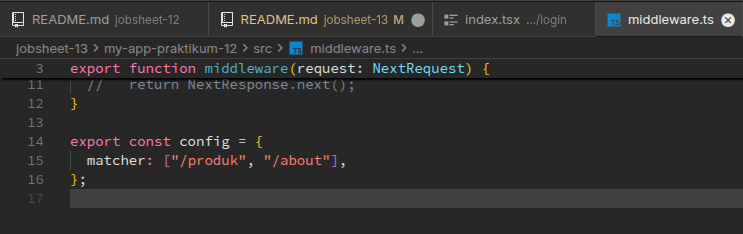
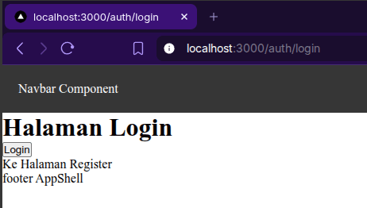

# C. Langkah Praktikum

## Bagian 1 – Membuat Middleware

Saya akan mengubah redirect otomatis (autentikasi) menggunakan middleware, jadi yang pertama saya lakukan adalah membuat file baru bernama `middleware.ts` sejajar dengan folder pages seperti berikut,


## Bagian 2 – Struktur Dasar Middleware

Jadi saya mencoba mengisi file `middleware.ts` yang sudah dibuat tadi dengan kode seperti berikut,



## Bagian 3 – Redirect Sederhana

Jadi sekarang saya mencoba untuk menambahkan eksperimen ke middleware, yaitu dengan melakukan redirect ke home `/` seperti berikut,



Sehingga pada saat saya jalankan di browser hasilnya seperti ini,


Terlihat jika alasan not workingnya karena "...redirected you too many times.", itu artinya kita terus terusan diredirect tanpa henti.

## Bagian 4 – Batasi Route Tertentu

Lalu untuk mengatasi masalah ini, saya melakukan konfigurasi route, dengan membatasi rute tertentu saja yang dapat menerapkan middleware ini. Disini middleware akan saya terapkan di rute `/produk` dan `/about` saja,


## Bagian 5 – Simulasi Sistem Login

Setelah itu baru kita coba terapkan logika middleware kedalam sistem login, dengan cara saya menambahkan beberapa pengkondisian sederhana seperti berikut,



Dengan kode tersebut maka kita tidak akan bisa masuk ke halaman produk (karena variabel isLogin akan terus `false`).

## D. Pengujian

### Uji 1 – isLogin = false

Akses: `/produk`

**Hasil:**

> Redirect ke /login


### Uji 2 – isLogin = true

Ubah: `const isLogin = true`

**Hasil:**

> Bisa mengakses /produk


### Uji 3 – Tambahkan Multiple Route

```ts
export const config = {
  matcher: ["/products", "/about"],
};
```

**Sekarang:**

- /products dan /about butuh login
- Halaman lain bebas



# E. Perbandingan Middleware vs useEffect

| Aspek           | useEffect          | Middleware           |
| --------------- | ------------------ | -------------------- |
| Redirect timing | Setelah render     | Sebelum render       |
| Glitch          | Ada                | Tidak                |
| Security        | Lemah              | Lebih aman           |
| Skalabilitas    | Harus tiap halaman | Sekali di middleware |

# F. Tugas Praktikum

## Tugas Individu

### 1. Buat halaman:

- /products
- /about
- /login

#### **Jawab**

saya sudah mempunyai ketiga halaman tersebut, tampilannya adalah seperti berikut,

**halaman `/produk`**



**halaman `/about`**


**halaman `/login`**



### 2. Implementasikan Middleware:

- Redirect ke /login jika belum login.
- Izinkan akses jika login true.

#### **Jawab**

Saya sudah membuat redirect otomatis ke halaman login jika variabel `isLogin = false`,


Lalu jika `isLogin = true` maka halaman produk bisa diakses,


### 3. Tambahkan proteksi hanya untuk route tertentu.

#### **Jawab**

Saya sudah menambahkan proteksi middleware dengan cara memberikan config di kode `middleware.ts` seperti berikut,



### 4. Dokumentasikan:

- Screenshot sebelum dan sesudah redirect.
- Perbandingan dengan useEffect.

#### **Jawab**

Pada saat redirect menggunakan `middleware`,


dan ini adalah redirect menggunakan `useEffect` (video lama)



_Terlihat jika menggunakan useEffect ada blink membuka halaman produk sebentar._

# G. Pertanyaan Analisis

### 1. Mengapa middleware lebih aman dibanding useEffect?

#### **Jawab**

Karena middleware sesuai namanya yaitu sesuatu yang berada di tengah tengah rute, jadi sebelum mengakses ke ujung rute tujuan, kita melalui validasi middleware terlebih dahulu, sehingga pengguna tidak sampai ke ujung rute tujuan terlebih dahulu sebelum divalidasi oleh middleware.

Dan memang sangat direkomendasikan di arsitektur autentikasi seperti ini untuk menggunakan middleware.

### 2. Mengapa middleware tidak menimbulkan glitch?

#### **Jawab**

Karena jika memang pengguna tidak terauntetikasi/gagal memenuhi persyaratan tertentu di middleware, tampoilan web tidak akan langsung menampilkan tampilan rute tujuan.

### 3. Apa risiko jika semua halaman diproteksi tanpa pengecualian?

#### **Jawab**

maka halaman browser akan mengalami error "..redirected you too many times.", yang dimana rute tidak akan ada habisnya meredirect pengguna.

### 4. Kapan middleware tidak diperlukan?

#### **Jawab**

pada saat halaman hanya menampilkan konten-konten tanpa validasi ditengah perpindahan halaman seperti autentikasi dan authorisasi contohnya.

### 5. Apa perbedaan middleware dan API route?

#### **Jawab**

Middleware itu adalah sebuah program ditengah-tengah proses perpindahan halaman (bisa digunakan untuk melakukan pengecekan/validasi). Jika API route itu adalah sekumpulan rute yang dibuat bertujuan untuk membuat API endpoint.
