# C. Langkah Praktikum

## Bagian 1 – Install NextAuth

Saya menginstall library `next-auth` seperti berikut,

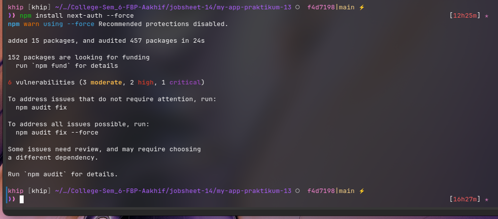

## Bagian 2 – Konfigurasi API Auth

Saya menambahkan konfigurasi untuk autentikasi menggunakan next-auth dengan cara membuat file baru bernama [...next-auth].ts di folder `/pages/api/auth/` seperti berikut,

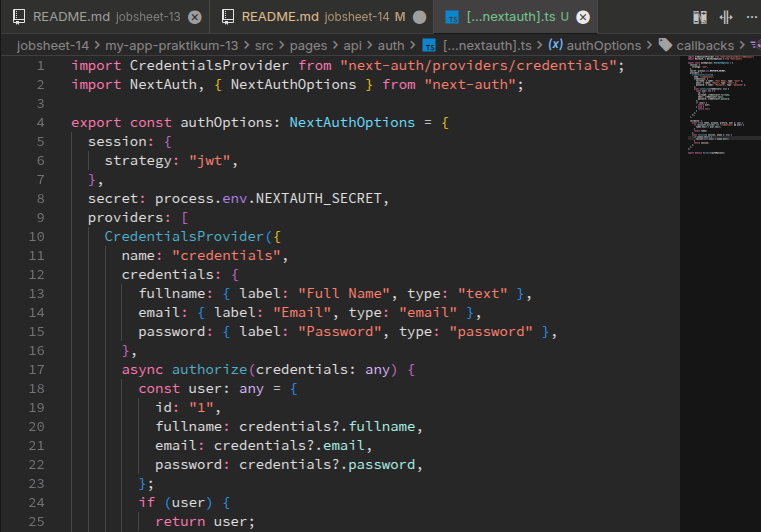

## Bagian 3 – Tambahkan Secret

Saya menambahkan variabel secret di `.env.local` untuk menjadi secret dari next auth seperti berikut,

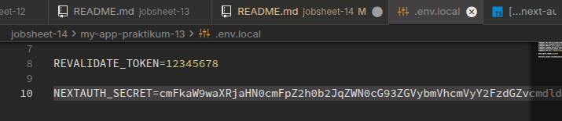

## Bagian 4 – Tambahkan SessionProvider

Lalu saya menuju ke file `_app.tsx` dan memodifikasi kode nya untuk mengimplementasikan autentikasi session dari next auth, dengan cara menambahkan `SessionProvider` seperti berikut,

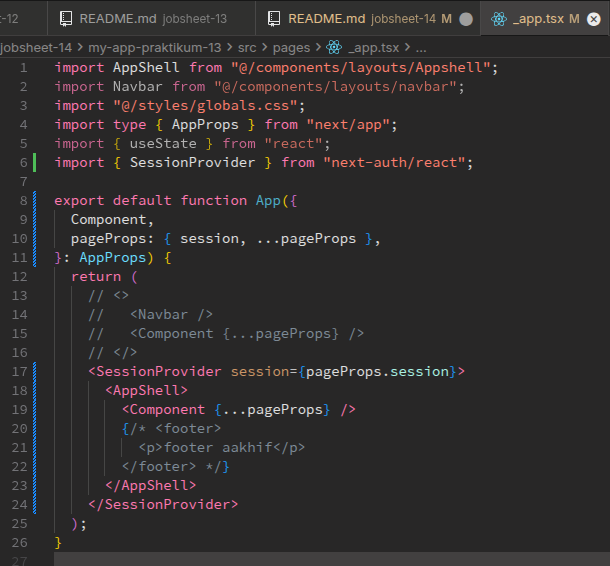

## Bagian 5 – Tambahkan Tombol Login & Logout

Lalu sekarang saya akan menambahkan tombol sign in/login di Navbar dari web nextjs saya seperti berikut,

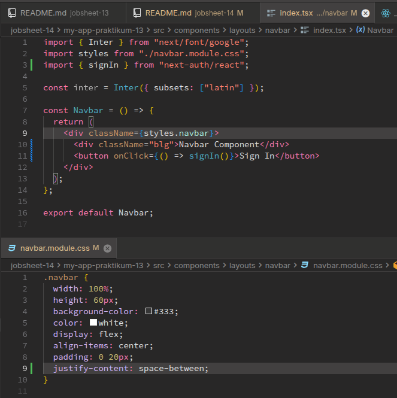

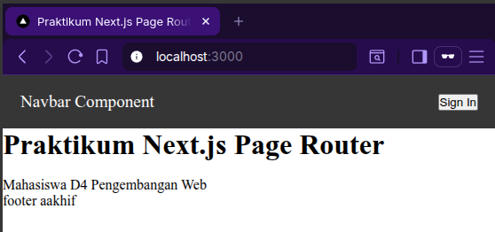

Sehingga pada saat saya tekan tombol Sign In nya hasilnya seperti berikut,

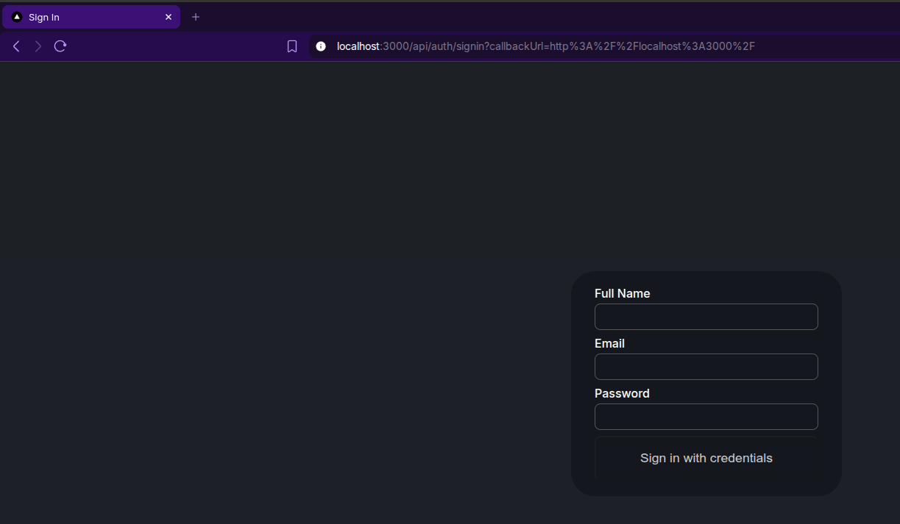

Setelah itu saya coba tekan tombol "Sign in with credentials" nya, dan mendapatkan session baru seperti ini jika di inspect,

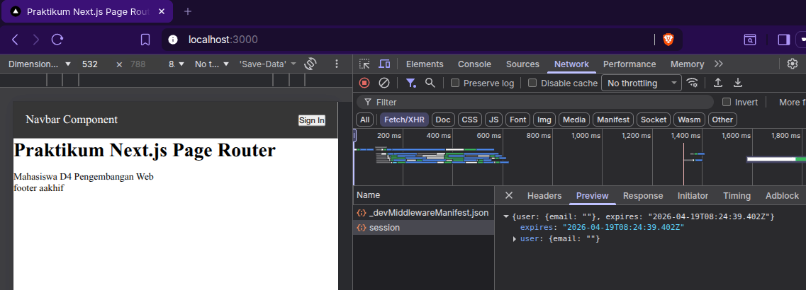

Sehingga untuk menangkap data dari session tersebut bisa dengan cara menambahkan kode seperti berikut (contohnya di navbar),

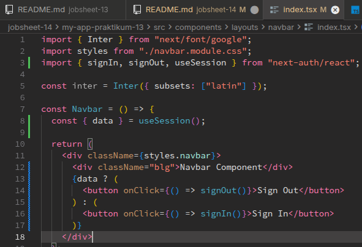

Sehingga saya sudah bisa melakukan Sign In dan Sign Out seperti berikut,

_pertama-tama session akan kosong,_

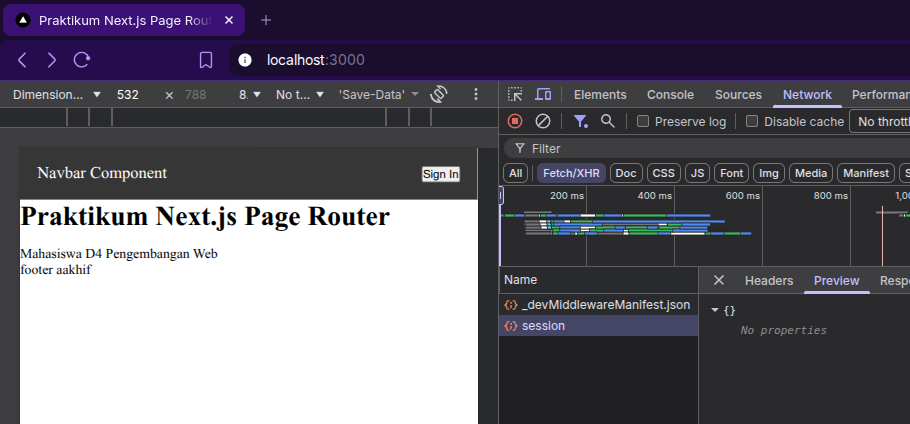

_setelah itu menekan tombol sign in dan mengisi form,_

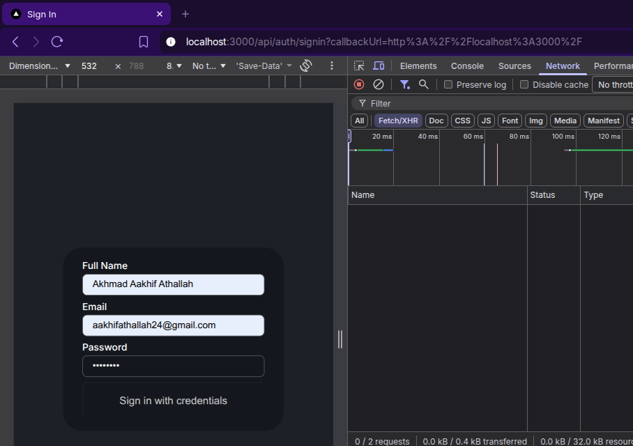

_setelah itu menekan tombol "Sign in with credentials" dan mendapatkan session baru beserta datanya (email),_

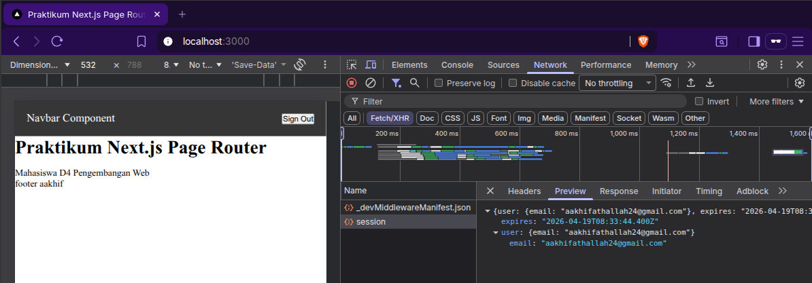

_terlihat di gambar diatas tombol "sign in" berubah menjadi "sign out", dan sekarang kita coba menekannya,_

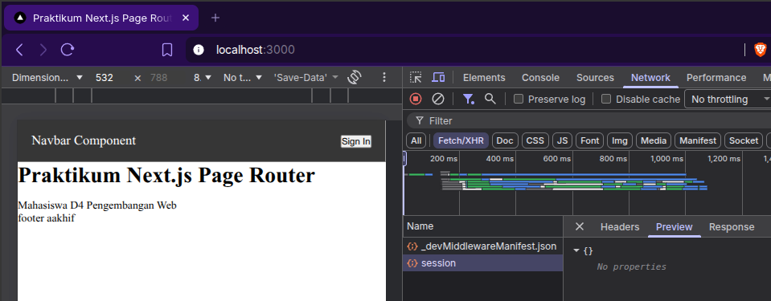

_terlihat jika setelah menekan tombol "sign out", tombol nya berubah menjadi "sign in" dan data didalam session nya sudah tidak ada._

# D. Menambahkan Data Tambahan (Full Name)

Sekarang saya ingin menambahkan Full Name ke data yang berada di dalam session, seperti ini kode nya,

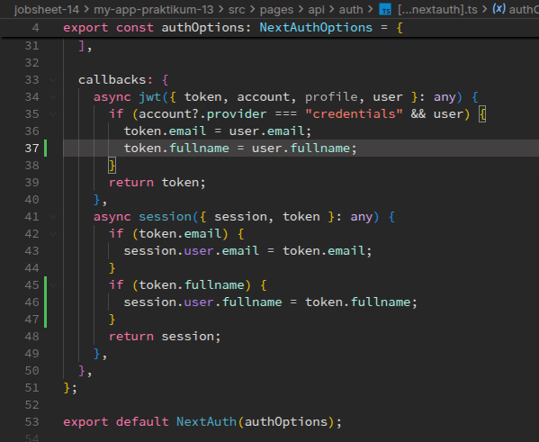

lalu setelah itu saya melakukan modifikasi styling terlebih dahulu seperti berikut hasilnya,

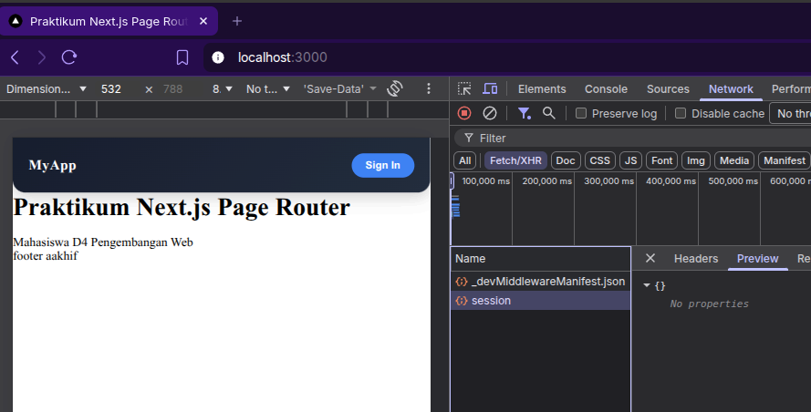

lalu saya mencoba untuk melakukan sign in dengan beberapa field form terisi seperti berikut,

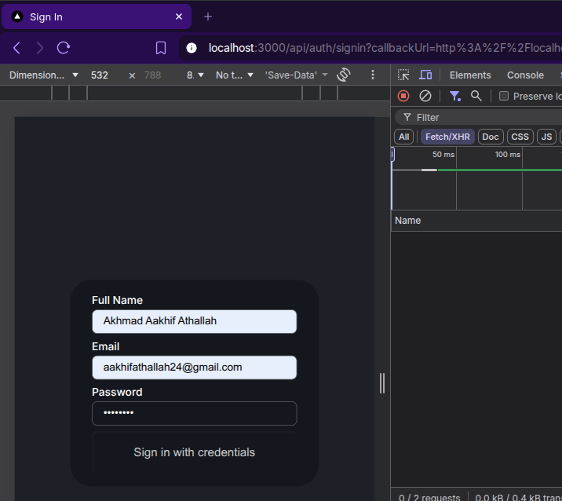

Sehingga isi dari sessionnya adalah seperti berikut,

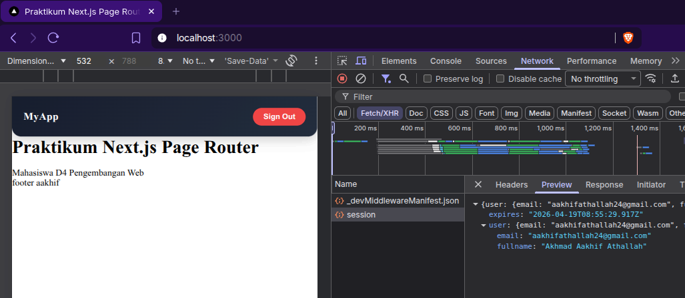

Terlihat data Full Name sudah muncul.

# E. Proteksi Halaman Profile

Setelah itu saya mencoba untuk menambahkan proteksi untuk halaman profile.

Pertama-tama saya memodifikasi halaman profile menjadi seperti berikut,

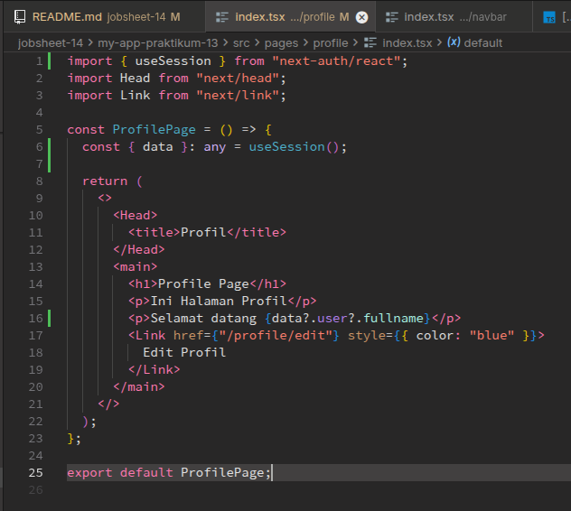

Sehingga hasilnya menjadi seperti ini,

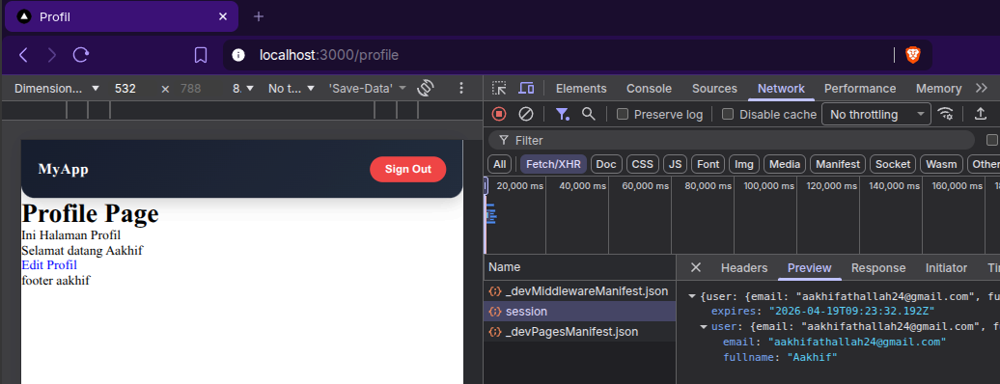

Setelah itu saya coba buat middleware authorization nya untuk halaman profil, dengan cara membuat file baru bernama `withAuth.ts` di folder `src/middleware` sejajar dengan pages,

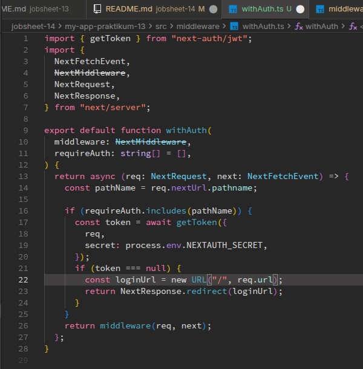

an juga memodifikasi middleware nya untuk mengimplementasikan middleware auth tadi, yang sudah kita buat di file `withAuth.ts`,

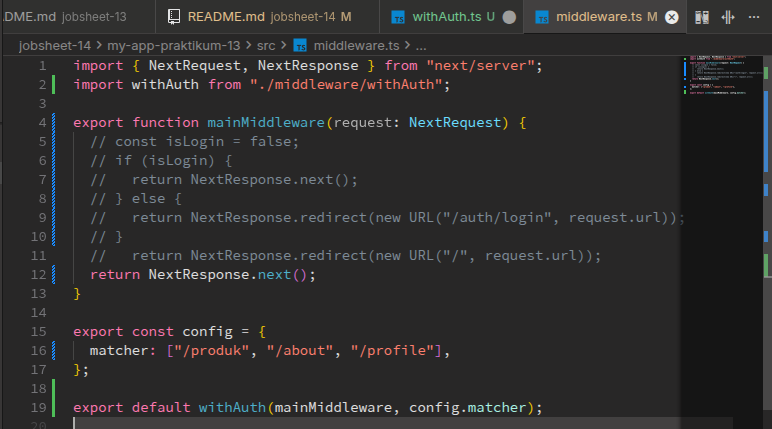

Sehingga pada saat user yang belum login mengakses rute `/produk`, `/about`, `/profile`, mereka akan diredirect ke halaman dashbaord langsung oleh middleware `withAuth`.

# F. Pengujian

## Uji 1 – Belum Login

Akses: `/profile`

**Hasil:**

> Redirect ke home

#### **Jawab**

Mencoba mengakses halaman `/profile` tetapi **belum login** hasilnya,

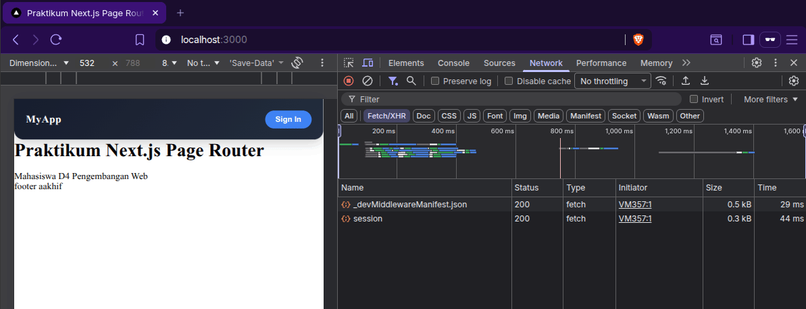

## Uji 2 – Sudah Login

Login terlebih dahulu → Akses `/profile`

**Hasil:**

> Bisa masuk

#### **Jawab**

Mencoba mengakses halaman `/profile` tetapi **sudah melakukan login** hasilnya,

## Uji 3 – Logout

Klik Sign Out → Akses `/profile`

**Hasil:**

> Tidak bisa masuk

#### **Jawab**

# H. Tugas Praktikum

### 1. Implementasikan login menggunakan Credentials Provider.

#### **Jawab**

Saya sudah mengimmplementasikan credentials provider di kode next-auth nya,

### 2. Tambahkan field full name.

#### **Jawab**

Saya juga sudah mengimplementasikan field full name ke next auth saya di sisi callback,

### 3. Tampilkan full name setelah login.

#### **Jawab**

Berikut adalah tampilan full name setelah login di inspect element,

### 4. Buat halaman profile.

#### **Jawab**

Lalu halaman profile nya adalah seperti berikut,

### 5. Lindungi halaman profile dengan middleware.

#### **Jawab**

SAya sudah melindungi halaman `/profile` nya menggunakan `withAuth` yang diimplementasikan di middleware seperti berikut hasilnya,

### 6. Dokumentasikan:

#### **Jawab**

- Screenshot login

- Screenshot session

- Screenshot redirect middleware

_(redirect belum login)_

_(sudah login lalu melakukan logout)_

# I. Pertanyaan Analisis

### 1. Mengapa session menggunakan JWT?

#### **Jawab**

Karena JWT (JSON Web Token) merupakan manajemen Session stateless yang sederhana untuk menyimpan session pengguna yang disimpan didalam token, yang dimana token itu sendiri di pegang oleh sisi client.

Sehingga lebih responsif interaksinya dengan sisi client karena informasi sesi tidak disimpan di server.

### 2. Apa perbedaan authorize() dan callback jwt()?

#### **Jawab**

Jika `authorize()` dalam `CredentialsProvider` fungsinya untuk authorisasi kredensial pengguna, pada saat pengguna menekan tombol sign in, jadi fungsi ini dijalankan lebih dahulu untuk authorisasi pengguna.

Sedangkan fungsi `jwt()` di sisi callback, untuk memperbarui JWT (JSON Web Token)/untuk memperbarui token session nya. Callback sendiri disini dijalankan pada saat pengguna sudah berhasil melewati proses authorisasi/sudah berhasil login.

### 3. Mengapa middleware perlu getToken()?

#### **Jawab**

Karena untuk memastikan apakah pengguna ini sudah melakukan login (sign in) atau belum, karena token sendiri akan mengembalikan data session hasil sign in kita.

### 4. Apa risiko jika NEXTAUTH_SECRET tidak digunakan?

#### **Jawab**

Maka siapa saja bisa memodifikasi isi token yang sudah tersimpan di website kita. Jika kita menerapkan NEXTAUTH_SECRET, maka yang memiliki secret nya saja lah yang bisa memodifikasi/memperbarui isi token.

Jadi secret disini tujuannya sebagai pengaman hanya kita yang memiliki secret yang bisa mengotak atik token yang telah kita buat.

### 5. Apa perbedaan autentikasi dan otorisasi dalam sistem ini?

#### **Jawab**

Autentikasi disini artinya validasi apakah user ini memiliki kredensial yang benar untuk memasuki sistem informasi kita.

Sedangkan otorisasi disini adalah aturan untuk pengguna sesuai dengan role mereka, aturan berupa siapa bisa mengakses apa, didalam sistem informasi ini.
