# C. Langkah Praktikum

## Bagian 1 – Membuat Register View

Saya sudah mempunyai file bernama `index.tsx` dan `register.module.scss` seperti berikut didalam direktori
`src/auth/views/register/`,

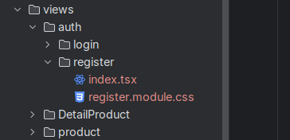

Lalu saya melakukan modifikasi pada kode `pages/auth/register.tsx`, `views/auth/register/register.module.css`, dan
`views/auth/register/index.tsx` sepeti berikut,

**register.tsx**

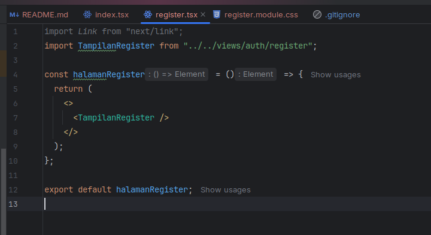

**regsiter.module.css**

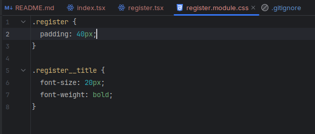

**index.tsx**

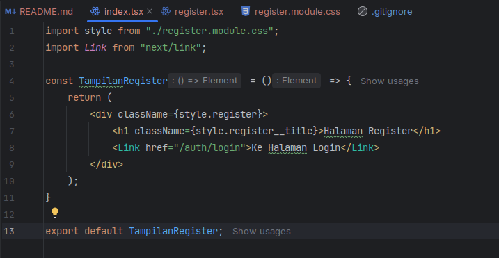

Lalu saya menambahkan form inputan berupa email, fullname, dan password di file `index.tsx

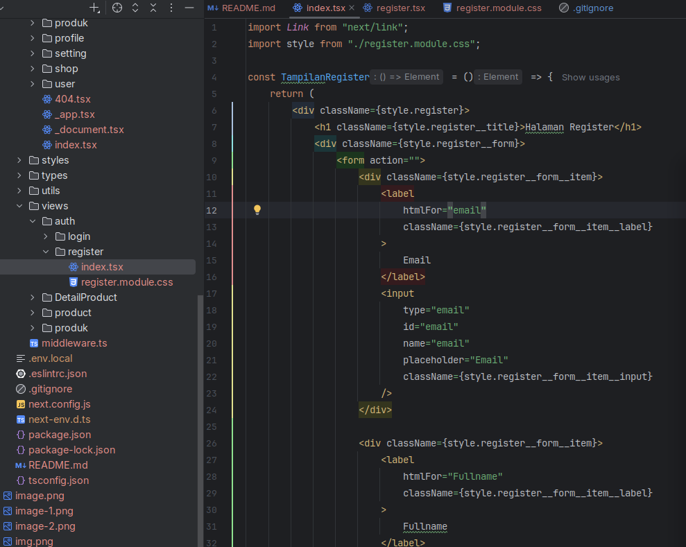

Lalu saya memodifikasi `register.module.scss` seperti berikut,

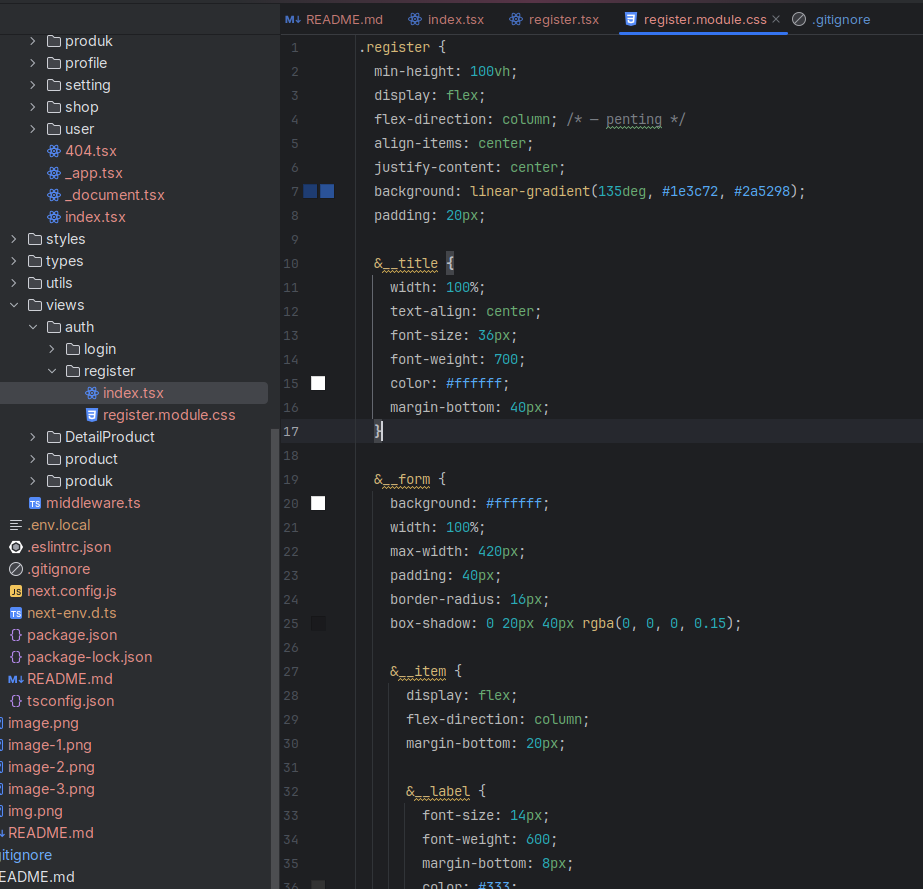

Sehingga hasil akhirnya tampilannya seperti berikut,

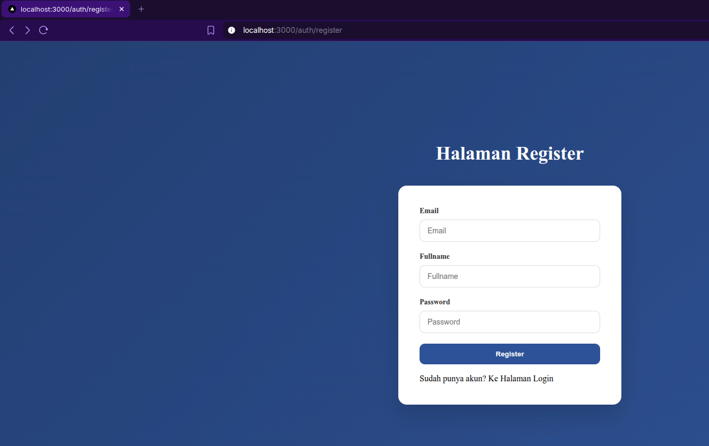

## Bagian 2 – Membuat API Register

Setelah itu saya mencoba memodifikasi file `servicefirebase.ts` seperti berikut,

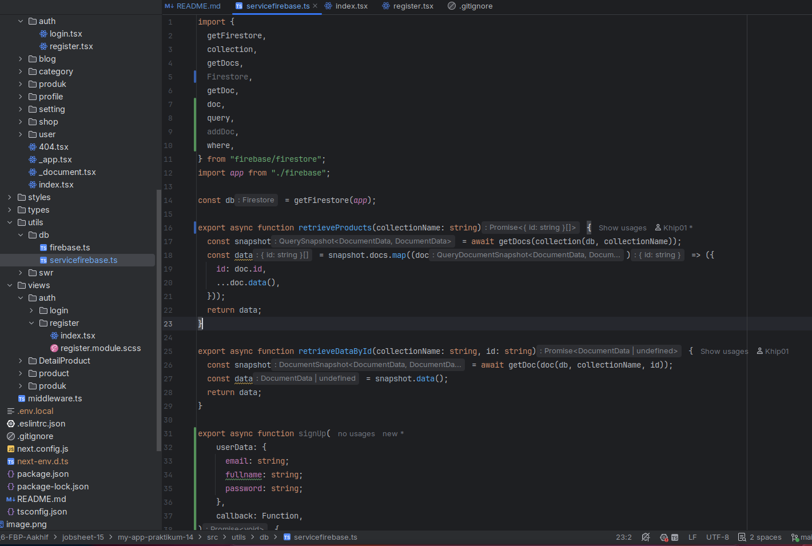

Setelah itu saya mencoba membuat file baru bernama `register.ts` didalam direktori `src/pages/api/`, lalu melakukan
modifikasi untuk file `register.ts` juga seperti berikut,

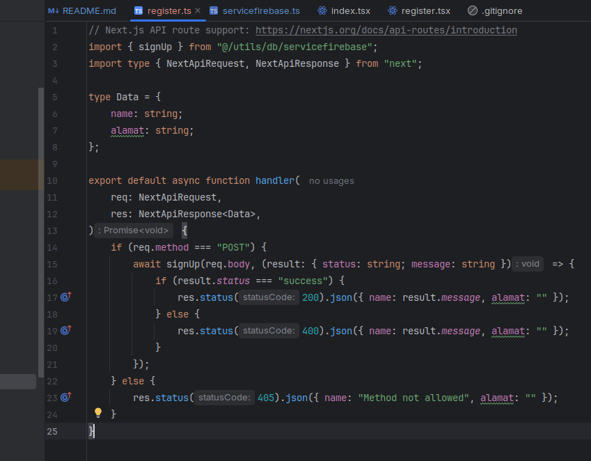

Setelah itu saya melakukan modifikasi pada kode `index.tsx` pada folder register,

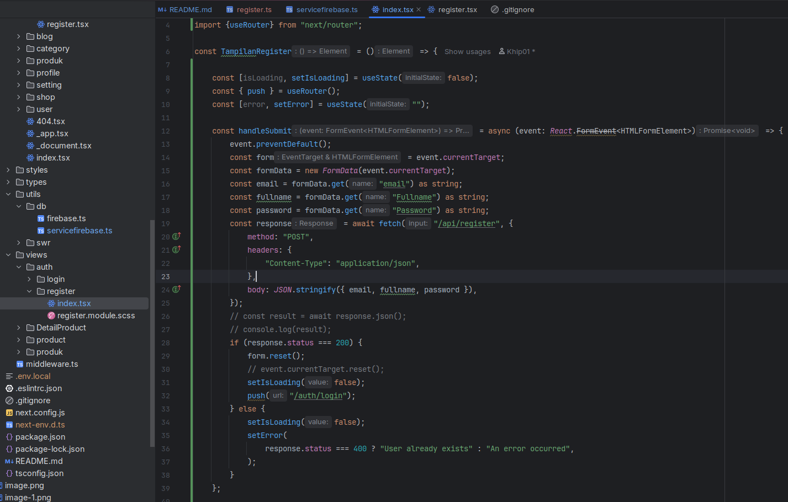

Sehingga hasil tampilannya adalah sebagai berikut,

Terlihat jika pada saat ditekan masih tidak bisa mengarahkan ke halaman login walaupun tombol register sudah ditekan.

## Bagian 3 – Install bcrypt

Saya melakukan instalasi package `bcrypt` didalam project nextjs saya,

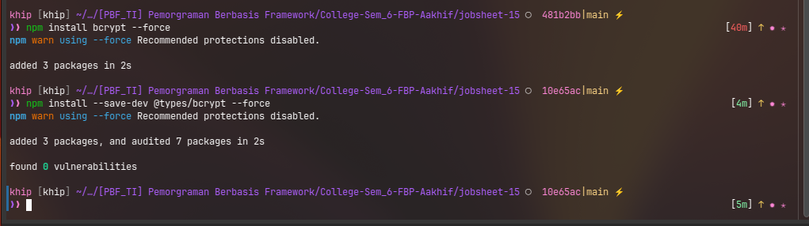

Lalu saya mencoba memodifikasi file `servicefirebase.ts` untuk menerapkan bcrypt pada password dan menambahkan field
baru yaitu role seperti berikut,

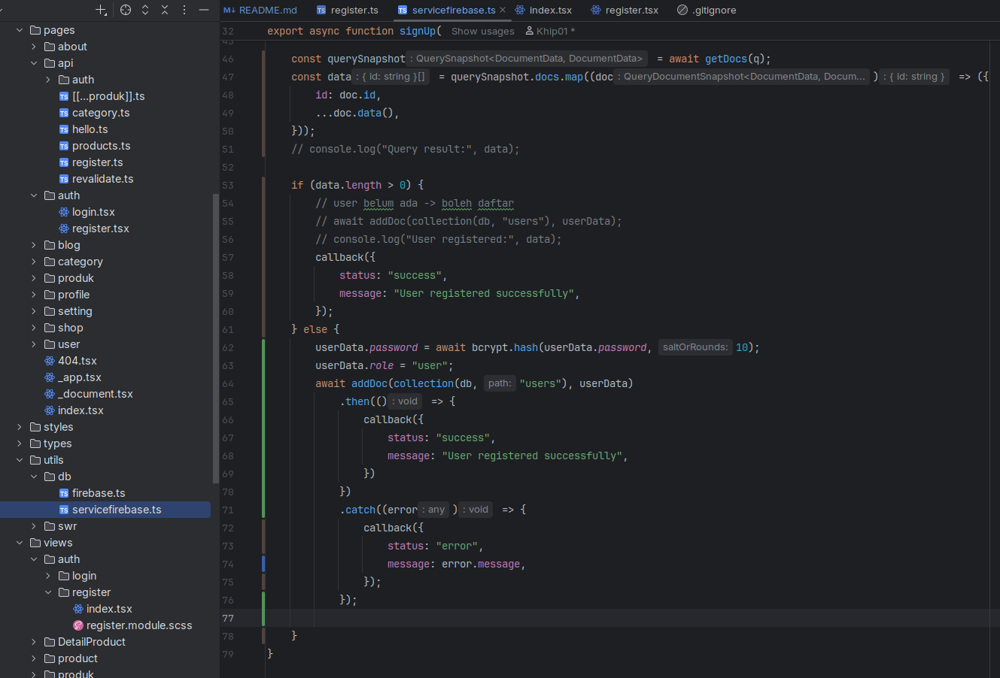

Setelah itu saya mencoba untuk menjalankan register seperti berikut,

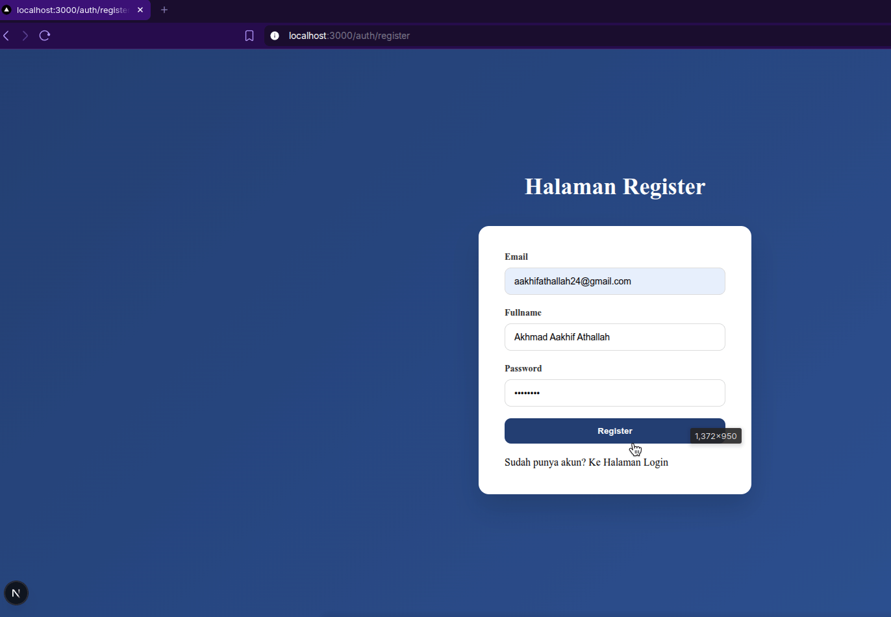

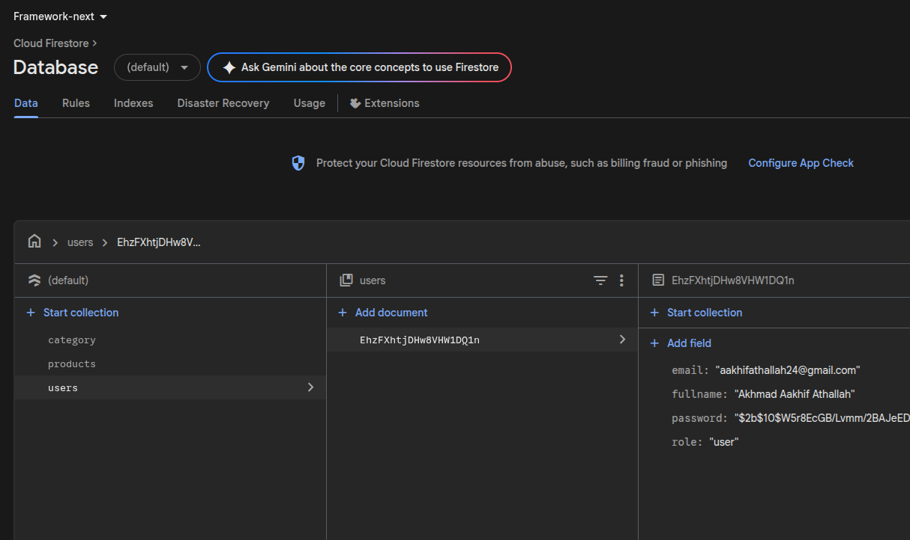

Telrihat jika pada saat setelah melakukan register saya sudah bisa diarahkan ke halaman login.

Lalu agar error terlihat pada saat kita melakukan register dengan menggunakan akun yang sama, maka saya memodifikasi
kode di `index.tsx` pada folder `views/auth/register` seperti berikut,

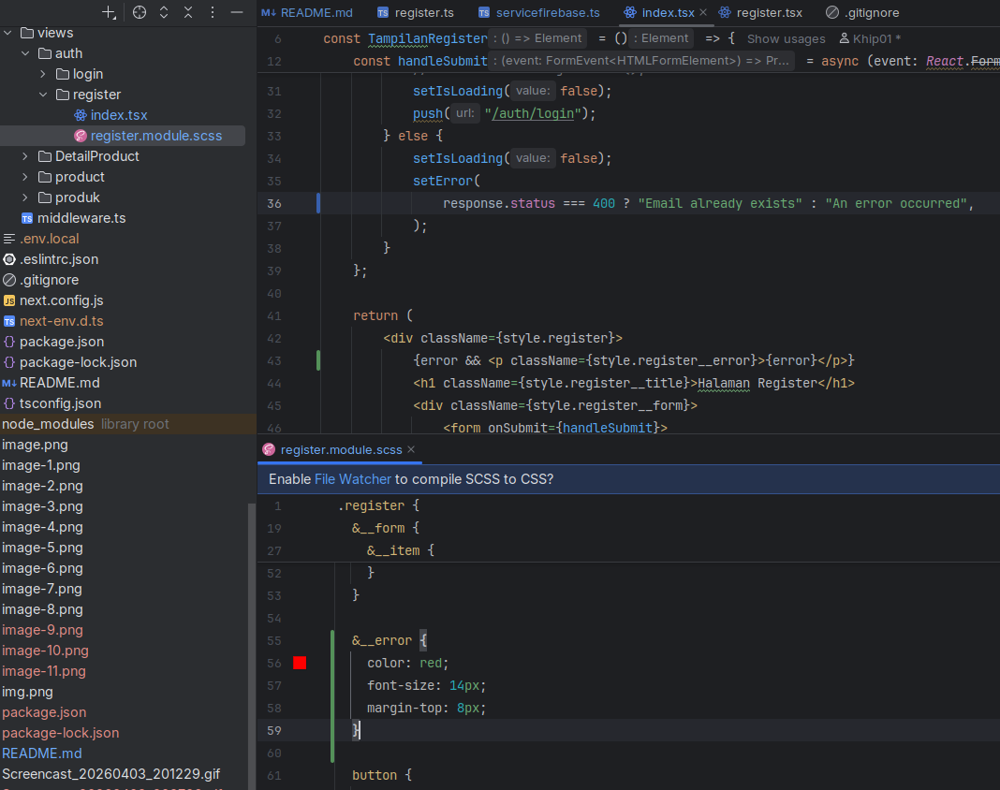

Sehingga tampilan halamannya pada saat memberikan akun email yang sama akan seperti berikut,

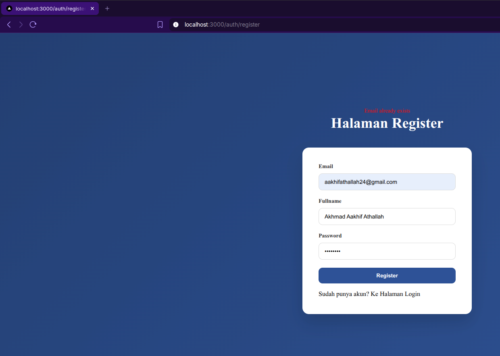

Terlihat jika tampilan errornya sekarang telah ditampilkan.

Setelah itu untuk memperbaiki UX yang bagus, saya tambahkan loading pada saat tombol submit register ditekan, dan
hasilnya seperti berikut,

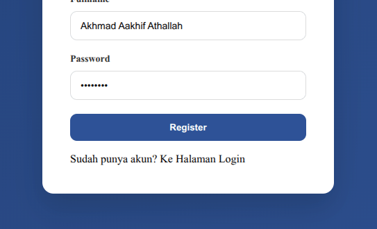

Terlihat jika saya bisa menampilkan/mengimplementasikan loading state pada tombol register.

# D. Pengujian

## Uji 1 – Register Baru

Input:

- Email baru

> Hasil:
> - Data tersimpan di Firestore
> - Password ter-hash
> - Redirect ke login

#### **Jawab**

Berikut adalah tampilan ketika saya berhasil membuat email baru,

## Uji 2 – Email Sudah Ada

Input:

- Email yang sama

> Hasil:
> - Error 400
> - Message: Email already exists

#### **Jawab**

Lalu saya mencoba untuk memberikan email yang sama dan hasilnya seperti berikut,

## Uji 3 – Method GET

**Akses:** `/api/register`

> Hasil:
> - 405 Method Not Allowed

#### **Jawab**

Lalu saya juga menguji endpoint API `/register` saya dengan menggunakan method GET dan hasilnya seperti berikut,

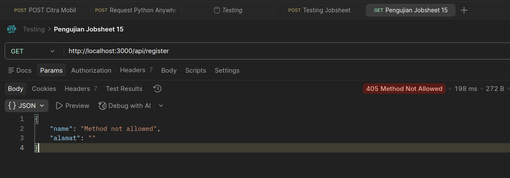

# G. Tugas Praktikum

### 1. Implementasikan register terhubung database.

#### **Jawab**

Saya sudah mengimplementasikan register agar terhubung ke database seperti berikut hasilnya,

### 2. Tambahkan validasi:

- Email wajib
- Password minimal 6 karakter

#### **Jawab**

Jadi saya menambahkan field email dan juga password seperti berikut,

### 3. Tambahkan role default "user".

#### **Jawab**

Jadi saya juga menambahkan role default pada untuk pengguna yang melakukan register, di kode berikut (dibawah kode
bcrypt),

### 4. Tampilkan pesan error di UI.

#### **Jawab**

Saya juga sudah mencoba menampilkan pesan error di UI seperti berikut,

### 5. Screenshot hasil:

- Register sukses
- Email sudah ada
- Database Firestore

#### **Jawab**

> **Register sukses**

> **Email sudah ada**

> **Database Firestore**

# H. Pertanyaan Analisis

### 1. Mengapa password harus di-hash?

#### **Jawab**

Karena agar tidak ada orang yang bisa membaca text asli dari password yang telah user tersebut buat. Dan password yang
sudah di hash tidak bisa kembalikan ke plain text (alias satu arah saja).

### 2. Apa perbedaan addDoc dan setDoc?

#### **Jawab**

Jika `addDoc` maka firestore database akan menambahkan doc baru didalam collection, jika setDoc maka firestore database
akan melakukan perubahan pada data yang sudah ada.

### 3. Mengapa perlu validasi method POST?

#### **Jawab**

Karena untuk mencegah kesalahan method pada saat mengakses endpoint, dan juga untuk memberitahu user/developer yang
mengakses endpoint tersebut apabila dirinya melakukan kesalahan penggunaaan method pada saat mengakses endpoint.

### 4. Apa risiko jika email tidak dicek unik?

#### **Jawab**

Maka email yang sama akan dibuat lebih dari satu/terjadi multiple data padahal email nya sama. Nantinya pada saat login
menggunakan email, maka email duplikat yang lain tidak akan digunakan.

### 5. Apa fungsi role pada user?

#### **Jawab**

Untuk membatasi hak akses pengguna di sebuah sistem informasi tersebut. Atau bisa disebut dengan otorisasi.