# C. Langkah Praktikum

## BAGIAN 1 – Custom Login Page

Sekarang saya mencoba untuk menambahkan custom pages di file `[...nextauth].ts` seperti berikut,

![tampilan custom pages di file [...nextauth].ts](image.png)

setelah itu saya mencoba untuk menjalankan project nextjs saya di url `/` seperti berikut,

dan pada saat tombol sign in ditekan maka akan diarahkan ke halaman login,

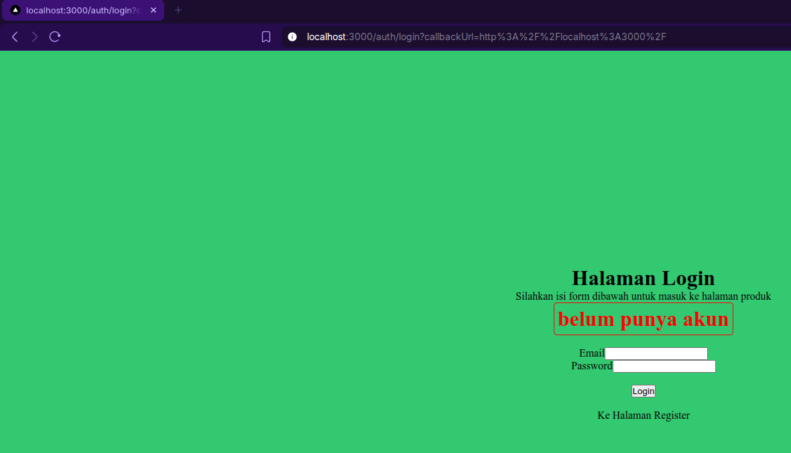

## BAGIAN 2 – Handle Login di Frontend

Setelah itu saya membuat ulang halaman `login.tsx` dengan melakukan copy seluruh kode di register dan melakukan
modifikasi/penyesuaian untuk halaman login,

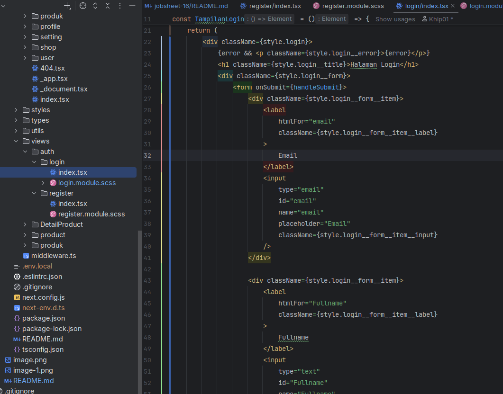

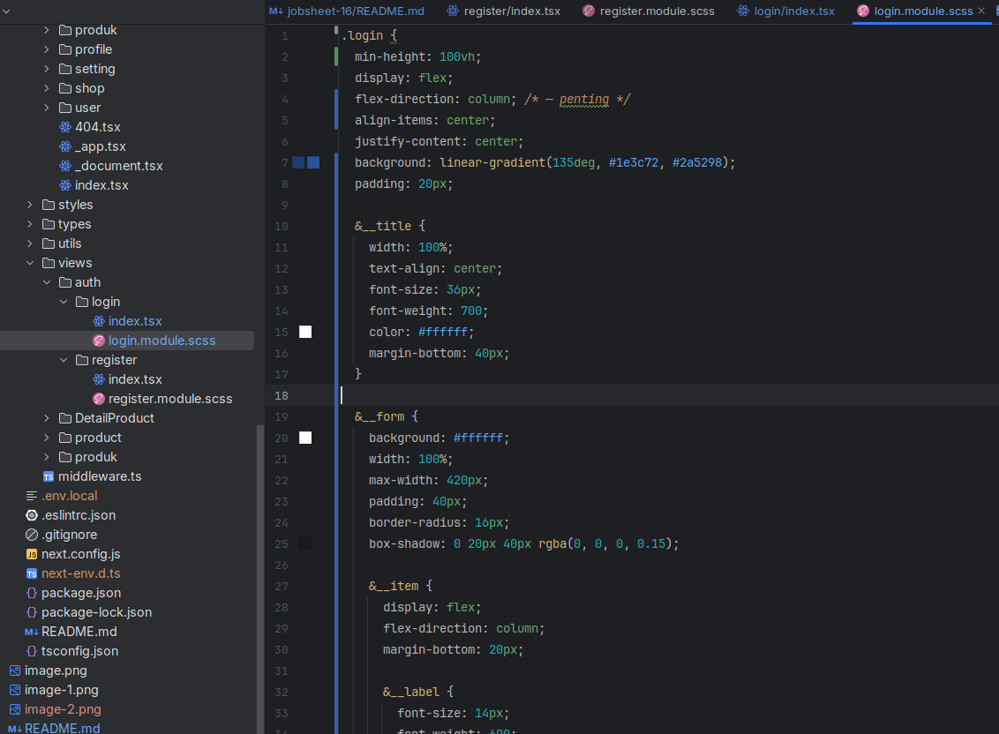

Sehingga hasil tampilannya seperti berikut,

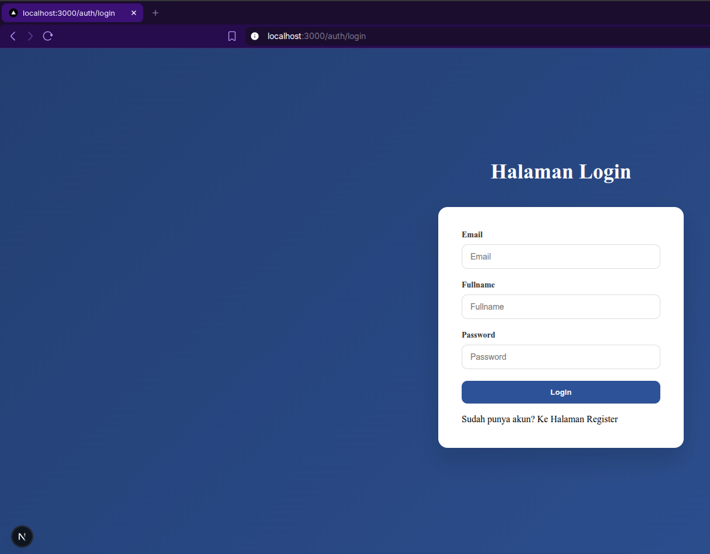

Setelah itu saya modifikasi lagi tampilan halaman login dengan menghapus textfield fullname (karena halaman tidak
memerlukan fullname). Sehingga tampilannya adalah seperti berikut,

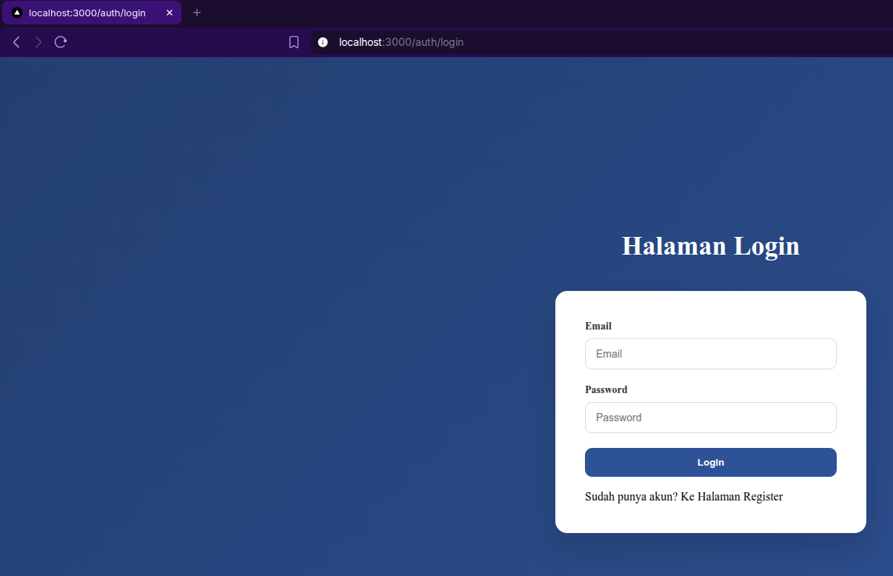

Lalu setelah itu saya modifikasi lagi untuk file index.tsx di direktori `views/auth/login/` untuk melakukan
fungsionalitas proses submit login.

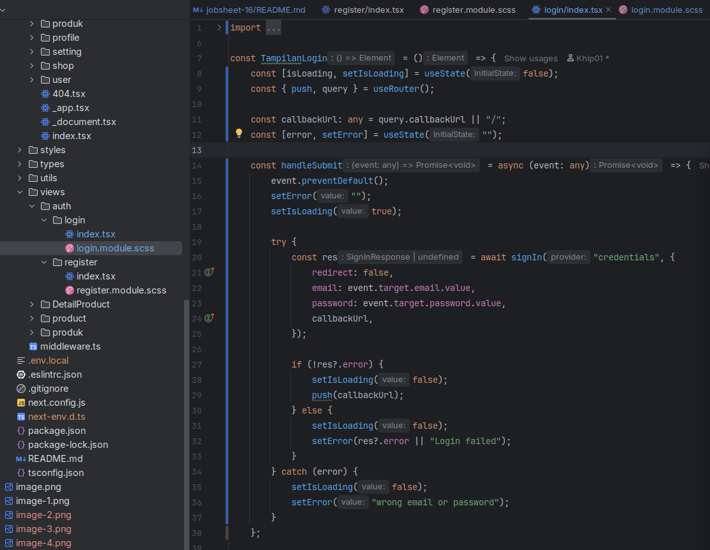

Setelah itu saya menambahkan fungsi untuk `signIn` di file `servicefirebase.ts` seperti berikut,

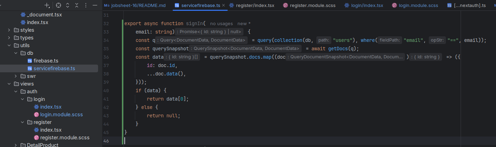

## BAGIAN 3 – Authorize di NextAuth (Database Login)

Lalu saat ini saya memodifikasi kode di file `[...nextauth].ts` (di bagian provider) untuk memperbaiki mekanisme login

![tampilan modifikasi kode [...nextauth].ts di bagian provider](image-8.png)

## BAGIAN 4 – Tambahkan Role ke Token

Setelah itu saya memperbaiki kode `[...nextauth].ts` (di bagian callbacks) untuk menyesuaikan validasi role dari
pengguna,

![tampilan kode hasil modifikasi file [...nextauth].ts di bagian callbacks](image-9.png)

Setelah itu saya mencoba menjalankan browser dan mencoba login menggunakan hasil modifikasi yang sudah saya lakukan, dan
hasilnya aadalah seperti berikut,

**(sebelum login)**
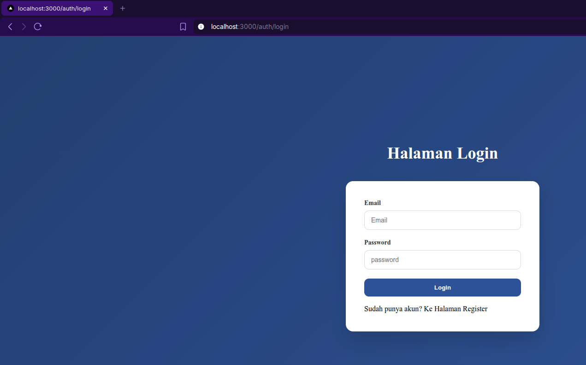

**(sesudah login)**
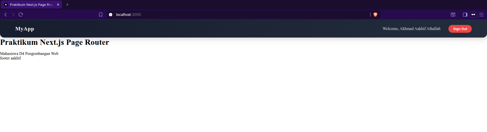

## BAGIAN 5 – Callback URL Logic

Lalu saya sekarang memodifikasi file `withAuth.ts` pada folder `src/middleware/`, dan kodenya adalah seperti berikut,

_(melakukan edit di baris 23 - 25)_
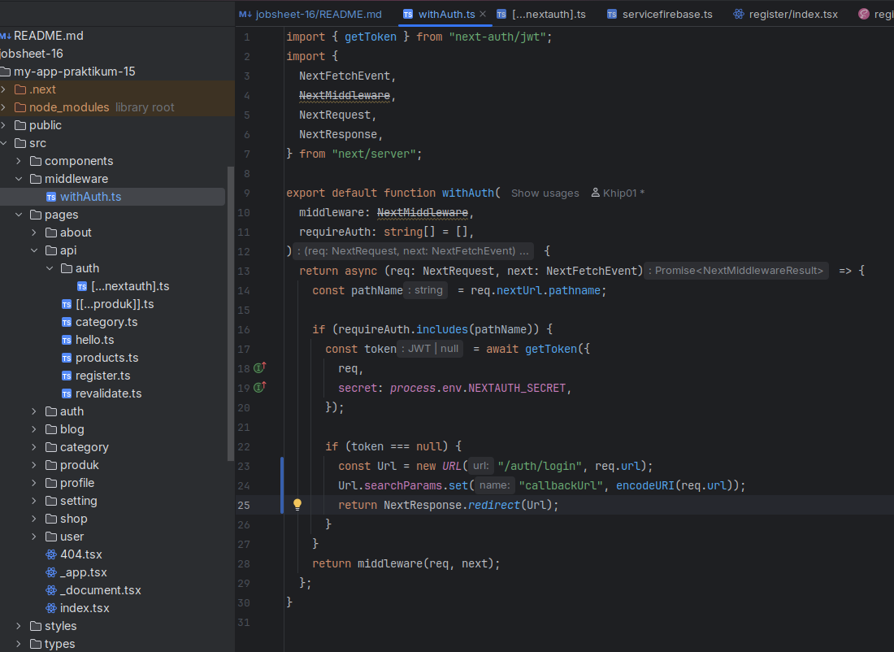

Tujuannya pada saat user setelah login bisa kembali ke halaman sebelumnya yang ia akses.

## BAGIAN 6 – Membuat halaman Admin dan authorize

Setelah itu saat ini saya mencoba membuat halaman admin di direktori `/pages/admin/`, seperti berikut,

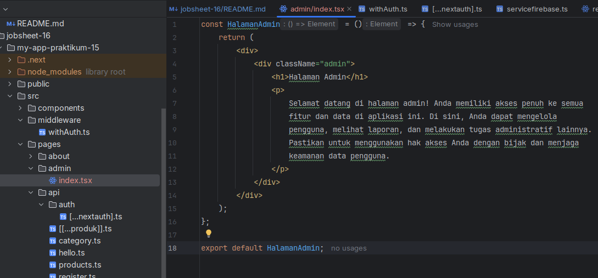

Setelah itu saya memodifikasi kode di file `withAuth.ts` menjadi seperti berikut,

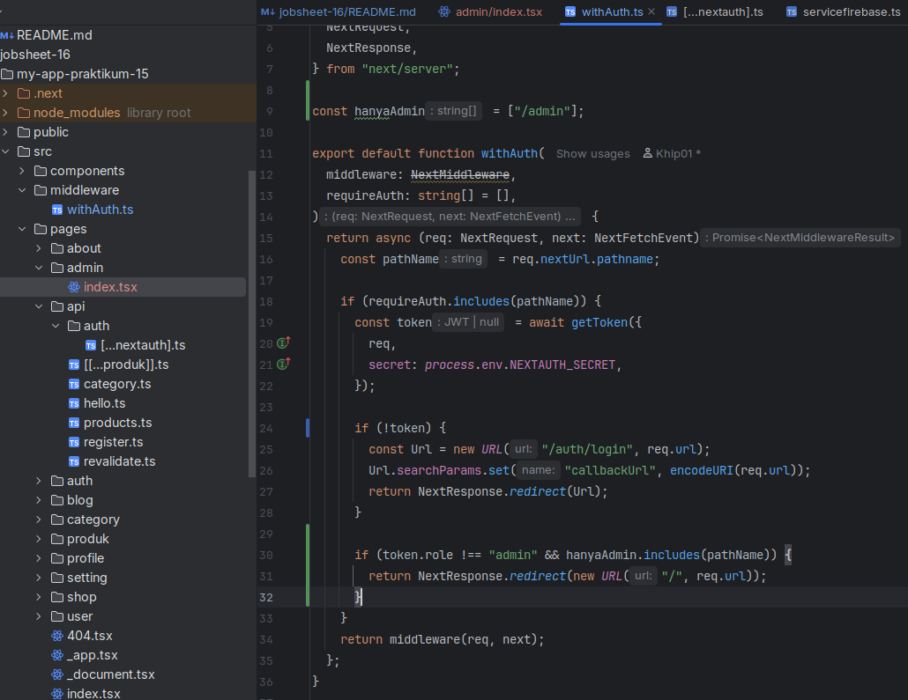

tujuannya agar path/url `/admin` dapat diakses oleh pengguna yanbg memiliki role `admin`.

Sehingga pada saat kita mencoba mengakses halaman admin, yang padahal role kita sendiri adalah `user` alias **bukan
admin**, maka kita akan dipentalkan ke halmaan utama `/` seperti berikut,

**(role saya adalah `user`)**

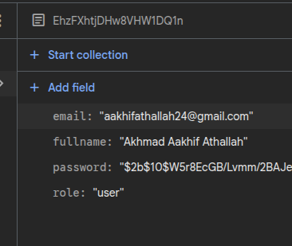

Setelah itu saya mencoba memodifikasi role saya sendiri menjadi seorang admin lewat firestore database langsung,

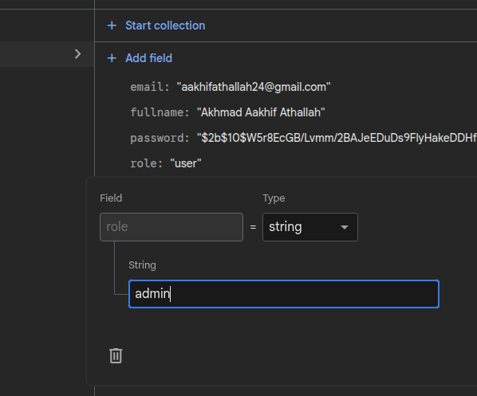

setelah itu saya mencoba mengakses path `/admin` kembali,

Terlihat jika saya bisa mengakses path admin setelah mengubah role saya menjadi seorang admin.

# D. Pengujian

## Uji 1 – Login Valid

Input:

- Email benar
- Password benar

> Hasil:
>
> - Login berhasil
> - Redirect sesuai callbackUrl

### **Jawab**

Jadi saya sebelumnya mencoba mengakses url `/admin` tetapi saya mendapati diarahkan ke halaman login seperti berikut,

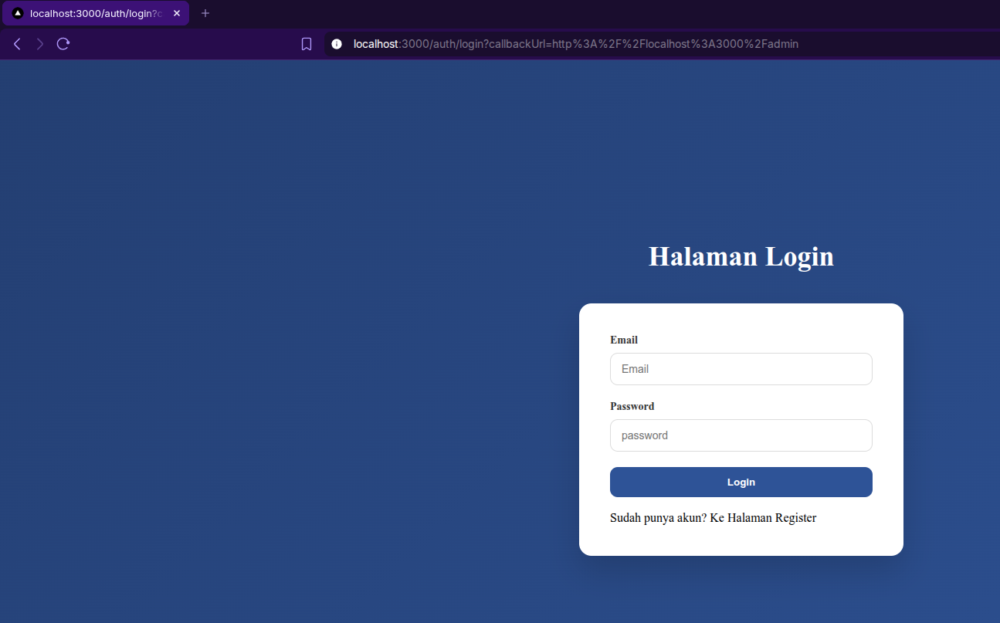

terlihat jika callback tampil di url, setelah login berhasil saya diarahkan lagi ke halaman `/admin`,

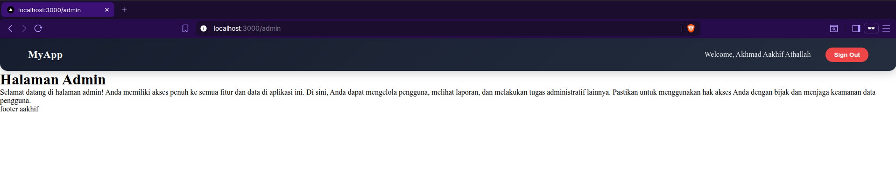

## Uji 2 – Password Salah

Input:

- Email benar
- Password salah

> Hasil:
>
> - Error message tampil
> - Tidak login

### **Jawab**

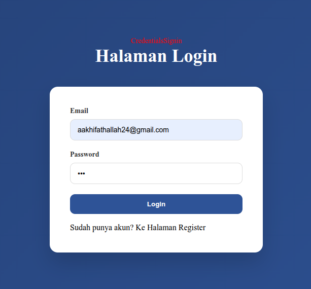

Terlihat jika terjadi error kredensial signin

## Uji 3 – Akses Admin sebagai User

Login sebagai:

- role: `user`

Akses: `/admin`

> Hasil:
>
> - Redirect ke home

### **Jawab**

**(role saya adalah `user`)**

## Uji 4 – Akses Admin sebagai Admin

Login sebagai:

- role: `admin`

Akses: `/admin`

> Hasil:
>
> - Bisa masuk halaman admin

### **Jawab**

**(role saya adalah `admin`)**

