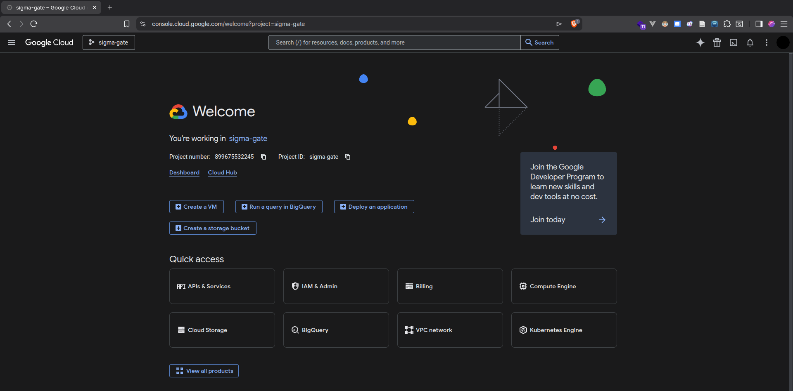
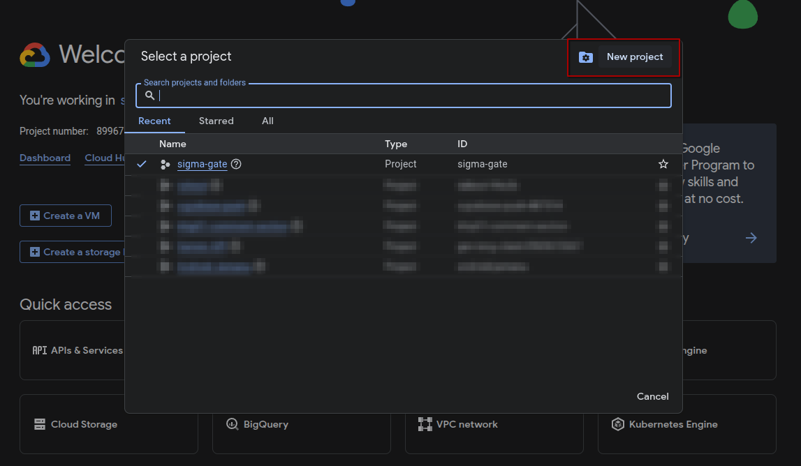
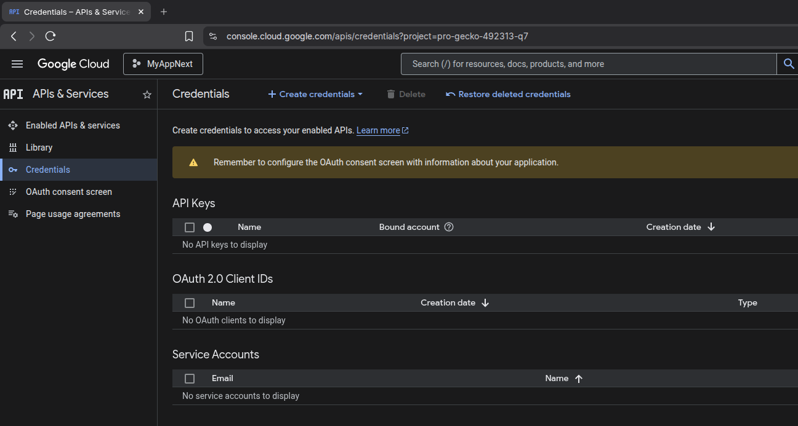
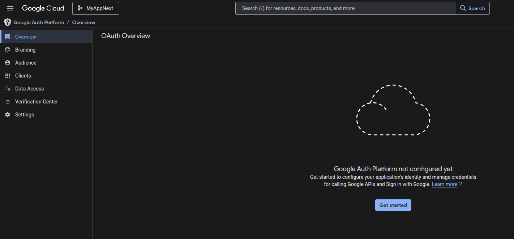
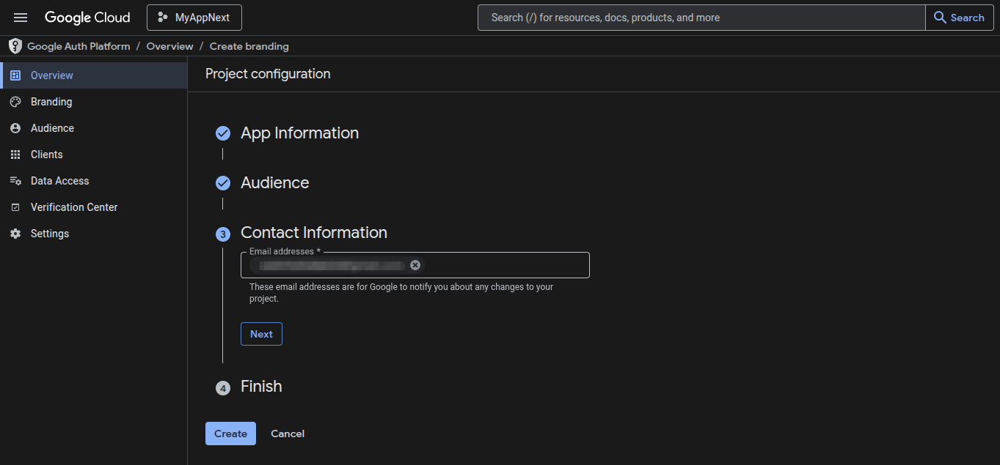
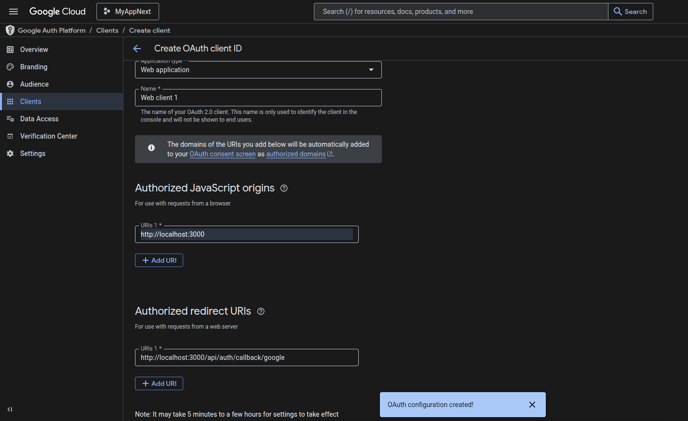
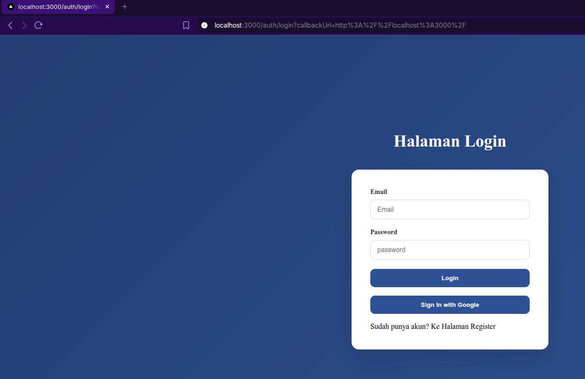
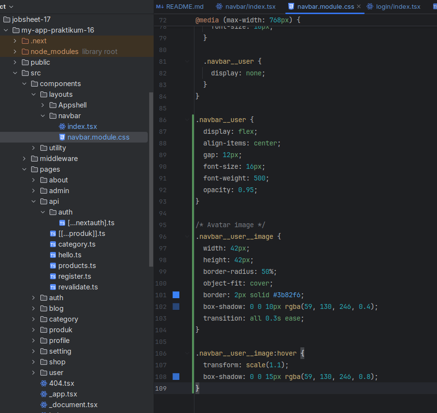
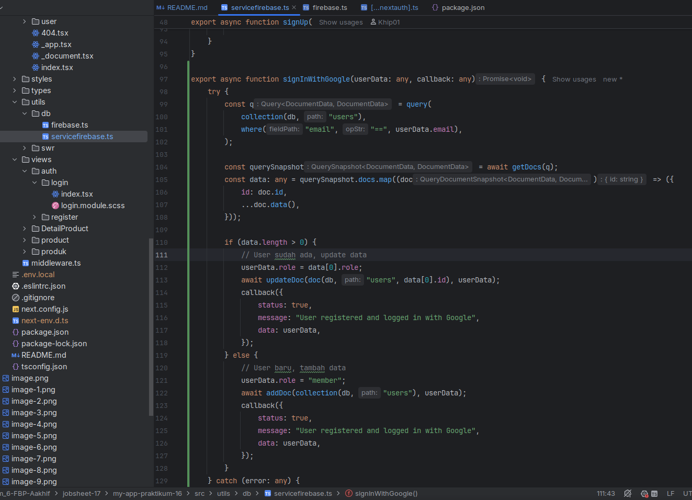
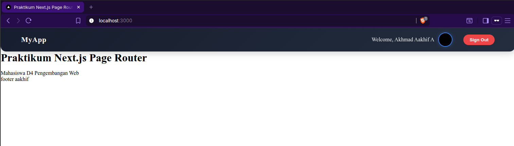

# B. Konfigurasi Google OAuth

Sekarang saya mencoba untuk melakukan konfigurasi Google OAuth di website Google Cloud Console,

## Langkah 1 - Masuk ke Google Cloud Console Buka

## Langkah 2 – Buat Project Baru

Lalu sekarang saya mencoba untuk membuat project baru,

Memberikan nama project,

Lalu saya menuju ke halaman credentials dari project `MyAppNext`,

## Langkah 3 – Konfigurasi OAuth Consent Screen

Lalu saya melakukan konfigurasi OAuth Consent Screen,

Lalu saya menekan tombol `Get started`, dan saya mendapati halaman seperti berikut,

## Langkah 4 – Buat OAuth Credentials

Lalu saya membuat OAuth Clients seperti berikut,

# C. Tambahkan Environment Variables

Saya melakukan copy paste Client ID yang sudah saya buat ke .env project seperti berikut,

# D. Konfigurasi Google Provider di NextAuth dan Handle Callback JWT & Session

Lalu setelah saya mendapatkan Client ID dari OAuth, saya modifikasi fiel `[...nextauth].ts` pada direktori `api/auth/`
menjadi seperti berikut,

![tampilan kode [..nextauth].ts seletah modifkasi](image-13.png)

![tampilan kode [..nextauth].ts seletah modifkasi](image-14.png)

# E. Tambahkan Button Login Google

Lalu setelah mengkonfigurasi google client di api, saya mencoba memodifikasi halaman login saya di file `index.tsx` pada
direktori `views/auth/login` dengan tombol login menggunakan google seperti berikut,

Dan hasil tampilannya adalah seperti berikut,

Lalu saya modifikasi lagi untuk halaman `index.tsx` dari navbar di direktori `components/layouts/navbar/` dengan
menampilkan gambar/profil picture seperti berikut,

# G. Simpan Data Google ke Database

Setelah itu saya ingin menambahkan proses untuk menyimpan data akun google ke firestore database pada saat pengguna
login menggunakan provider google (bukan login biasa), jadi tidak hanya sekadar di state jwt saja.

Pertama-tama saya mememperbarui kode `servicefirebase.ts` untuk membuat fungsi baru untuk menyimpan ke database,

Lalu saya memanggilnya di file `[...nextauth].ts` seperti berikut,

![tampilan kode [...nextauth].ts](image-21.png)

Setelah itu saya mencoba menjalankan browser dengan sign-in menggunakan provider google, tetapi sebelumnya data saya di
firebase adalah seperti ini (sebelum login menggunakan akun google),

Lalu saya coba login menggunakan akun google,

# H. Pengujian

| Skenario                     | Hasil yang Diharapkan       | Bukti Screenshot                                                             |
|:-----------------------------|:----------------------------|:-----------------------------------------------------------------------------|
| Login Google pertama kali    | Data tersimpan di Firestore |                      |
| Login Google kedua kali      | Data diupdate               |                        |
| User role user akses /admin  | Redirect                    |  |
| User role admin akses /admin | Bisa masuk                  |      |
| Avatar tampil                | Ya                          |                      |

# Analisis & Diskusi

### 1. Apa perbedaan login credential dan login Google?

#### **Jawab**

Jika login credentials maka kita dibebaskan untuk login menggunakan akun email selain akun google `@gmail.com`. Tetapi
jika login menggunakan provider google, maka kita hanya bisa login menggunakan akun google `@gmail.com`.

### 2. Mengapa data Google tetap perlu disimpan ke database?

#### **Jawab**

Karena tetap berguna digunakan untuk mendata perubahan informasi dari pengguna.

### 3. Apa fungsi JWT callback?

#### **Jawab**

Fungsi "Callback JWT" dalam auth ini (di kasus ini) bertujuan untuk melakukan pembaruan state JWT dan penyimpanan
kredensial hasil autentikasi ke database.

### 4. Mengapa perlu multi-role?

#### **Jawab**

Karena untuk membatasi hak akses yang ada pada website kita untuk masing-masing user.

### 5. Apa risiko jika tidak menyimpan user ke database?

#### **Jawab**

Maka nantinya kita akan kesulitan pada saat ingin menampilkan profil pengguna ataupun melakukan validasi
role/kredensial.