# PRAKTIKUM 1 – Image Optimization

## A. Optimasi Gambar Lokal (Public Folder)

Sekarang saya ingin mengganti gambar notfound 404 di file `404.tsx` dengan menggunakan tag `<Image>` bawaan `next/image`
seperti berikut,

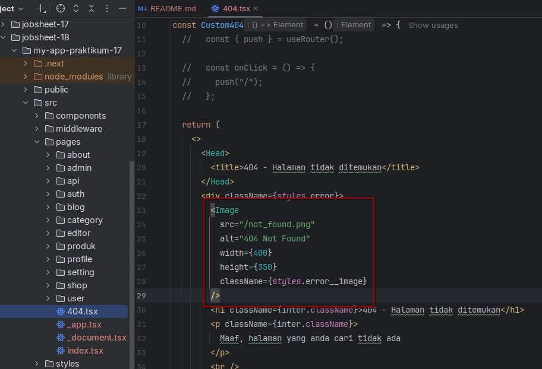

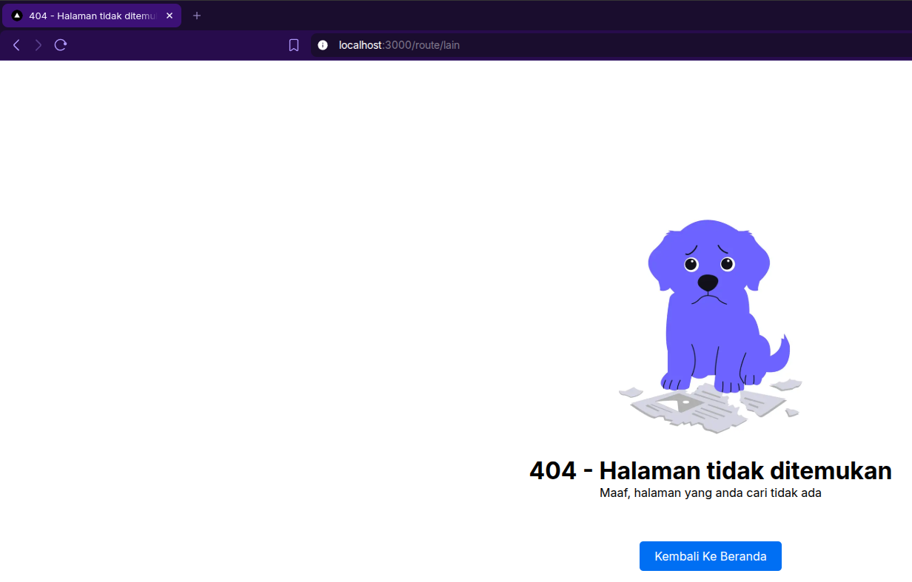

## B. Optimasi Gambar Remote (External URL)

Setelah itu saya melakukan optimasi gambar dari eksternal, contohnya di halaman `/produk`, maka saya melakukan
modifikasi di file `/views/product/index.tsx` seperti berikut,

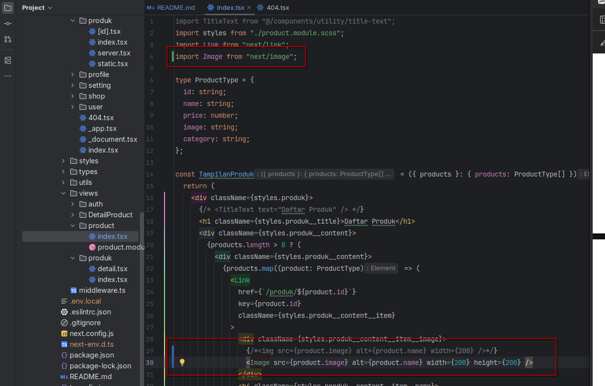

Setelah itu dikarenakan gambar-gambarnya diambil dari url tertentu, maka konfigurasi nya berbeda di file
`next.config.js` nya seperti berikut,

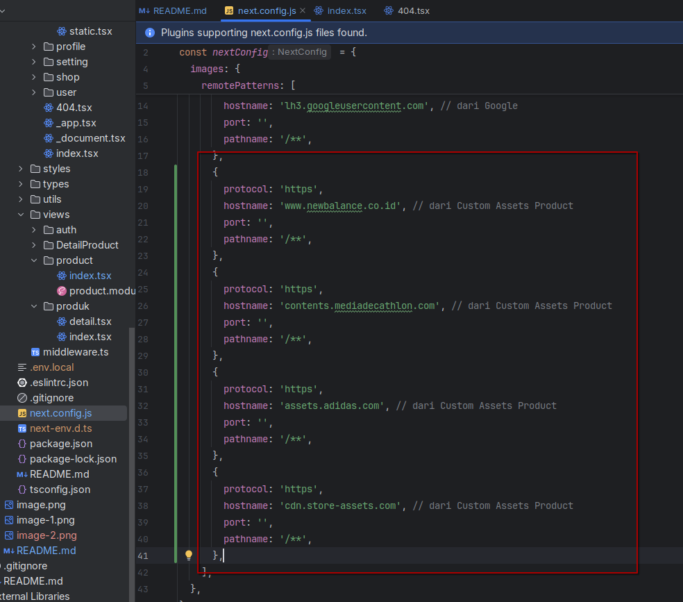

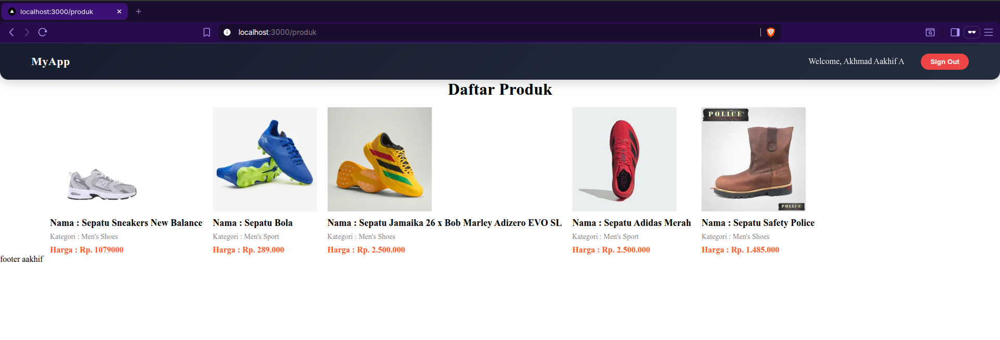

# PRAKTIKUM 2 – Font Optimization

## A. Menggunakan next/font

Lalu sekarang saya melakukan font optimization di sisi parent (yaitu via `Appshell`), sehingga seluruh font dari konten
akan berubah. Jadi saya akan memodifikasi file `/components/layouts/Appshell/index.tsx` seperti berikut,

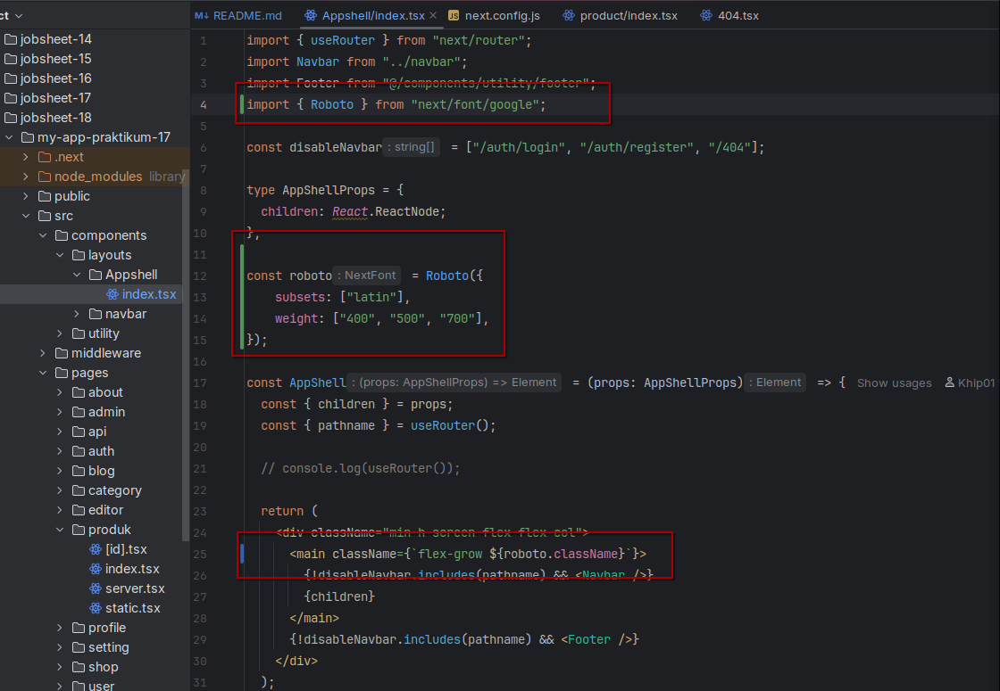

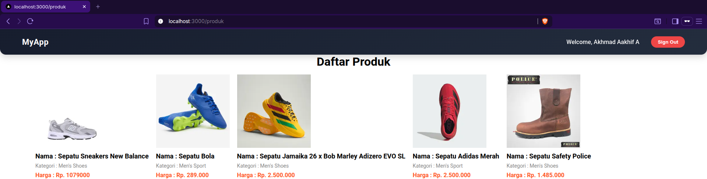

# PRAKTIKUM 3 – Script Optimization

## B. Menggunakan next/script

Lalu saya melakukan optimisasi lagi di bagian loading sebuah teks `"MyApp"` yang awalnya ditulis langsung didalam tag
`
`, dengan cara menuliskan strategy `lazyOnload` didalam tag `<Script>` bawaan `next/script`, sehingga teks
`"MyApp"` akan di load setelah semua sumber daya utama dari konten website selesai (alias terakhir),

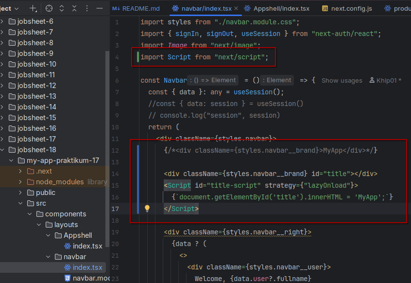

Jadi itu adalah salah satu implementasi tag `<Script>` bawaan `next/script` sebagai sarana lazyOnload pada sebuah
konten.

# PRAKTIKUM 4 – Optimasi Avatar dengan next/image

Saya sudah melakukan optimisasi avatar yang ada pada navbar seperti berikut,

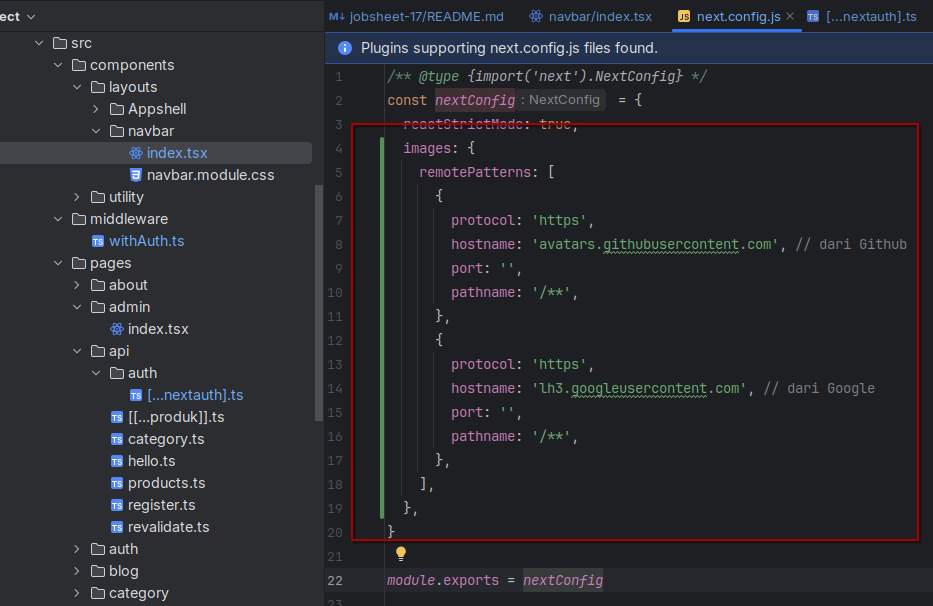

# Tugas Praktikum

### 1. Optimasi semua image di project menggunakan next/image

#### **Jawab**

Saya sudah melakukan optimasi semua image di project menggunakan next/image,

> **halaman 404 notfound** \
> 

> **tampilan preview image pada `/produk`** \
> 

> **tampilan avatar pada navbar**
> 

### 2. Gunakan minimal 1 font dari next/font

#### **Jawab**

Disini saya sudah menggunakan font yaitu `roboto`,

### 3. Tambahkan script Google Analytics menggunakan next/script

#### **Jawab**

Jadi saya mencoba memasang Google Analytics ini di file `_app.tsx` seperti berikut,

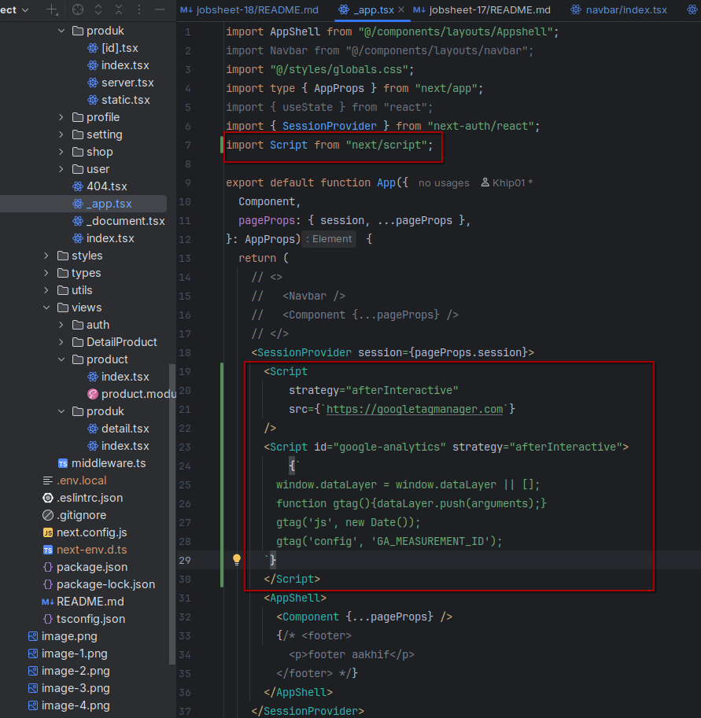

### 4. Terapkan dynamic import pada minimal 1 komponen

#### **Jawab**

Karena disini terdapat komponen yang kurang begitu banyak berinteraksi dengan pengguna yaitu komponen `footer`, sehingga
saya memilih footer sebagai komponen dinamis, sehingga saya modifikasi kode di file `Appshell/index.tsx` seperti
berikut,

> **Sebelum menggunakan footer dynamic component**
> 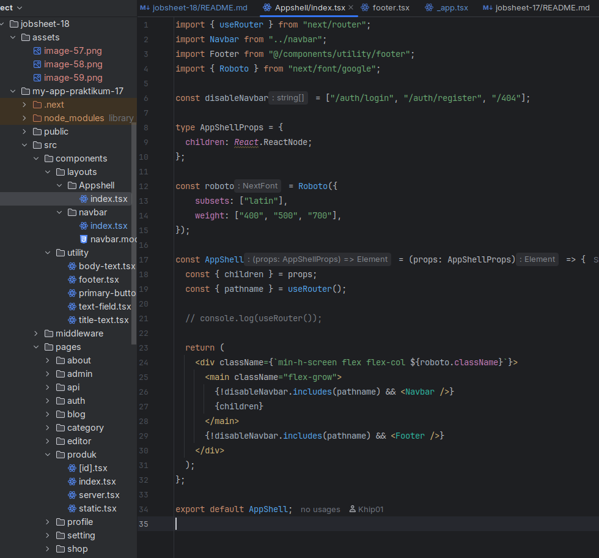

> **Sesudah menggunakan footer dynamic component**
> 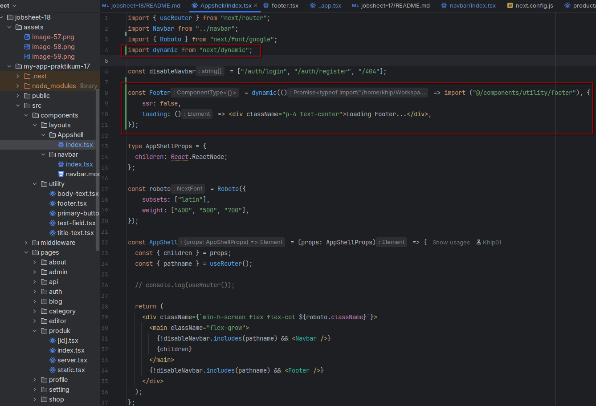

Jadi setelah menambahkan dynamic import di komponen footer, maka import untuk **komponen footer tidak perlu langsung
dimuat** ketika halaman pertama kali dimuat.

### 5. Dokumentasikan perubahan performa (screenshot Lighthouse)

#### **Jawab**

Lalu saya melakukan testing performa dari beberapa halaman dari website,

> **Tampilan hasil testing performa halaman utama `/`** \
> 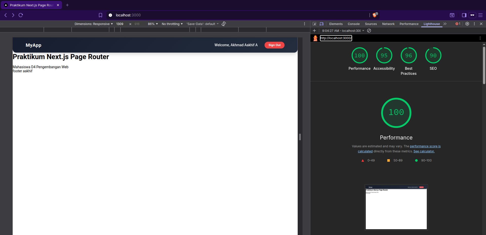

> **Tampilan hasil testing performa halaman `/produk/static`** \
> 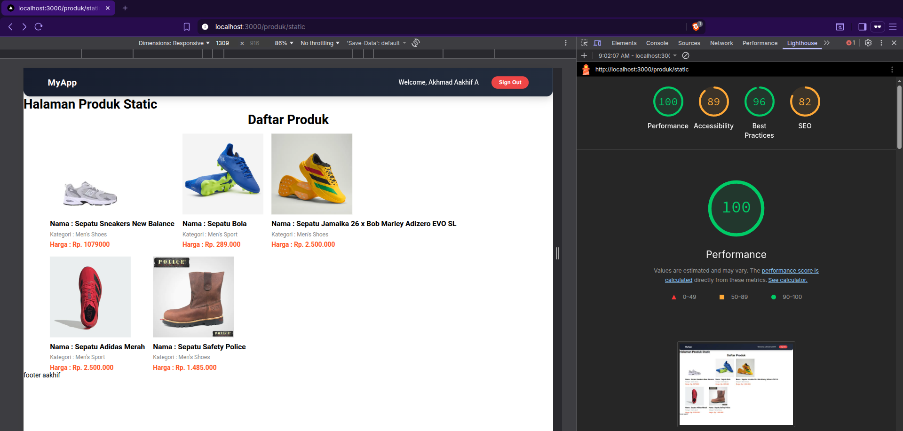

> **Tampilan hasil testing performa halaman `/produk`** \
> 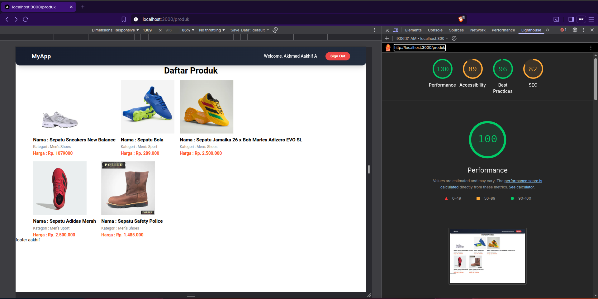

> **Tampilan hasil testing performa halaman notfound `(error 404)`** \
> 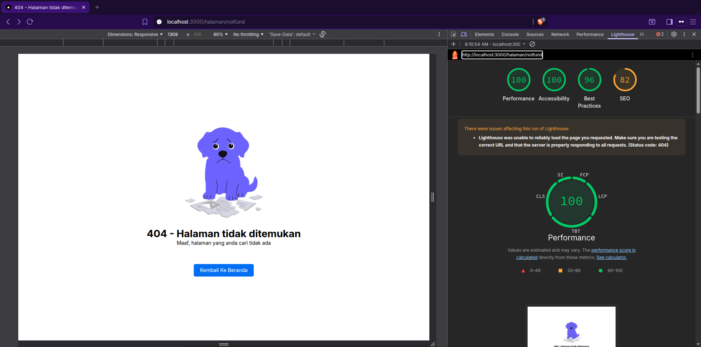

> **Tampilan hasil testing performa halaman `/about`** \
> 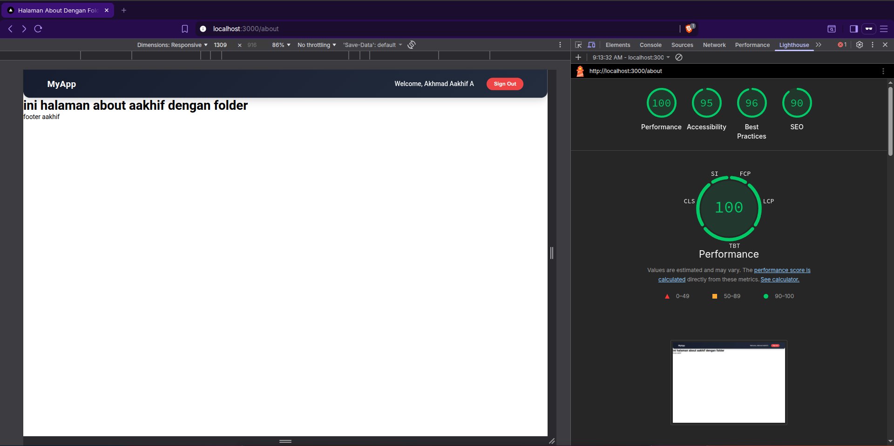

> **Tampilan hasil testing performa halaman `/admin` (dengan proses rintangan validasi di middleware nya)** \
> 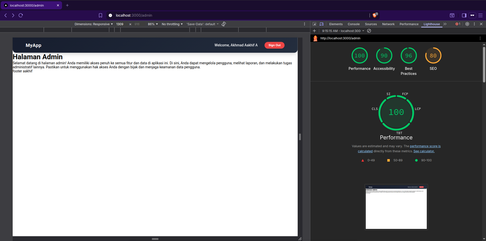
