# PRAKTIKUM 1 – Setup Jest di Next.js

Pertama-tama saya menginstall library seperti berikut untuk melakukan testing,

```bash
npm install jest jest-environment-jsdom @testing-library/react @testing-library/jest-dom --save-dev --force
```

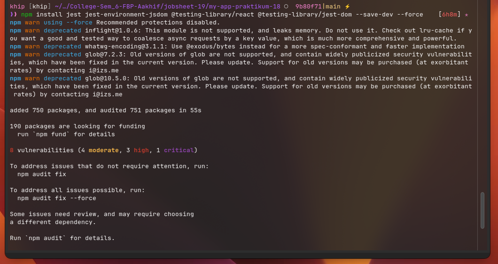

Lalu saya membuat file konfigurasi baru bernama `jest.config.mjs` untuk melakukan testing,

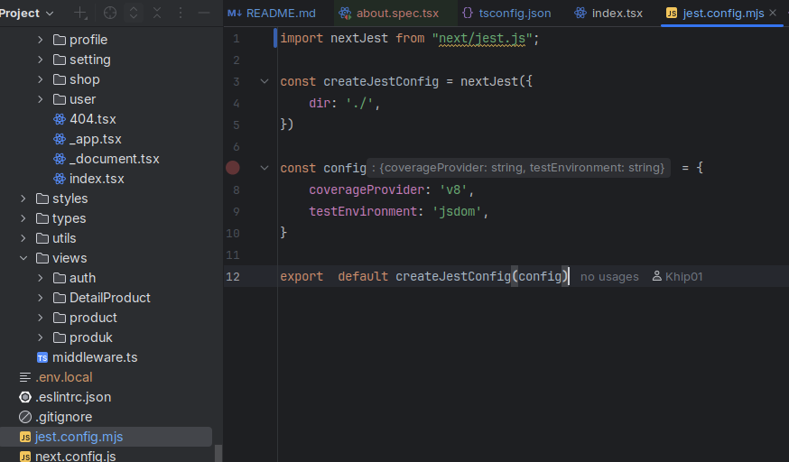

Lalu saya menambahkan test coverage nya di `package.json` bagian `scripts`,

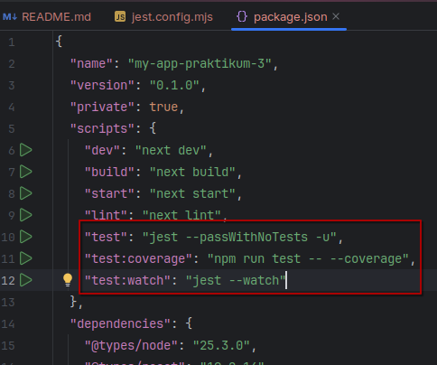

# PRAKTIKUM 2 – Struktur Folder Testing

Lalu saya membuat folder bernama `__test__` didalam direktori `src/` seperti berikut,

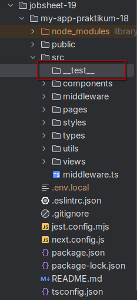

# PRAKTIKUM 3 – Testing Halaman About

Lalu saya mencoba membuat file testing didalam direktori `src/__test__/pages/about.spec.tsx` seperti berikut,

> [!IMPORTANT]
> Karena saya sempat mendapatkan error mengenai type definition dari fungsi milik `jest` seperti berikut, \
> 
>
> Saya menyelesaikannya dengan cara menginstall package `@types/jest` \
> 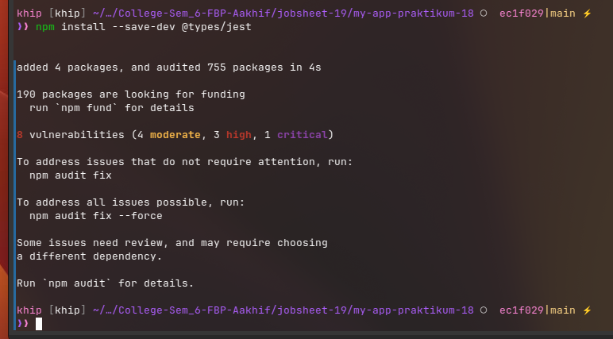
>
> Sehingga tampilannya sudah tidak error seperti berikut, \
> 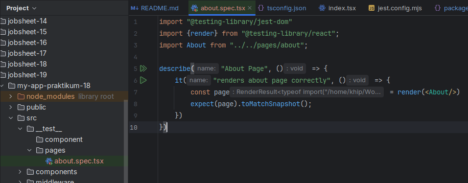

Setelah itu saya coba menjalankan testing dengan menggunakan `npm run test` di konsole/terminal saya seperti berikut,

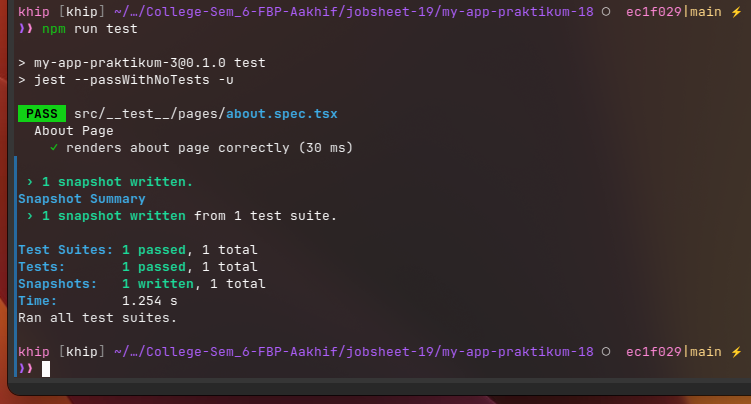

# PRAKTIKUM 4 – Coverage Report

Setelah itu saya mencoba untuk menjalankan test coverage dengan menggunakan perintah `npm run test:coverage` seperti
berikut,

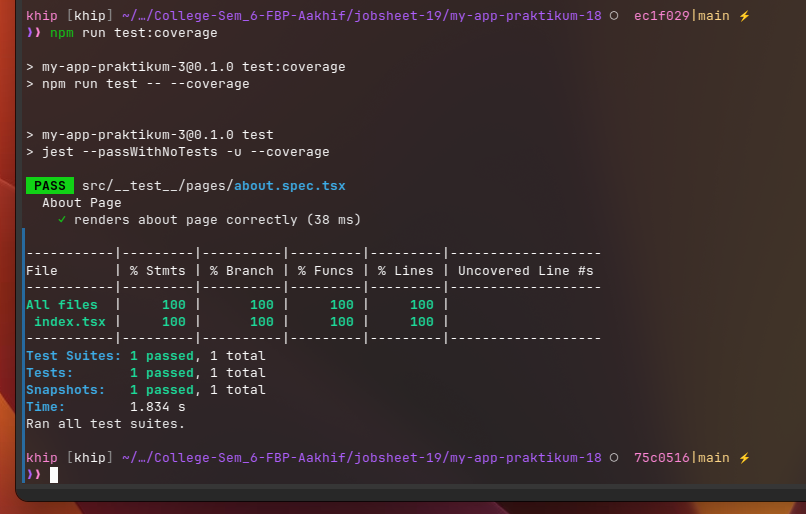

Dan hasil nya saya mendapatkan folder baru bernama `coverage` dan isinya adalah sebagai berikut,


Dan tampilan report versi webnya adalah seperti berikut,

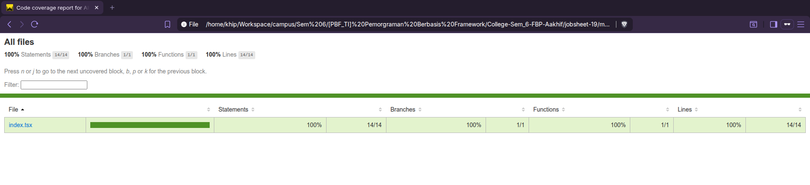

# PRAKTIKUM 5 – Konfigurasi Coverage Lengkap

Lalu saya melakukan modifikasi kode di `jest.config.mjs` untuk melakukan test coverage ke seluruh isi dari direktori
`/<rootDir>/src/` seperti berikut,

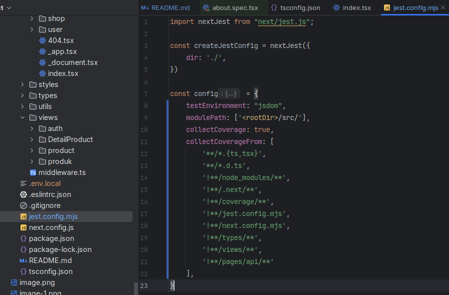

Dan setelah itu saya jalankan `npm run test:coverage` lagi di konsole/terminal saya dan hasilnya seperti berikut,

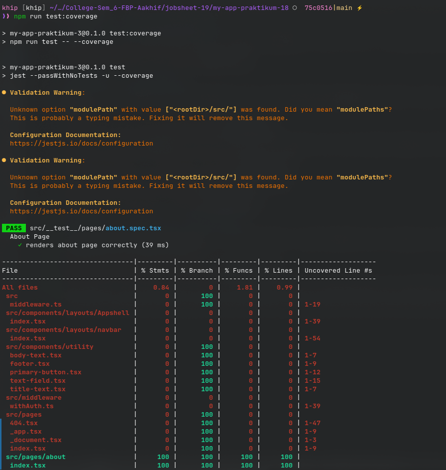


Untuk tampilan dari `index.html` nya adalah seperti berikut,


# PRAKTIKUM 6 – Testing dengan getByTestId

Saya mencoba untuk menambahkan atribut `data-testid` pada kode html `about/index.tsx` seperti berikut,


Lalu saya update kode testing `about.spec.tsx` nya untuk melakukan test atribut `data-testid` seperti berikut,

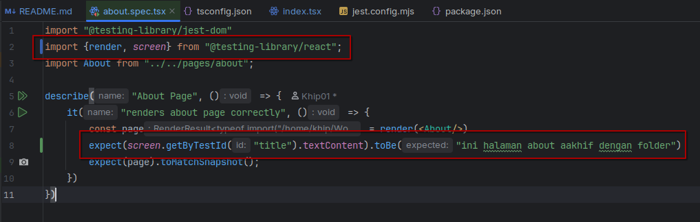

Setelah itu saya run kembali `test:coverage` nya seperti berikut,


Coba misal saya salahkan expected value nya menjadi seperti berikut,


Lalu saya coba jalankan lagi `test:coverage` nya,


Terlihat jika hasil testing nya ada yang gagal/tidak sesuai ekspektasi.

# PRAKTIKUM 7 – Testing Page dengan Router (Mocking)

Lalu saya mencoba untuk melakukan testing halaman produk,

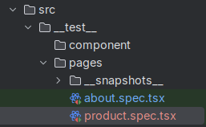


Tapi hasilnya error karena undefined data,

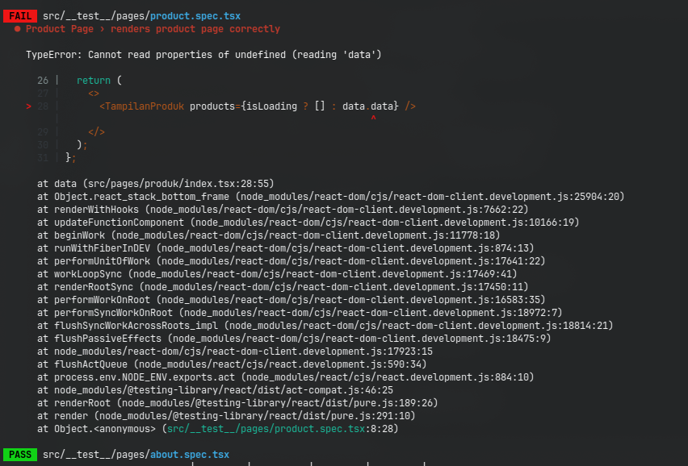

# PRAKTIKUM 8 – Menangani Undefined Data

Untuk menyelesaikan masalah error **undefined data** tersebut, saya melakukan beberapa modifikasi seperti berikut,

> **kode `/pages/produk/index.tsx`**
> 

> **kode `/views/product/index.tsx`**
> 

> **kode `about.spec.tsx` dan `product.spec.tsx`**
> 

Setelah itu saya coba jalankan lagi untuk `test:coverage` nya, dan hasilnya adalah seperti berikut,


