# PRAKTIKUM 1 – Setup Jest di Next.js

Pertama-tama saya menginstall library seperti berikut untuk melakukan testing,

```bash
npm install jest jest-environment-jsdom @testing-library/react @testing-library/jest-dom --save-dev --force
```


Lalu saya membuat file konfigurasi baru bernama `jest.config.mjs` untuk melakukan testing,


Lalu saya menambahkan test coverage nya di `package.json` bagian `scripts`,


# PRAKTIKUM 2 – Struktur Folder Testing

Lalu saya membuat folder bernama `__test__` didalam direktori `src/` seperti berikut,


# PRAKTIKUM 3 – Testing Halaman About

Lalu saya mencoba membuat file testing didalam direktori `src/__test__/pages/about.spec.tsx` seperti berikut,

> [!IMPORTANT]
> Karena saya sempat mendapatkan error mengenai type definition dari fungsi milik `jest` seperti berikut, \
> 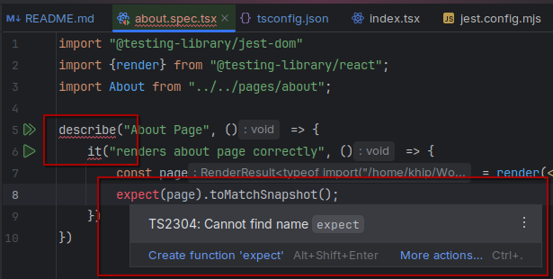
>
> Saya menyelesaikannya dengan cara menginstall package `@types/jest` \
> 
>
> Sehingga tampilannya sudah tidak error seperti berikut, \
> 

Setelah itu saya coba menjalankan testing dengan menggunakan `npm run test` di konsole/terminal saya seperti berikut,


# PRAKTIKUM 4 – Coverage Report

Setelah itu saya mencoba untuk menjalankan test coverage dengan menggunakan perintah `npm run test:coverage` seperti
berikut,


Dan hasil nya saya mendapatkan folder baru bernama `coverage` dan isinya adalah sebagai berikut,


Dan tampilan report versi webnya adalah seperti berikut,


# PRAKTIKUM 5 – Konfigurasi Coverage Lengkap

Lalu saya melakukan modifikasi kode di `jest.config.mjs` untuk melakukan test coverage ke seluruh isi dari direktori
`/<rootDir>/src/` seperti berikut,


Dan setelah itu saya jalankan `npm run test:coverage` lagi di konsole/terminal saya dan hasilnya seperti berikut,


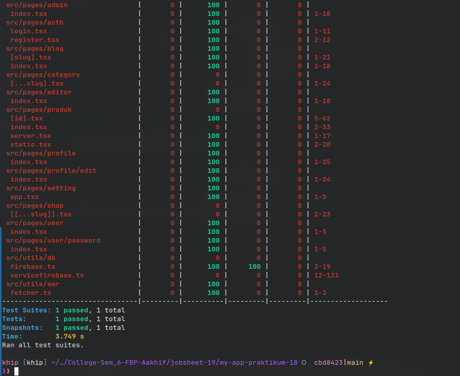

Untuk tampilan dari `index.html` nya adalah seperti berikut,

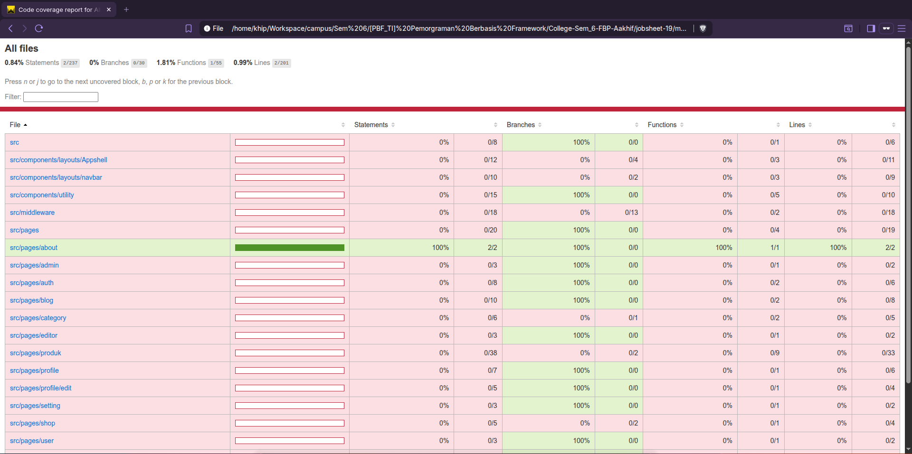

# PRAKTIKUM 6 – Testing dengan getByTestId

Saya mencoba untuk menambahkan atribut `data-testid` pada kode html `about/index.tsx` seperti berikut,

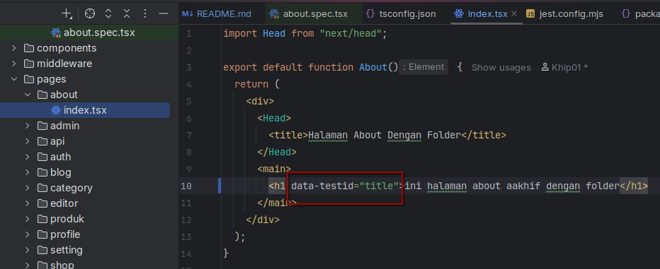

Lalu saya update kode testing `about.spec.tsx` nya untuk melakukan test atribut `data-testid` seperti berikut,


Setelah itu saya run kembali `test:coverage` nya seperti berikut,

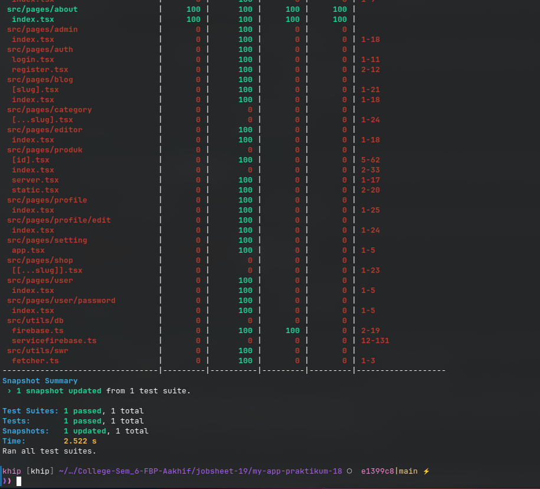

Coba misal saya salahkan expected value nya menjadi seperti berikut,

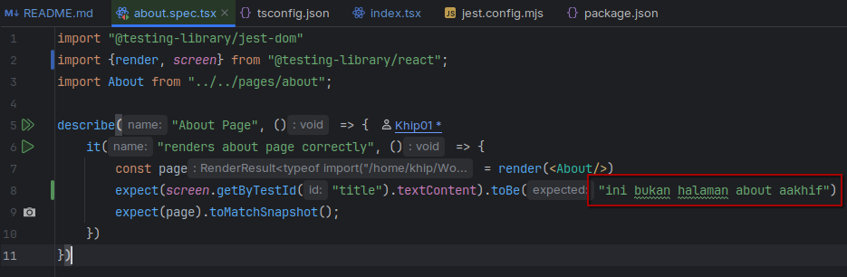

Lalu saya coba jalankan lagi `test:coverage` nya,

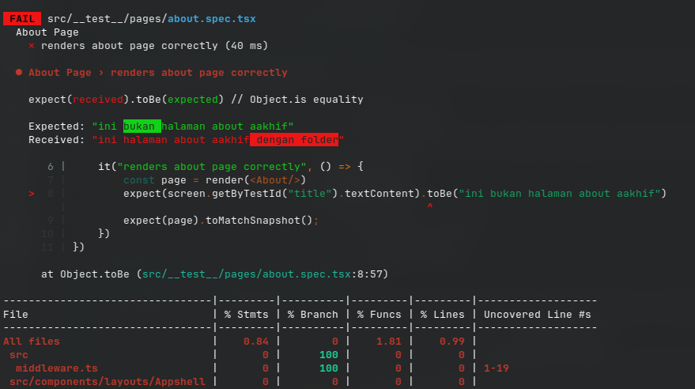

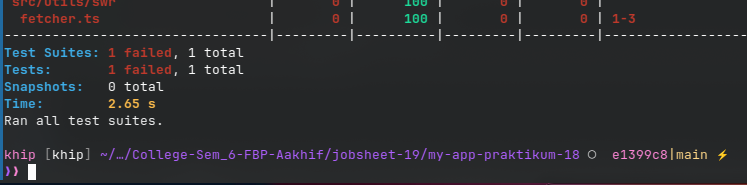

Terlihat jika hasil testing nya ada yang gagal/tidak sesuai ekspektasi.

# PRAKTIKUM 7 – Testing Page dengan Router (Mocking)

Lalu saya mencoba untuk melakukan testing halaman produk,


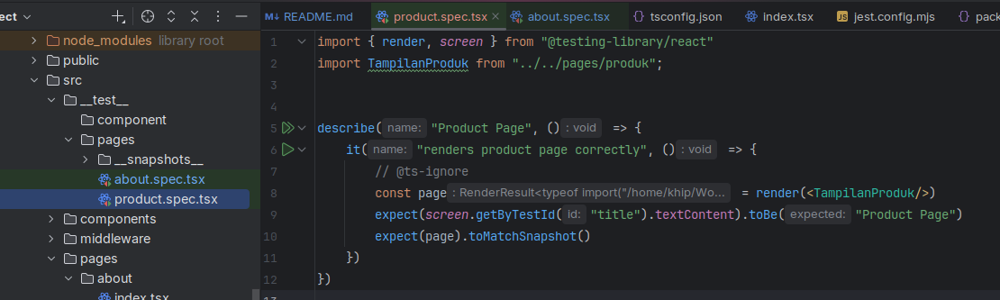

Tapi hasilnya error karena undefined data,


# PRAKTIKUM 8 – Menangani Undefined Data

Untuk menyelesaikan masalah error **undefined data** tersebut, saya melakukan beberapa modifikasi seperti berikut,

> **kode `/pages/produk/index.tsx`**
> 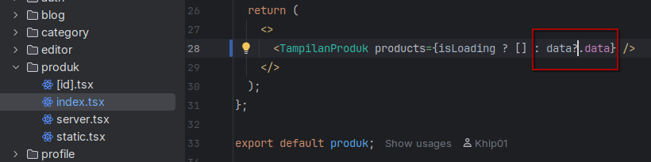

> **kode `/views/product/index.tsx`**
> 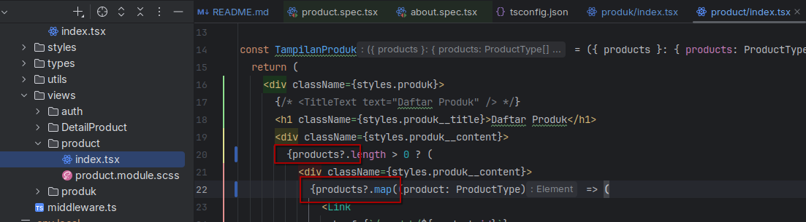

> **kode `about.spec.tsx` dan `product.spec.tsx`**
> 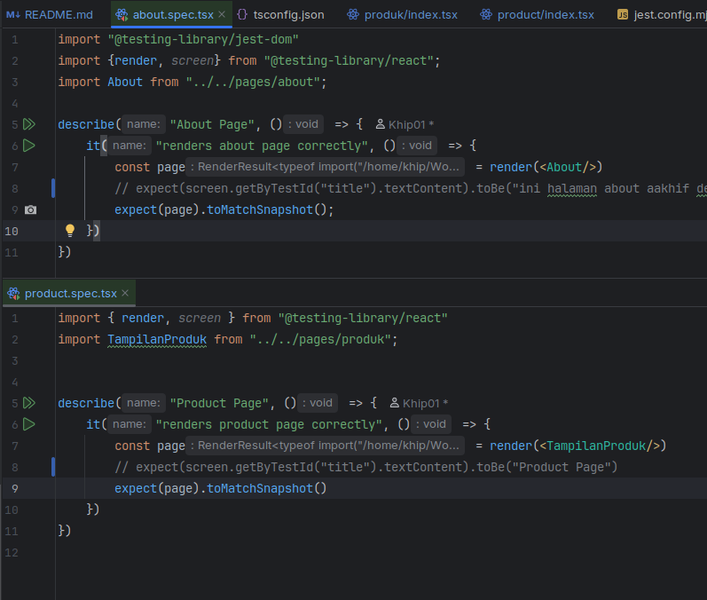

Setelah itu saya coba jalankan lagi untuk `test:coverage` nya, dan hasilnya adalah seperti berikut,

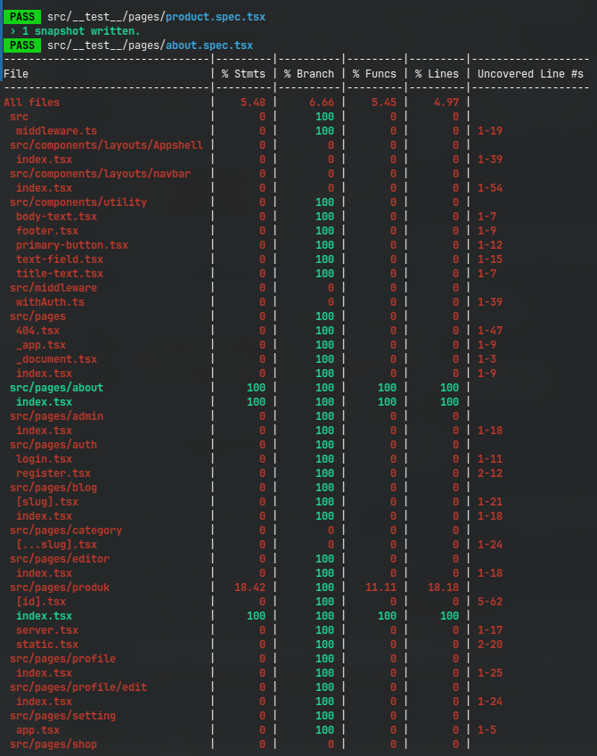
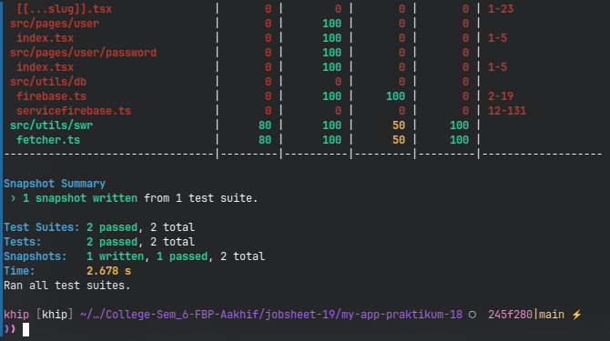

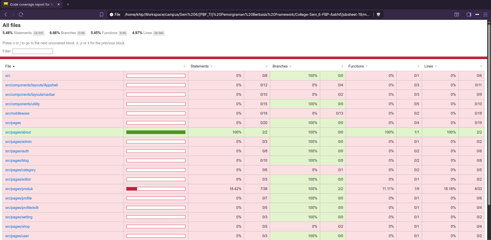

# Tugas Praktikum

### 1. Buat unit test untuk:

    - Halaman Product
    - 1 Komponen

#### **Jawab**

Saya sudah membuat unit test di halaman produk seperti berikut,


### 2. Gunakan minimal:

    - 1 Snapshot test
    - 1 toBe()
    - 1 getByTestId()

#### **Jawab**

Saya sudah mencoba untuk menggunakan beberapa test tersebut seperti ini,


### 3. Buat coverage minimal 50%

#### **Jawab**

Untuk itu saya sudah mencoba melakukan test coverage pada beberapa tampilan berikut saja,

- login
- register
- navbar
- produk
- produk/id
- appshell

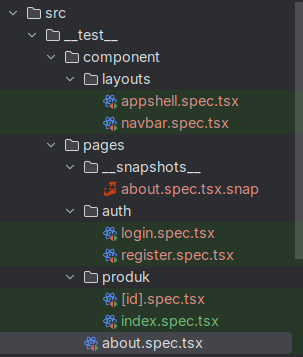

Dan hasilnya adalah seperti berikut,

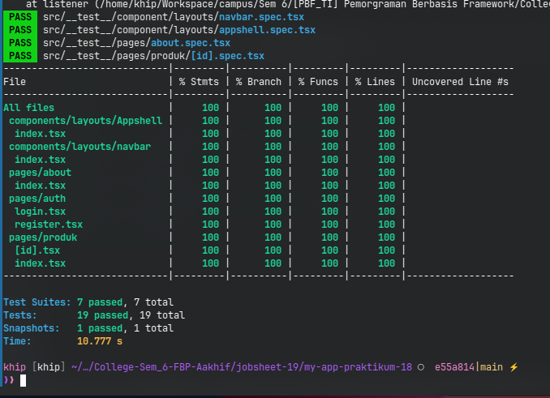

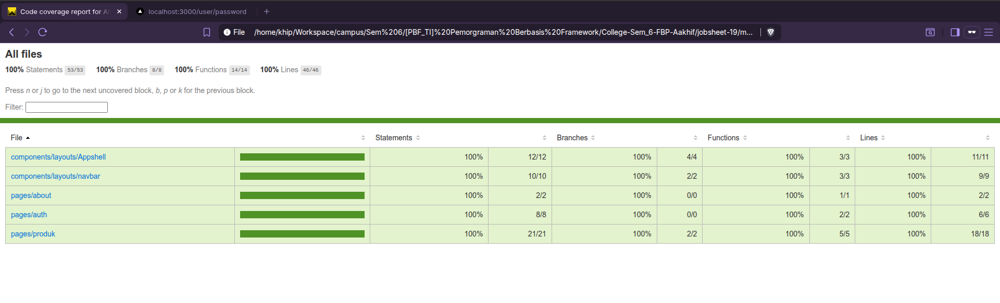

### 4. Lakukan mocking untuk router

#### **Jawab**

Saya sudah mencoba untuk mocking `next/router` seperti berikut,

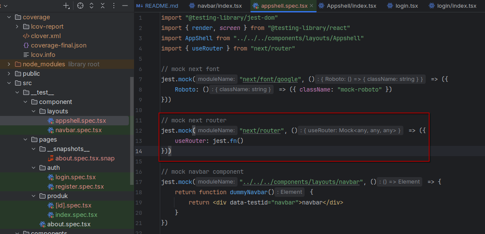

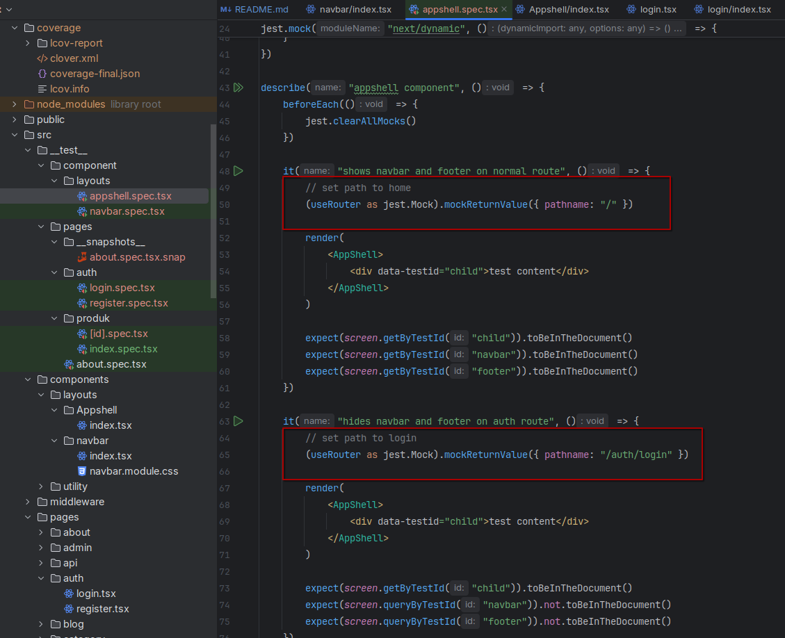

### 5. Dokumentasikan hasil coverage

#### **Jawab**

Hasil akhir test:coverage adalah seperti berikut,

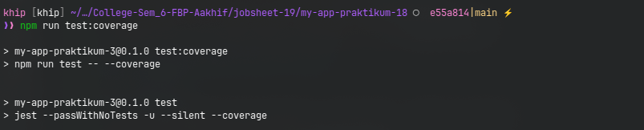 \
 \
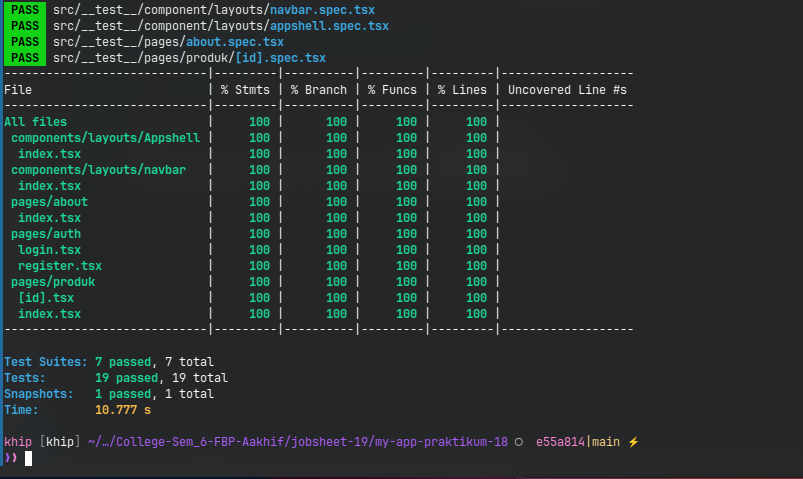

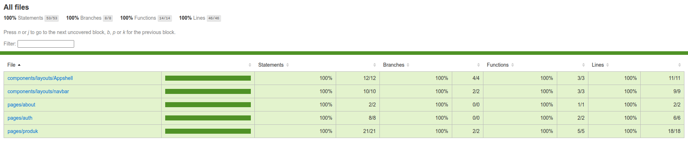

# Diskusi & Refleksi

### 1. Mengapa unit testing penting sebelum production?

#### **Jawab**

Karena bisa membantu untuk membuat hasil perubahan dari tahap development menjadi tetap konsisten dan dapat
dipantau/tracking apabila ada kesalahan/perbedaan yang terjadi setelah tahap development perangkat lunak dilakukan.

### 2. Mengapa branch coverage sulit mencapai 100%?

#### **Jawab**

Jika logika, proses yang dilakukan oleh program yang akan di test terlalu dalam, maka bisa saja kita sulit untuk
mengcover seluruh kemungkinan yang ada sehingga bisa saja mengakibatkan kemungkinan testing terlompati.

Misal dalam kasus nullable data yang terus beruntun, pengkondisian yang mendalam, callback function didalam sebuah
proses, dan sejenisnya yang memiliki kemungkinan yang banyak dan bercabang.

### 3. Apa itu mocking?

#### **Jawab**

Jika dari sudut pandang saya, mocking adalah sebuah pemberian data palsu/data uji pada saat melakukan testing di sebuah
test case. Sehingga pada saat test case dijalankan, data yang digunakan untuk menguji hanyalah data buatan yang dibuat
seolah-olah data tersebut data asli.

### 4. Kapan snapshot test digunakan?

#### **Jawab**

Snapshot Test ini digunakan ketika tampilannya sudah dianggap konsisten, jadi snapshot test ini akan digunakan sebagai
patokan tampilan/proses/fungsi halaman yang sudah stabil.

### 5. Apakah semua file harus dites?

#### **Jawab**

Menurut saya tidak semua, mungkin paling saya rekomendasikan adalah tes halaman-halaman dengan data dinamis, halaman
dengan adanya beberapa hasil kemungkinan yang berbeda, halaman dengan masukan yang bermacam-macam, intinya halaman
dengan isi data/masukan yang bisa berubah-ubah.

Jadi saya pribadi kurang merekomendasikan untuk tes halaman yang tampilannya berupa tampilan statis tanpa ada perubahan
sedikitpun baik dalam tahap pengembangan ataupun tahap deployment.