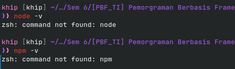
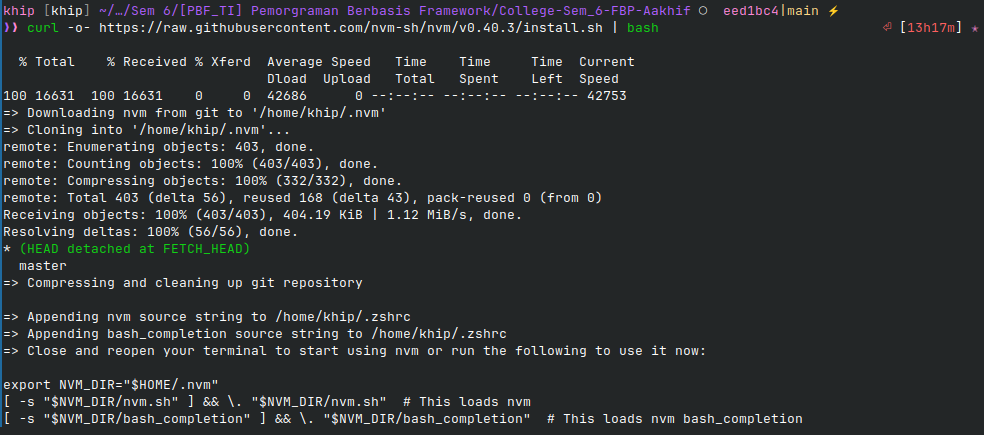
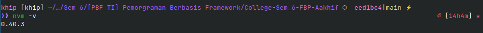
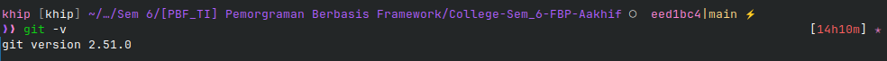
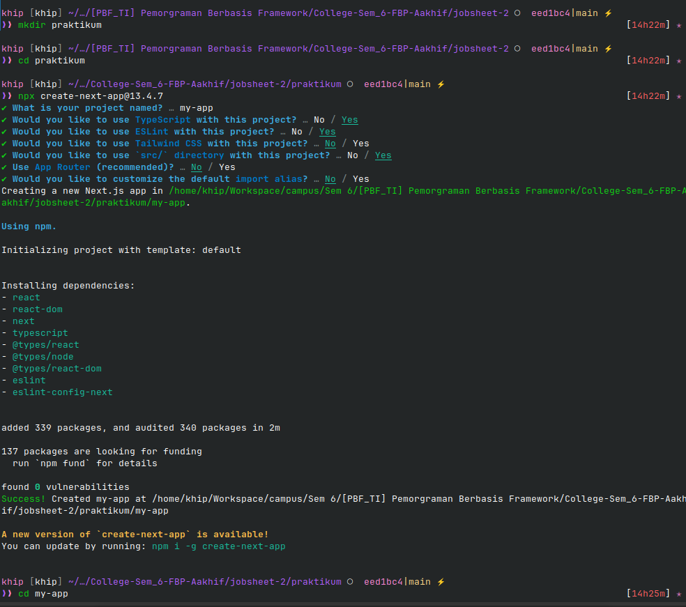
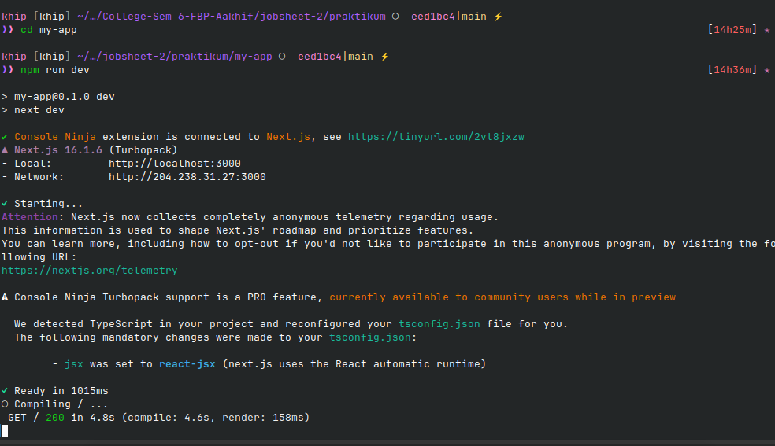
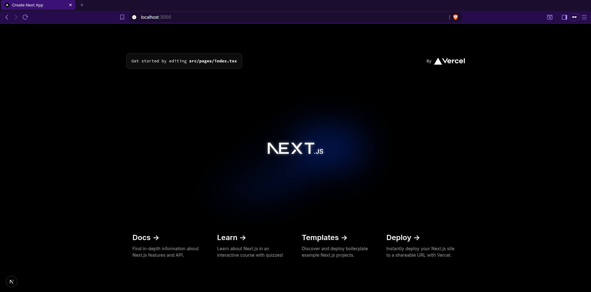
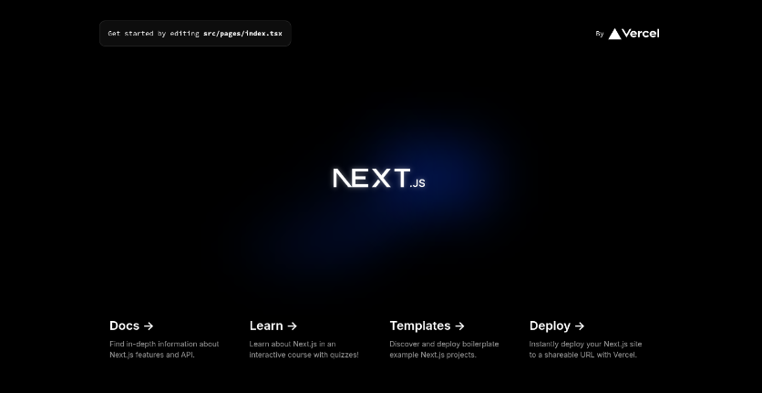
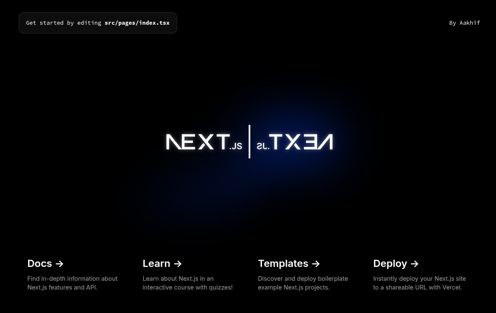

# D. Langkah Kerja Praktikum

## Langkah 1 – Pengecekan Lingkungan

Dikarenakan saya belum menginstall node dan npm 
 

Jadi saya mencoba untuk menginstall nya terlebih dahulu,

## Langkah 2 – Membuat Project Next.js

Saya sudah memuat project baru dengan menggunakan npx (node package execute),

## Langkah 3 – Menjalankan Server Development

Saya menjalankan `npm run dev` dan hasilnya seperti ini,

## Langkah 4 – Mengenal Struktur Folder

Saya sudah memahami sedikit struktur folder dari nextjs ini, dan saya sedikit bermain-main dengan kode di index.tsx, \
Before:

After:
