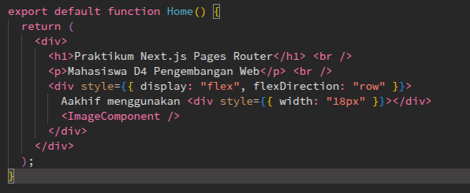
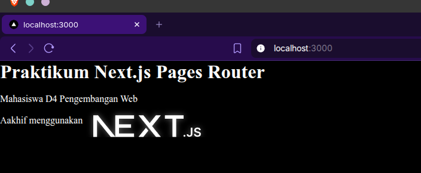
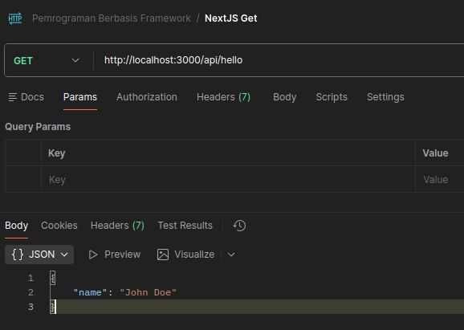
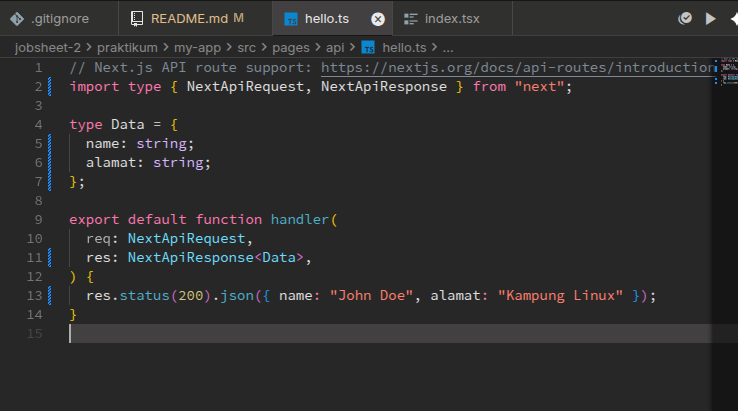
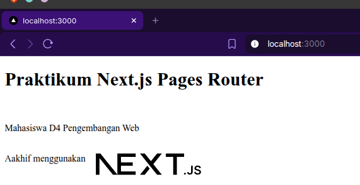
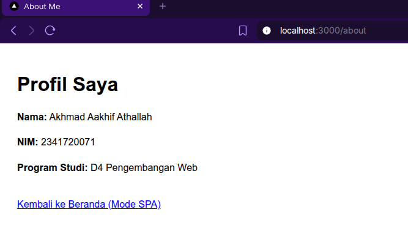
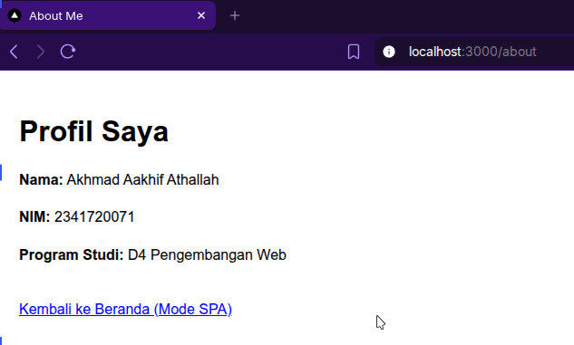

# D. Langkah Kerja Praktikum

## Langkah 1 – Pengecekan Lingkungan

Dikarenakan saya belum menginstall node dan npm

Jadi saya mencoba untuk menginstall nya terlebih dahulu,

## Langkah 2 – Membuat Project Next.js

Saya sudah memuat project baru dengan menggunakan npx (node package execute),

## Langkah 3 – Menjalankan Server Development

Saya menjalankan `npm run dev` dan hasilnya seperti ini,

## Langkah 4 – Mengenal Struktur Folder

Saya sudah memahami sedikit struktur folder dari nextjs ini, dan saya sedikit bermain-main dengan kode di index.tsx, \
Before:

After:

## Langkah 5 – Modifikasi Halaman Utama

Saya mengubah lagi halaman utama nextjs menjadi seperti ini,

dan hasilnya adalah seperti ini,

## Langkah 6 – Modifikasi API

Saya awalnya memiliki api dengan hasil seperti ini,

Lalu saya mengubah kodenya menjadi seperti ini,

dan hasilnya seperti ini,

## Langkah 7 – Modifikasi Background

Saya sudah mengubah background nya jadi putih (itu karena kita tidak menggunakan style css bawaan dari nextjs, import style nya kita nonaktifkan), dan hasilnya adalah seperti berikut,

# E. Tugas Praktikum

## Tugas 1 (Wajib)

- Buat halaman baru about.js di folder pages.
- Tampilkan:
  - Nama Mahasiswa
  - NIM
  - Program Studi

### **Jawab**

Saya sudah membuat halaman baru di file about.js, dan inilah hasilnya,

## Tugas 2 (Pengayaan)

- Tambahkan minimal 1 link navigasi dari halaman utama ke halaman about.

### **Jawab**

Saya sudah menambahkan link navigasi (dengan menggunakan tag `<Link>`) dari halaman beranda ke halaman about, seperti ini lah hasilnya,

# F. Pertanyaan Refleksi

### 1. Mengapa Pages Router disebut sebagai routing berbasis file?

#### **Jawab**

Karena struktur folder dan nama file di dalam direktori pages secara otomatis menentukan route URL dari aplikasi.

### 2. Apa perbedaan Next.js dengan React standar (CRA)?

#### **Jawab**

Perbedaan nextjs dan react app disini adalah seperti berikut,

##### 1. Dari sisi rendering

**React** menggunakan rendering CSR/Client Side Rendering, yang dimana ini mempersulit SEO dari website yang dibuat menggunakan React. Ini dikarenakan pada saat client mengakses halaman React, browser akan mengambil/mendownload halaman kosong terlebih dahulu, lalu React menggenerate nya sembari client mengakses halaman (sehingga client tidak mendapatkan halaman HTML di awal halaman dimuat).

**Next.js** menggunakan SSR/Server Side Rendering, yang dimana Next.js akan menyiapkan HTML terlebih dahulu sebelum dikirim ke sisi client/browser. Sehingga konten/isi HTML sudah siap sebelum client mengambil/mendownload halamannya.

##### 2. Dari sisi routing

**React** menggunakan routing berbasis URL, harus disiapkan routing confignya dengan menginstall library tambahan seperti React Router.

**Next.js** menggunakan routing berbasis file, yang dimana rute halaman akan sesuai dengan susunan file didalam direktori `pages`.

##### 3. Dari sisi arsitektur

**React** merupakan **library** untuk frontend, sehingga jika ingin menerapkan backend butuh backend terpisah seperti Express.js, Go, dkk.

**Next.js** merupakan **framework** fullstack yang dibangun diatas React, bisa digunakan untuk frontend ataupun backend karena menyediakan (routing, server-side, dll) yang tidak dimiliki oleh React standar.

### 3. Apa fungsi perintah npm run dev?

#### **Jawab**

Untuk menjalankan development server secara lokal. Yang dilakukan adalah kompilasi kode secara real-time _(mengcompile kode Typescript ke Javascript biasa secara realtime agar bisa dimengerti oleh browser)_.

### 4. Apa perbedaan npm run dev dan run build ?

#### **Jawab**

`npm run dev` berfungsi untuk running project Next.js pada saat programmer melakukan **proses development**.

Sedangkan `npm run build` digunakan pada saat aplikasi/web dalam tahap **sudah siap produksi/sudah jadi**, sehingga siap untuk di deploy secara online/publik.
