# PRAKTIKUM 1 – Membuat Repository GitHub

Saya akan menggunakan github repo saat ini untuk melakukan deployment project nextjs.

# PRAKTIKUM 2 – Deployment ke Vercel

Saya sudah melakukan login ke vercel menggunakan akun github,

Melakukan add new project,

Melakukam import menggunakan github,

Lalu saya melakukan install vercel ke akun github saya, tetapi hanya di spesifik repositori ini saja seperti berikut,

Sehingga project repo saya akan tampil seperti berikut dan bisa di impor,

Tetapi sebelum melakukan import, saya akan mengkonfigurasi terlebih dahulu,

> **Melakukan comment pada file yang berhubungan dengan static-site generation dan beralih menggunakan server-side
> rendering di file `[id].tsx`**
> 
> 

Lalu saya membuat .env.local untuk public URL dari project,

Lalu saya gunakan di file `server.tsx` dan `[id].tsx` seperti berikut,

Setelah itu saya lakukan commit,

Selanjutnya saya melakukan import project repo ini ke vercel,

Setelah itu saya menekan tombol deploy dan hasilnya seperti berikut,

Terlihat jika saya sudah berhasil melakukan deploy ke vercel.

# PRAKTIKUM 3 – Menambahkan Environment Variable di Vercel

Lalu saya menambahkan environment variable dari project saya (_`env.local`_) ke project yang sudah di deploy di vercel.

Dengan cara menekan tombol `Settings` di sidebar dan menekan `Environment Variables`, setelah itu menekan
`Add Variables`,

Lalu melakukan import .env dari lokal project dan memilih file `.env.local` seperti berikut,

Lalu saya melakukan modifikasi ke salah satu variabel `NEXT_PUBLIC_API_URL` seperti berikut,

Lalu sekarang saya melakukan redeploy project saya di vercel,

# PRAKTIKUM 4 – Konfigurasi Google OAuth Production

Sekarang saya mengkonfigurasi kembali Google OAuth yang pernah ditambahkan agar mengizinkan URL production dari vercel
seperti berikut,

Lalu saya juga memperbaiki beberapa kode tampilan tombol halaman login

Setelah selesai, lalu saya melakukan redeploy.

# PRAKTIKUM 5 – Pengujian Setelah Deployment

Terlihat jika setelah re-deployment dari perubahan praktikum sebelumnya berhasil dijalankan,

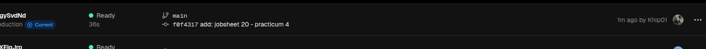

Saya mengecek url `/`:

url `/about`:

> **Langsung diarahkan ke halaman login,**
> 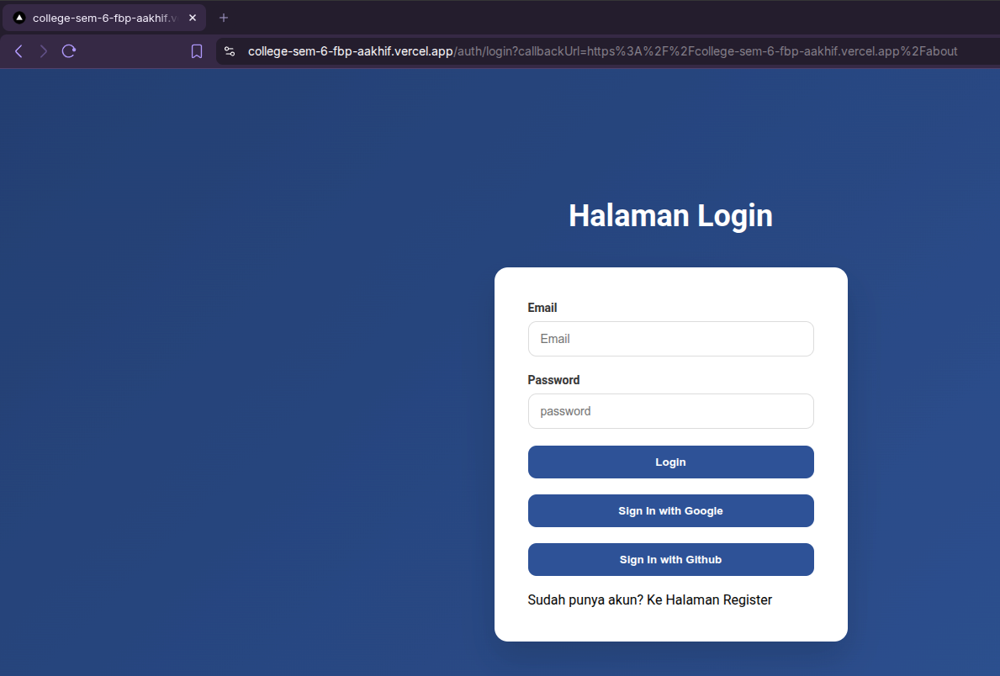

> **Setelah melakukan login,**
> 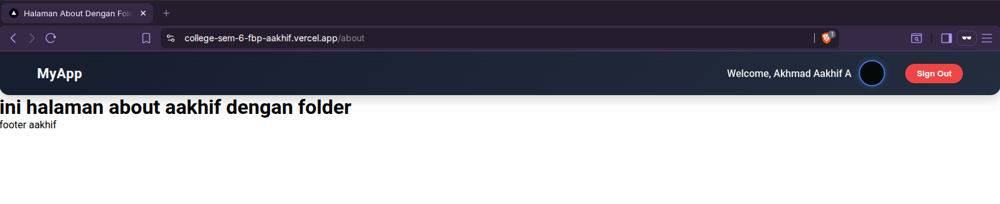

url `/produk`

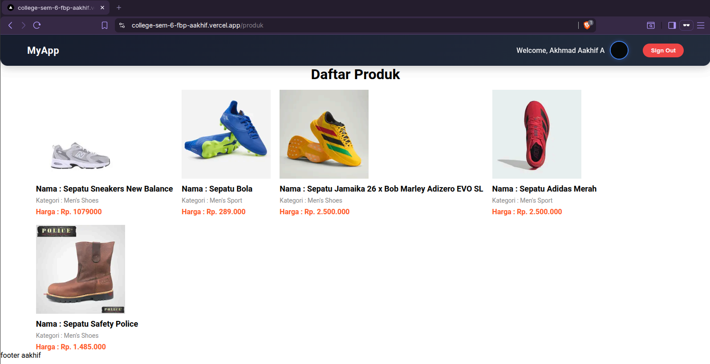

url `/profile`

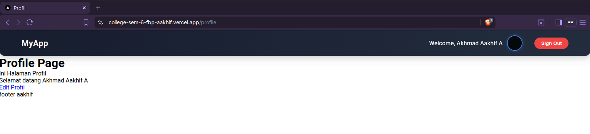

Melakukan Login Google,

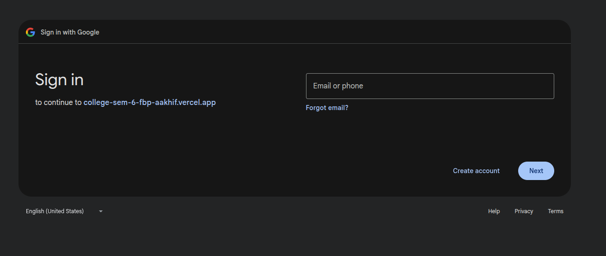

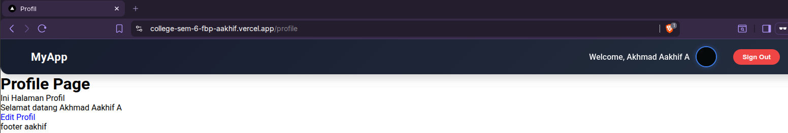

Melakukan Login menggunakan Credential biasa,

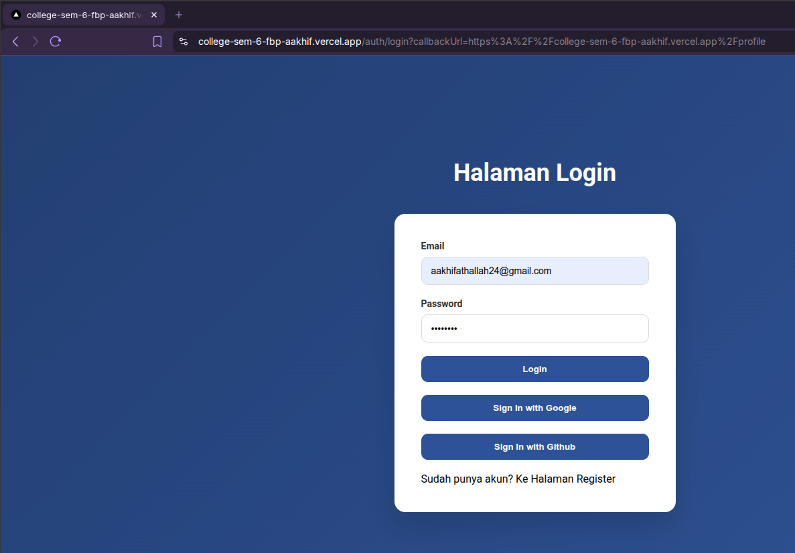

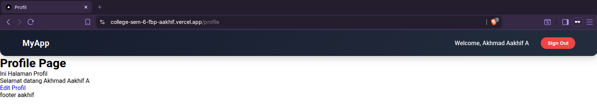

# Tugas Praktikum

### 1. Deploy project Next.js ke Vercel

#### **Jawab**

Saya sudah melakukan deploy project nextjs saya ke Vercel, seperti berikut,

### 2. Pastikan API tidak menggunakan localhost

#### **Jawab**

Saya sudah mengubah endpoint API dan mengaturnya menggunakan .env seperti berikut,

### 3. Konfigurasikan Google OAuth production

#### **Jawab**

Saya juga sudah mengkonfigurasi Google OAuth product

### 4. Lakukan minimal 1 redeploy

#### **Jawab**

Saya sudah pernah melakukan redeploy pada saat merubah .env untuk pengaturan API Endpoint seperti berikut,

Jika dilihat juga saya sudah melakukan redeploy berkali kali,

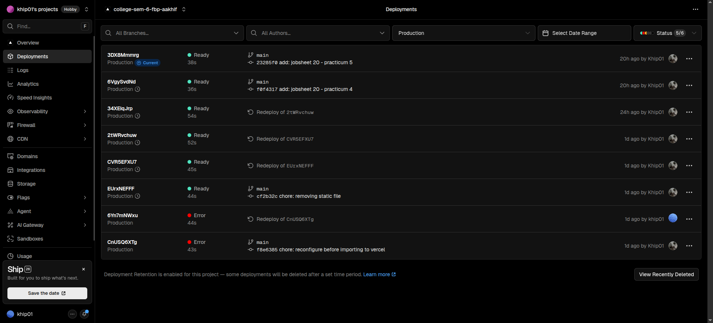

### 5. Dokumentasikan:

- Screenshot dashboard Vercel
- URL hasil deployment
- Screenshot login Google berhasil

#### **Jawab**

1. Berikut adalah screenshot dari dashboard Vercel saya,

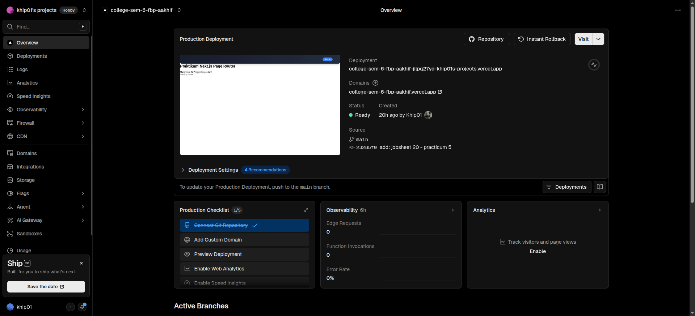

2. Lalu berikut juga screenshot URL hasil deployment nya,

3. Lalu berikut adalah screenshot login google yang berhasil,

Melakukan **Login Google**,

Melakukan **Login menggunakan Credential biasa**,

