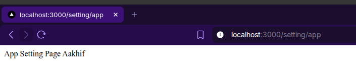
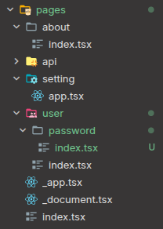
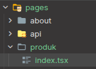
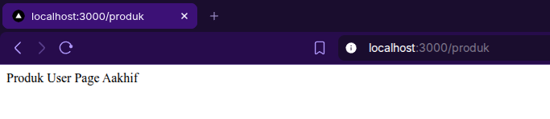
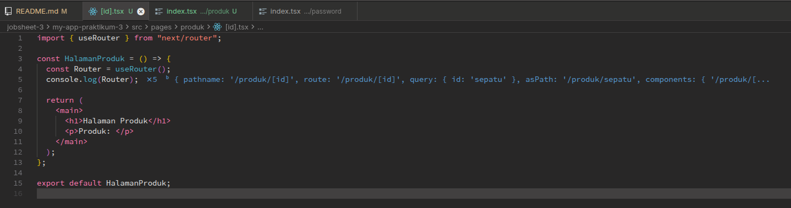
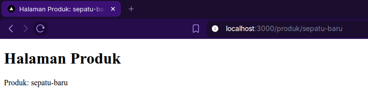
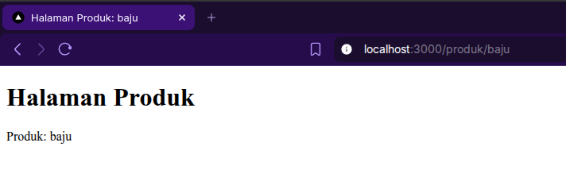

# D. Langkah Praktikum

## 1. Routing Dasar (Static Routing)

Saya sudah menambahkan halaman about dengan cara menambahkan file `about.tsx` di folder `pages`

## 2. Routing Menggunakan Folder

Saya sudah membuat folder dengan file index.tsx didalamnya (yang berisi tampilan about yang sudah dipindah kedalam folder)

## 3. Nested Routing

### a. Membuat folder settings

Saya mencoba untuk membuat folder settingsdan mengisinya dengan file `user.tsx` dan `app.tsx`

Setelah itu saya modifikasi halaman user dengan cara memindahkan `user.tsx` kedalam folder baru bernama user, dan me-rename nya menjadi `index.tsx`

Dan hasilnya menjadi seperti ini,

### b. Nested Lebih Dalam

Lalu saya menambahkan folder baru bernama "password", lalu didalamnya ditambahkan file `index.tsx` seperti berikut,

## 4. Dynamic Routing

### a. Buat Halaman Produk

Saya membuat halaman produk baru,

Lalu saya membuat file baru bernama `[id].tsx`,

Lalu saya modifikasi kode nya dan mencoba memberikan segment sepatu

Dan di console log hasilnya seperti berikut,

Lalu saya memodifikasi `[id].tsx` agar dapat mengambil nilai dari id,

![kode hasil modifikasi [id].tsx](image-15.png)

![modifikasi [id].tsx agar dapat mengambil nilai id](image-14.png)

### b. Uji di Browser

Jadi saya mencoba memberikan parameter id: sepatu-baru

