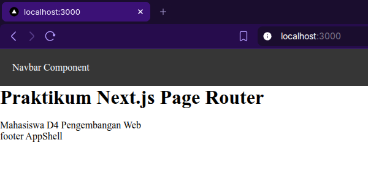
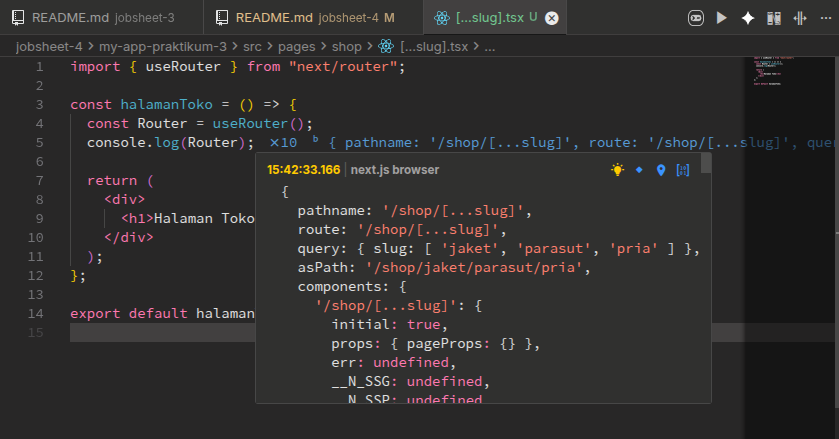
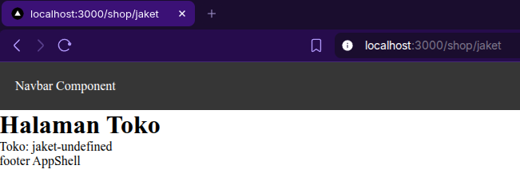
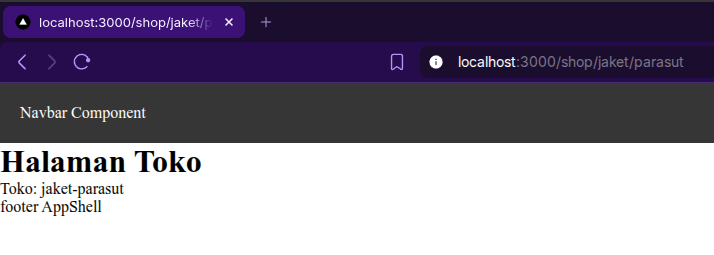
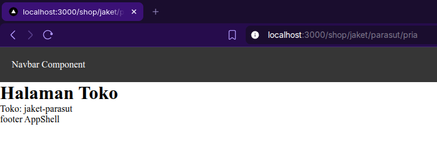
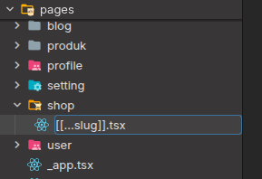
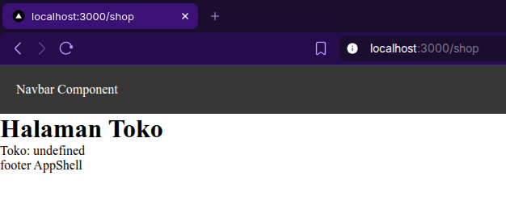

# D. Langkah Praktikum

## Langkah 1 – Menjalankan Project

Saya menjalankan project di jobsheet 3 sebelumnya,

## Langkah 2 – Membuat Catch-All Route

Saya mencoba membuat rute baru bernama `...slug.tsx` sehingga pada saat saya akses seperti ini,

Dan hasilnya di `console.log()` seperti ini,

Lalu saya memodifkasi file `...slug` untuk menampilkan nilai query nya dan hasilnya seperti berikut,

## Langkah 3 – Pengujian Catch-All Route

Saya menguji rute dengan jumlah slug yang bervariasi,

Jadi karena hasil tampilannya kurang tepat, jadi saya memperbaiki file `...slug.tsx` saya,

dan hasilnya menjadi seperti berikut,

Tetapi untuk sementara saya menggunakan kode ini saja untuk menampilkan item,

## Langkah 4 – Optional Catch-All Route

Ketika saya mencoba mengakses rute `http://localhost:3000/shop` saya mendapatkan halaman notfound next.js

sehingga agar rute parameter slug berupa opsional, saya memberikan kurung siku tambahan seperti berikut,

Sehingga pada saat saya coba akses rutenya, hasilnya menampilkan seperti berikut

