# D. Langkah Praktikum

## Langkah 1 – Menjalankan Project

Saya menjalankan project di jobsheet 3 sebelumnya,

## Langkah 2 – Membuat Catch-All Route

Saya mencoba membuat rute baru bernama `...slug.tsx` sehingga pada saat saya akses seperti ini,

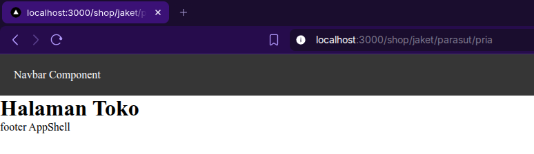

Dan hasilnya di `console.log()` seperti ini,

Lalu saya memodifkasi file `...slug` untuk menampilkan nilai query nya dan hasilnya seperti berikut,

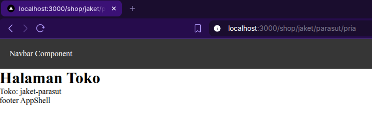

## Langkah 3 – Pengujian Catch-All Route

Saya menguji rute dengan jumlah slug yang bervariasi,

Jadi karena hasil tampilannya kurang tepat, jadi saya memperbaiki file `...slug.tsx` saya,

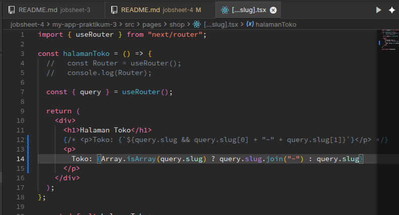

dan hasilnya menjadi seperti berikut,

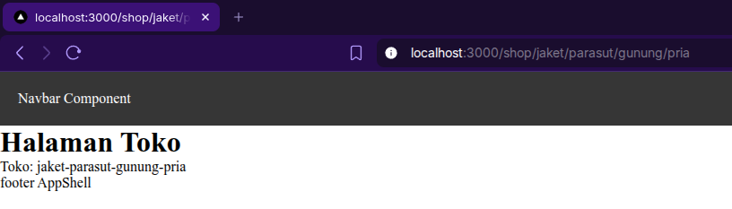

Tetapi untuk sementara saya menggunakan kode ini saja untuk menampilkan item,

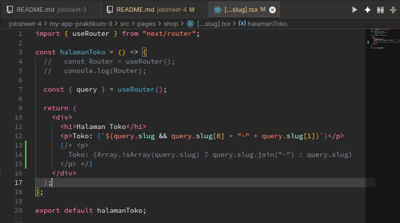

## Langkah 4 – Optional Catch-All Route

Ketika saya mencoba mengakses rute `http://localhost:3000/shop` saya mendapatkan halaman notfound next.js

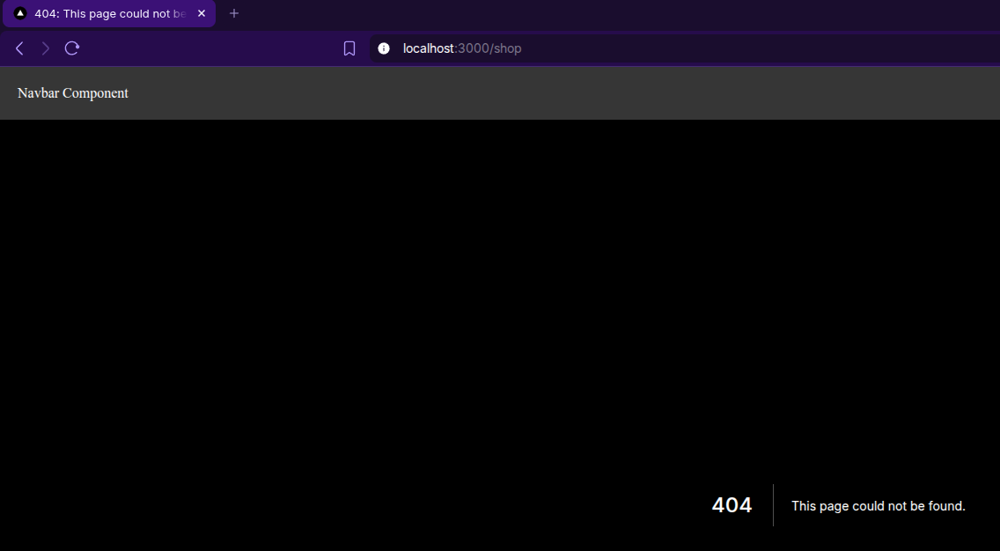

sehingga agar rute parameter slug berupa opsional, saya memberikan kurung siku tambahan seperti berikut,

Sehingga pada saat saya coba akses rutenya, hasilnya menampilkan seperti berikut

## Langkah 5 – Validasi Parameter

Saya mencoba untuk menambahkan validasi agar tidak error saat slug kosong,

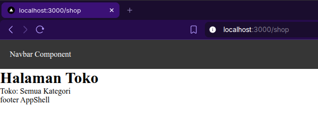

## Langkah 6 – Membuat Halaman Login & Register

Saya membuat folder `pages/auth`, setelah itu didalamnya ada file login.tsx dan register.tsx,

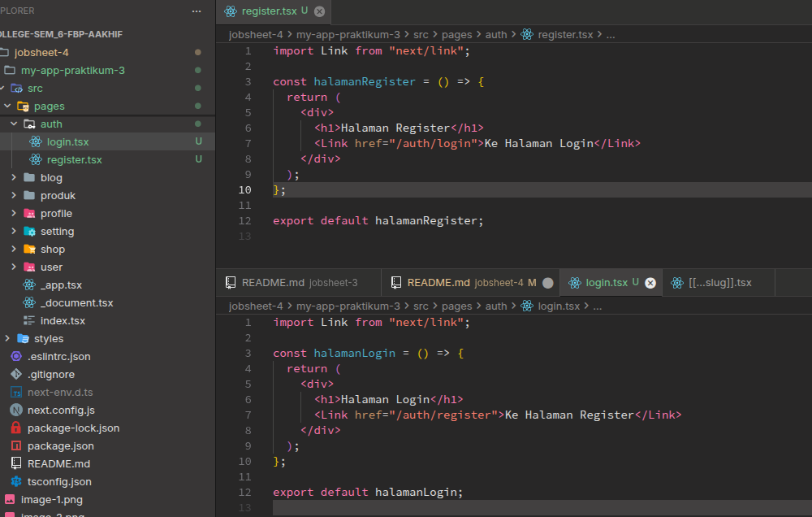

## Langkah 7 – Navigasi Imperatif (router.push)

Lalu saya menambahkan tombol Login didalam halaman login seperti berikut

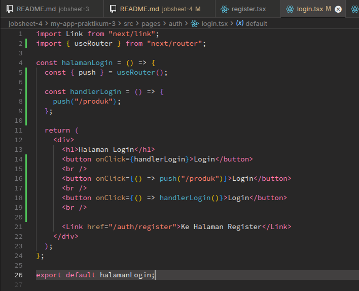

Dan hasilnya seperti ini,

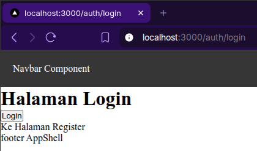

## Langkah 8 – Simulasi Redirect (Belum Login)

Di halaman product (`index.tsx`), saya menamabhkan kode berikut untuk melakukan redirect,

Dan hasilnya pada saat saya coba mengakses rute `/product` adalah seperti ini,

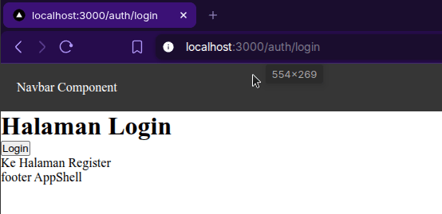

Tapi sayangnya kalo kita lihat disitu tombol login seperti tidak berfungsi, karena pada saat push() ke halaman `/produk`, di halaman product dia malah di redirect kembali ke halaman login. Mengapa? ya karena state dari variabel `isLogin` itu selalu `false`.

Maka dari itu tombol login ini terlihat seperti tidak melakukan apapun.

Jadi saya modifikasi kode nya agar state dari variabel `isLogin` itu berubah menjadi true.

Dan hasilnya adalah seperti berikut,

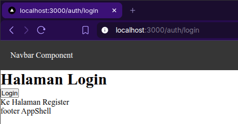

Jadi disini yang saya tangkap adalah, kita berusaha menentukan redirect/tidaknya dari state variabel `isLogin`, di kode tombol logout ini di halaman produk,

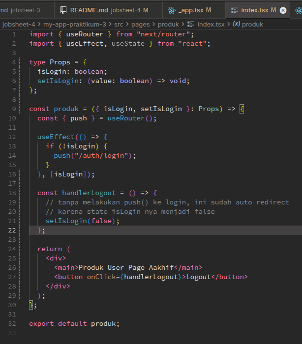

disitu di fungsi `handlerLogout` saya hanya memanggil fungsi seIsLogin untuk mengubah state `isLogin` menjadi false, sehingga saya tidak perlu melakukan push ke halaman login (karena sudah ada redirect yang mengecek apakah state variabel `isLogin` adalah false) di sebelah sini,

# E. Tugas Praktikum

## Tugas 1 (Wajib)

Saya sudah mencoba membuat catch-all route `/category/[...slug].tsx`, dan menampilkan seluruh parameternya sebagai list. Dan hasilnya adalah seperti berikut,

## Tugas 2 (Wajib)

Saya sudah memodifikasi file `login.tsx` dan `register.tsx` agar bisa berpindah pindah dengan tag `<Link>`, dan juga saya bisa berpindah ke halaman `produk` dengan tombol login, berikut adalah hasilnya,

## Tugas 3 (Pengayaan)

Saya juga sudah menerapkan ogiredirect jika user belum login, hasilnya adalah seperti berikut,

# F. Pertanyaan Evaluasi

### 1. Apa perbedaan [id].js dan [...slug].js?

#### **Jawab**

Jadi perbedaan nya yaitu, jika `[id].tsx` hanya bisa mengambil satu parameter dari rute, tetapi jika `[...slug].tsx` bisa mengambil banyak parameter dari rute.

### 2. Mengapa slug berbentuk array?

#### **Jawab**

Sebenarnya penamaan slug sendiri digunakan agar bertujuan untuk human readable, dan `slug` yang kita gunakan di praktikum selama ini dibuat bertujuan agar kita bisa mengirim multiple/lebih dari satu parameter didalam rute.

### 3. Kapan sebaiknya menggunakan Link dan router.push()?

#### **Jawab**

Kita menggunakan tag `<Link>` pada saat kita hendak berpindah halaman instan (untuk mengedepankan UX), karena karakternya sendiri yang tidak melakukan reload halaman.

Sedangkan `router.push()` digunakan pada saat kita sedang melakukan pemrosesan data didalam fungsi, seperti submit form, redirect user, dan sejenisnya.

### 4. Mengapa navigasi Next.js tidak me-refresh halaman?

#### **Jawab**

Tergantung, sebenarnya jika kita menggunakan router.push() halaman akan me-refresh. Jika kita menggunakan tag `<Link>` maka kita tidak melakukan refresh/reload halaman.

Karena karakter dari Next.js sendiri yang berupa Client Side rendering dan data sudah di `_prefetch_` sebelum user melakukan pergantian halaman. Seperti pada dokumentasi Next.js berikut:

> [!TIP]
> Prefetching is the process of loading a route in the background before the user navigates to it. This makes navigation between routes in your application feel instant, because by the time a user clicks on a link, the data to render the next route is already available client side.
