# D. Langkah Praktikum

## 1. Global CSS

### a. File Global

Saya mempunyai file CSS global ini,

### b. Import Global CSS

Lalu saya juga mempunyai isi file `_app.tsx` yang sudah ada import `"@/styles/globals.css"` seperti berikut,

## 2. CSS Module (Local Scope)

### a. Struktur Komponen Navbar

Saya mempunyai stuktur komponen navbar seperti ini,

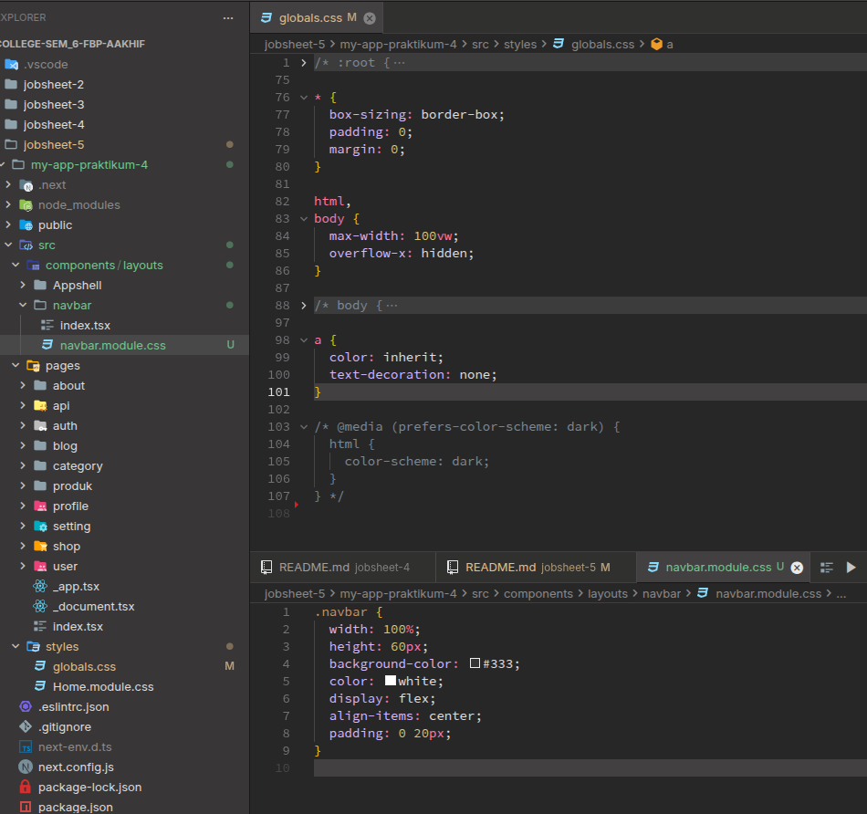

Lalu terlihat juga di gambar diatas jika saya juga sudah memindahkan style navbar dari global ke file baru `navbar.module.css`

### b. Pemanggilan di Komponen

Lalu saya memodifikasi kode `index.tsx` di folder navbar,

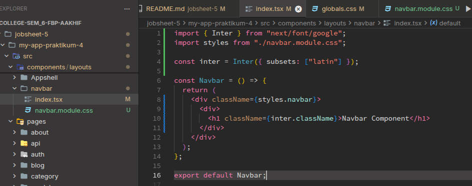

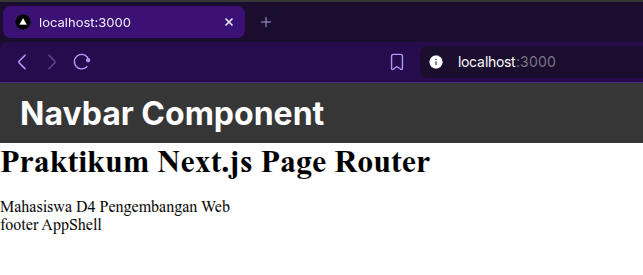

## 3. Styling untuk Pages (CSS Module)

### a. Contoh Login Page

Lalu saya mencoba menambahkan `login.module.css` (styling untuk halaman login) di folder auth,

Terlihat juga saya sudah menerapkannya di kode `login.tsx`, dan hasilnya adalah seperti berikut,

## 4. Conditional Rendering Navbar (Tanpa Navbar di Login)

Saya memodifikasi file `index.tsx` pada folder `AppShell` seperti berikut,

Sehingga hasilnya halaman loginnya tidak ada navbar nya,

## 5. Refactoring Struktur Project (Best Practice)

Lalu saya mencoba merapihkan struktur loginmenjadi seperti berikut,

Setelah itu saya mencoba menambahkan kode didalam `/views/auth/login/index.tsx`, dan memindahkan login.module.css ke dalam folder `views/auth/login/` dan hasilnya seperti berikut,

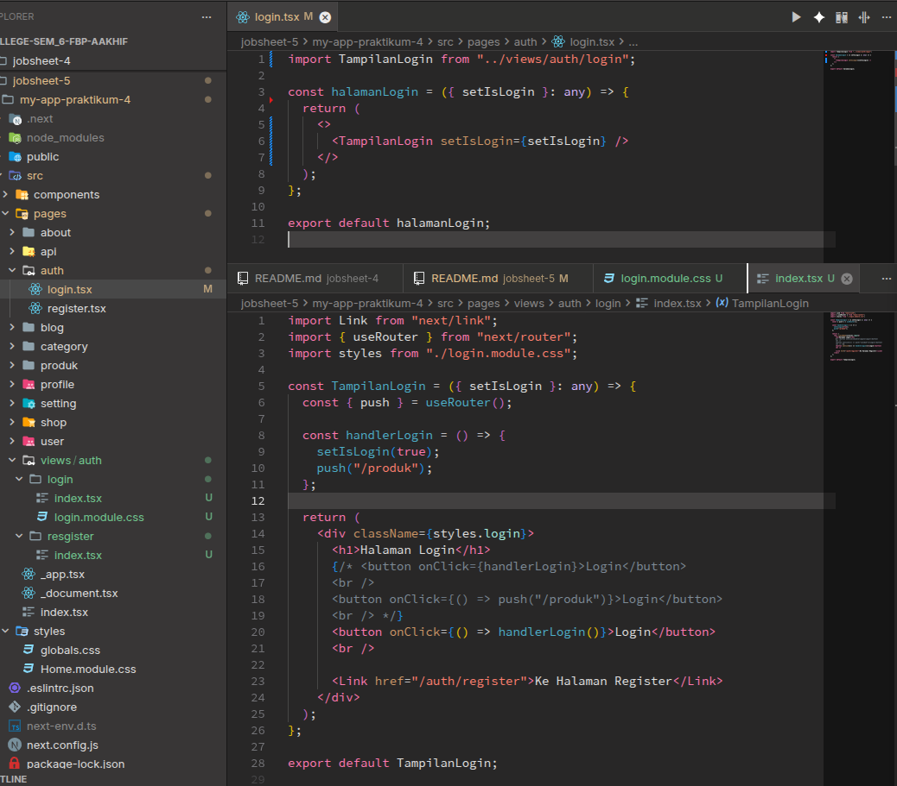

Tampilannya sama saja seperti sebelumnya, karena kita hanya merubah/memodifikasi struktur file dan direktori nya saja,

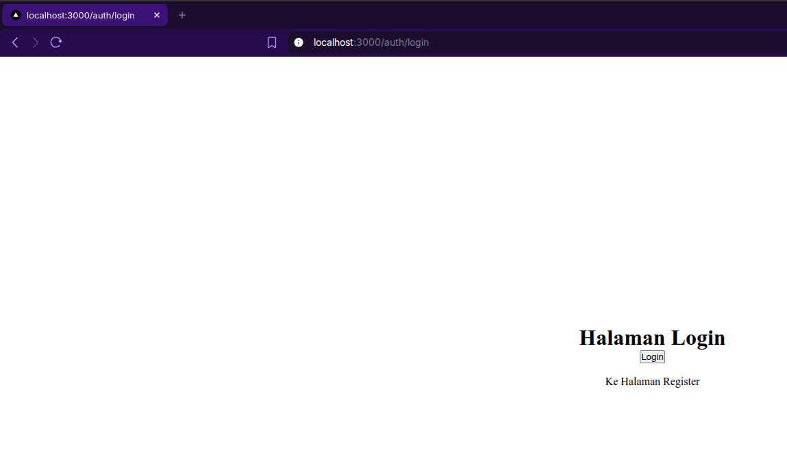

## 6. Inline Styling (CSS-in-JS)

Saya melakukan inline styling di halaman login (views `index.tsx`) seperti berikut,

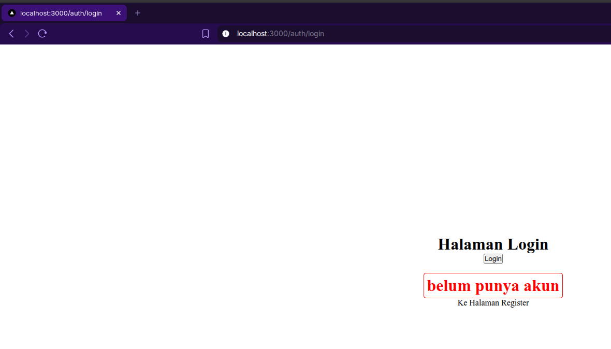

## 7. Kombinasi Global CSS + CSS Module

Saya mencoba menggabungkan styling module.css dengan styling global, seperti berikut (di tampilan navbar),

dan hasilnya adalah seperti berikut (ukuran font dari navbarnya saya kecilkan),

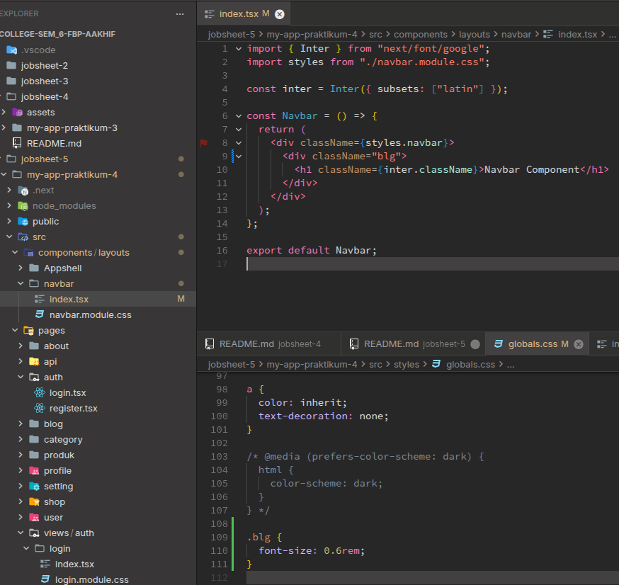

## 8. SCSS (SASS)

### a. Install SASS

Saya menjalankan command berikut di project ini,

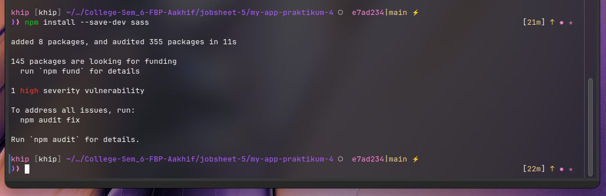

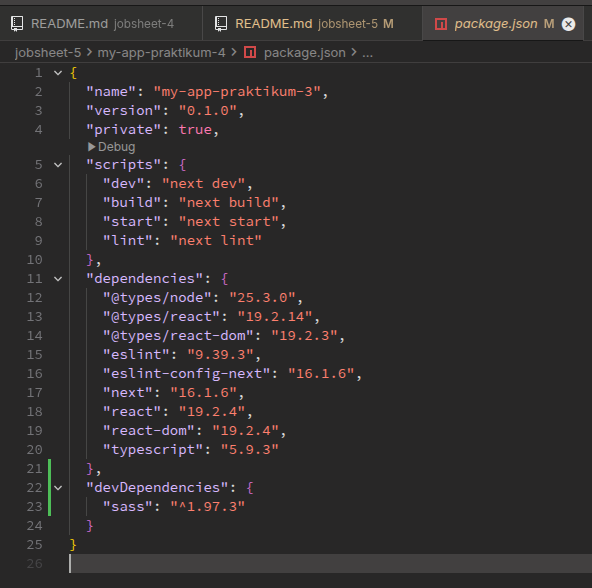

### b. Global Variable

Saya mencoba menambahkan colors.scss pada folder styles

### c. Gunakan di Module

Saya mencoba menambahkan style scss baru di views login, dan menggantikan style css biasa menggunakan scss, dan seperti berikut adalah kodenya,

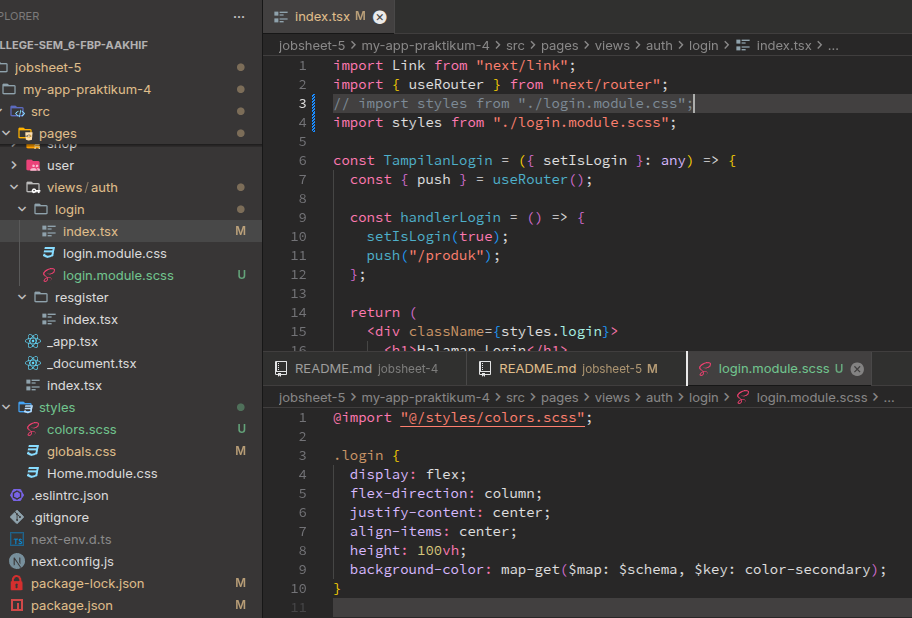

Lalu berikut adalah tampilannya,

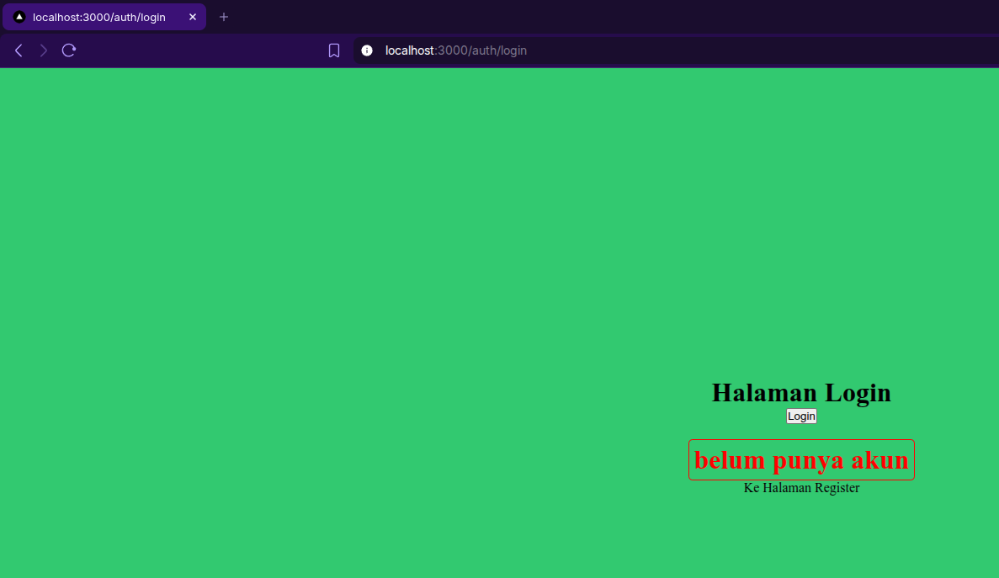

## 9. Tailwind CSS

### a. Install

Saya mencoba menginstall tailwind, dan package lainnya di project ini dengan command seperti berikut,

Lalu saya init package tailwind nya,

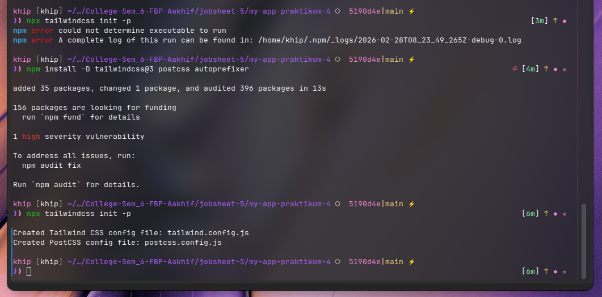

### b. Konfigurasi tailwind.config.js

Lalu saya melakukan konfigurasi tailwind.config.js

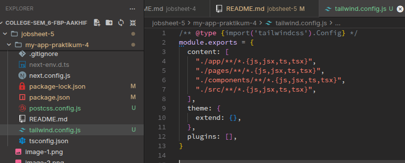

### c. Import di Global CSS

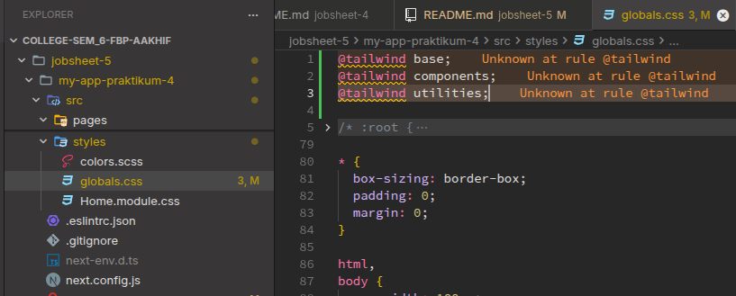

### d. Contoh Penggunaan

Lalu saya mencoba mengimplementasikan tailwind tadi ke halaman login di bagian tag <h1> nya,

Dan berikut adalah tampilannya,

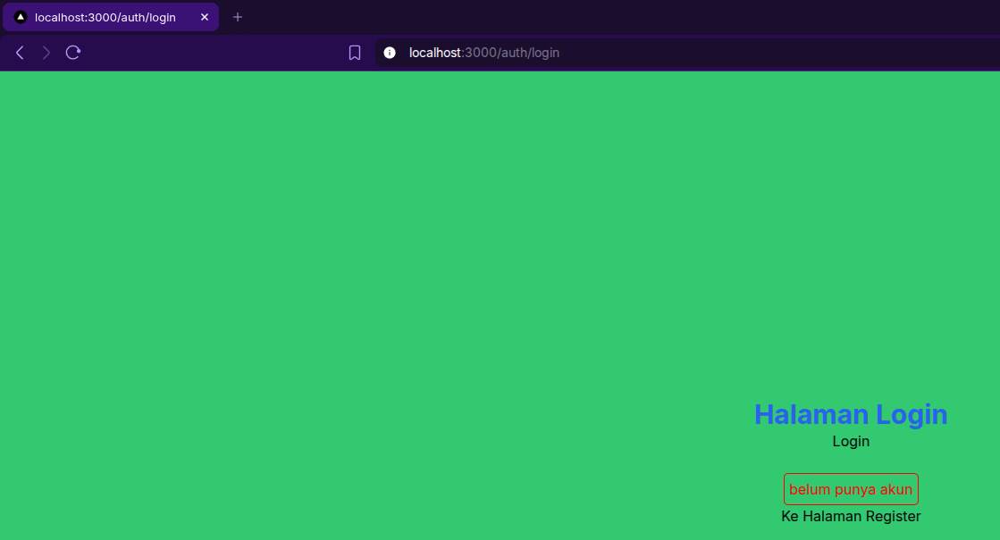

# E. Tugas Praktikum

## Tugas 1

- Buat halaman Register
- Gunakan CSS Module

Karena sebelumnya halaman register masih berupa polosan seperti ini,

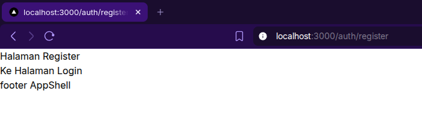

saya mencoba melaukan styling halaman register dengan menggunakan `module.css`, dan berikut adalah hasilnya,

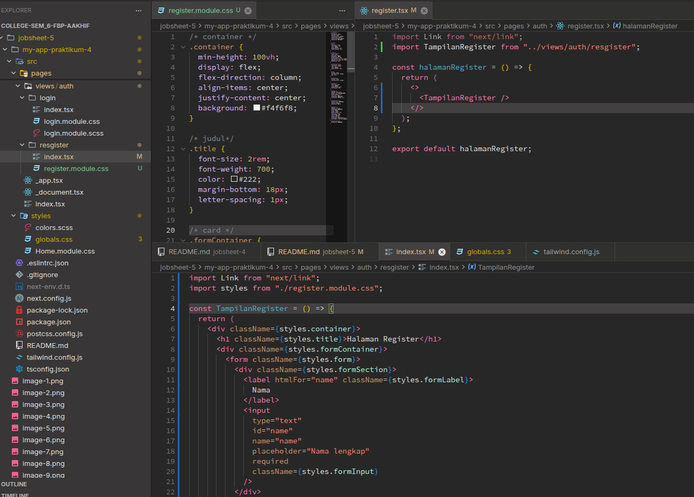

Lalu tampilannya adalah sebagai berikut,

## Tugas 2

- Refactor halaman Produk ke folder views
- Pisahkan Hero Section dan Main Section

Jadi sebelumnya halaman produk itu tampilannya masih berada di route `pages/produk`, sekarang saya akan merapihkan tampilannya kedalam `pages/views/produk/`, dan berikut adalah hasilnya,

Berikut adalah halaman utama produk (rute `/produk/`),

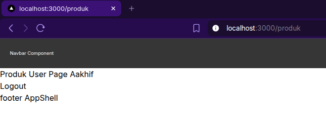

Lalu berikut adalah rute `/produk/:id/`,

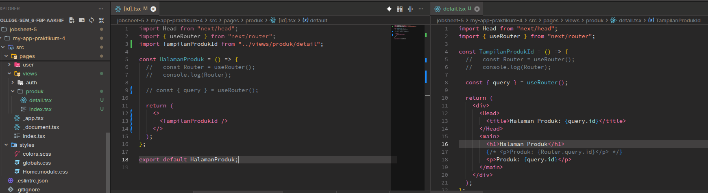

## Tugas 3

Jadi saya ingin membuat folder baru bernama `utility`, didalam folder `components` seperti berikut,

Setelah itu saya menambahkan 5 utility components seperti berikut,

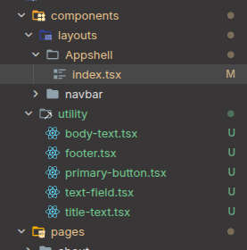

- `body-text.tsx`
- `footer.tsx`
- `primary-button.tsx`
- `text-field.tsx`
- `title-text.tsx`

Dan berikut adalah sedikit isi kodenya,

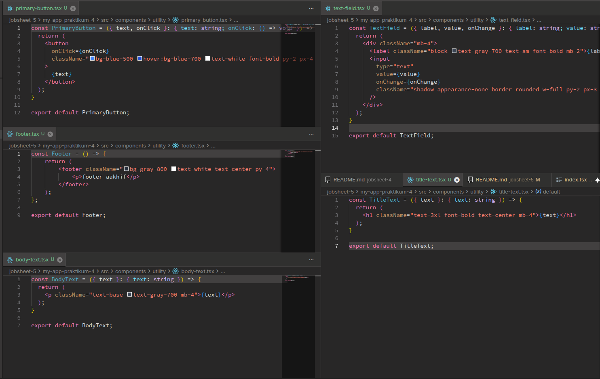

# F. Pertanyaan Refleksi

### 1. Kapan sebaiknya menggunakan CSS Module dibanding Global CSS?

#### **Jawab**

Saat kita ingin melakukan styling untuk satu component/satu halaman/satu file saja, yang dimana tidak digunakan/dipanggil dalam seluruh basis kode.

### 2. Apa kelemahan inline styling?

#### **Jawab**

Kita tidak bisa memanggil style nya berulang ulang untuk digunakan di komponen lain, karena stylingnya hanya untuk tag yang bersangkutan saja.

### 3. Mengapa SCSS cocok untuk project skala besar?

#### **Jawab**

Karena kemampuannya yang bisa melakukan import lebih rapi dan performance, susunan kode styling yang lebih rapi dalam kemampuan nesting style, bisa menerapkan reusable logic seperti variable dan mixin.

### 4. Apa keunggulan Tailwind dibanding CSS tradisional?

#### **Jawab**

Mudah untuk diimplementasikan langsung ke dalam tag yang bersangkutan tanpa perlu menuliskan banyak kode styling terpisah diluar tag, ada beberapa style css yang sudah dibungkus oleh tailwind sehingga terlihat lebih praktis, tidak boros file/boros kode karena harus menuliskan kode css tersendiri.

