# D. Langkah Kerja Praktikum

## Langkah 1 – Menjalankan Project

Saya mencoba menjalankan project sebelumnya,

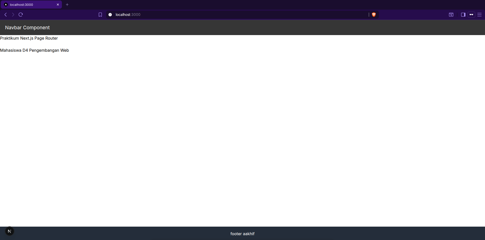

Terlihat jika saya tidak mengalami kendala apapun.

## Langkah 2 – Membuat Custom Document

Saya melakukan modifikasi file `_document.tsx` dengan kode berikut,

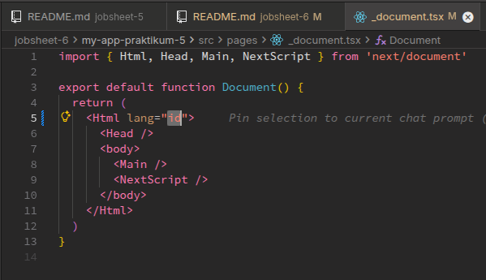

Lalu saya coba cek di inspect element,

Terlihat jika language nya sudah berubah menjadi "id".

## Langkah 3 – Pengaturan Title per Halaman

Saya mencoba menambahkan tag `<title>` di halaman index.tsx halaman pages (alias url '/')

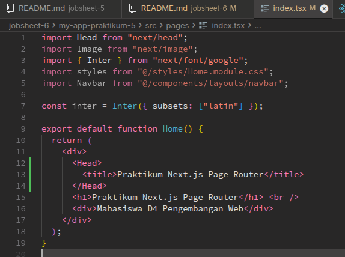

Dan hasilnya adalah seperti berikut,

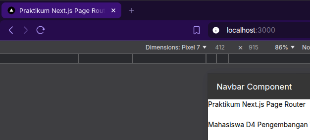

## Langkah 4 – Membuat Custom Error Page (404)

Saya akan mencoba menghandle halaman error 404 not found dengan cara pertama-tama saya akan membuat file 404.tsx baru di folder `pages/`,

---

Tetapi sebelum itu, karena saya merasa ada yang janggal dengan tampilannya, seperti h1 yang membuat text masih menjadi biasa saja seperti ini,

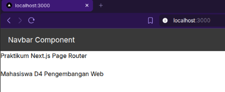

Terlihat jika harusnya tulisan `"Praktikum Next.js Page Router"` itu harusnya sedang menggunakan heading 1, akhirnya saya memutuskan untuk menguninstall tailwindcss dengan cara,

uninstall tailwindcss dan package lainnya,

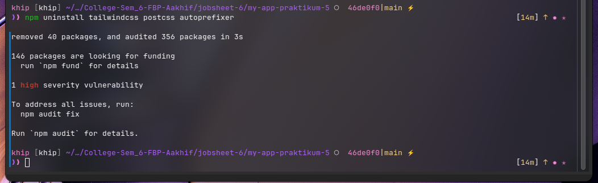

menghapus file `tailwind.config.js` dan `postcss.config.js`, dan juga menghapus folder cache `.next`, `node_modules`, an `package-lock.json`, sehingga melakukan install kembali,

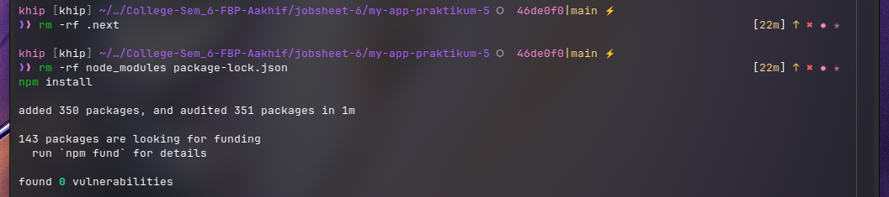

Dan pada saat saya jalankan `npm run dev` kembali, hasilnya sudah benar dan sesuai,

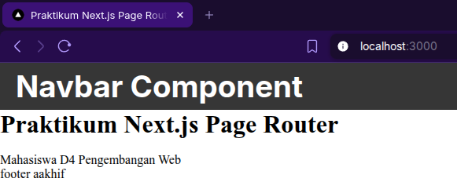

Sehingga kita bisa melanjutkan ke halaman 404 notfound,

---

Saya sudah membuat file `404.tsx` di folder `pages/` dan juga isinya dan seperti inilah hasilnya pada saat saya mencoba memanggil localhost dengan segmen `dashboard/`,

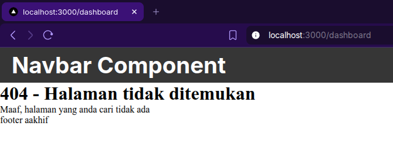

Terlihat jika hasilnya sudah sesuai dengan heading 1 dan juga `404.tsx` juga berhasil ditampilkan.

## Langkah 5 – Styling Halaman 404

Sekarang saya ingin mencoba styling halaman 404 ini dengan scss, dengan membuat file baru bernama `404.module.scss` di dalaman folder `styles/`dan hasilnya adalah seperti berikut,

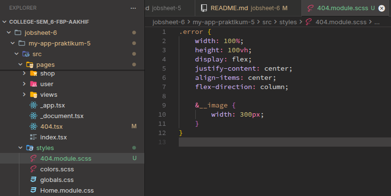!

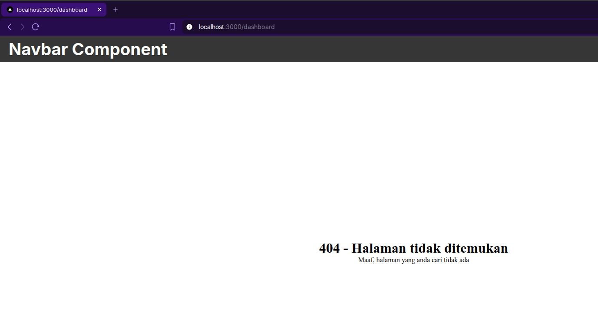

Lalu karena tampilan 404 notfound nya masih ada navbarnya, jadi saya mencoba untuk menghilangkannya dengan cara menambahkan halaman 404 ke blacklist yang ada di file `AppShell` (agar navbar tidak ditampilkan).

Dan hasilnya adalah sebagai berikut,

## Langkah 6 – Menampilkan Gambar dari Folder Public

Lalu saya mencoba untuk menambahkan gambar di halaman 404,

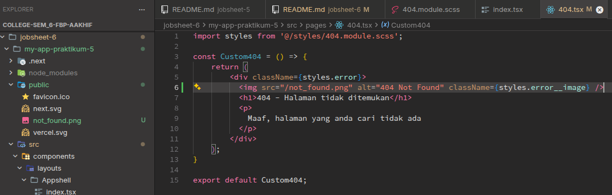

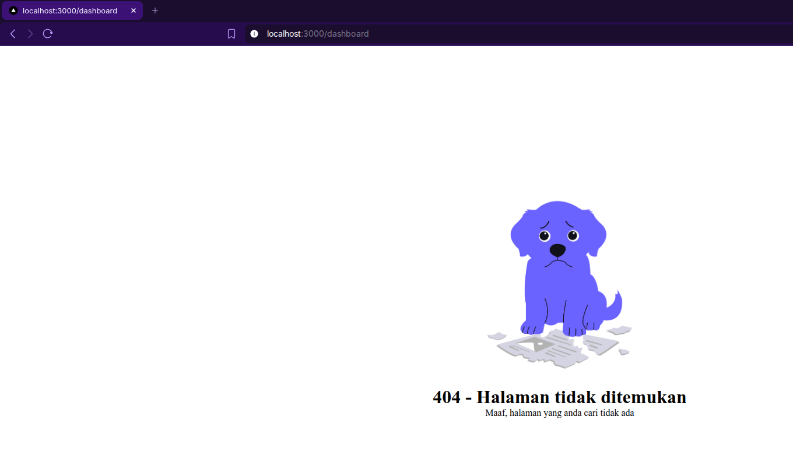

# E. Tugas Praktikum

## Tugas 1 (Wajib)

Tambahkan:

- Judul halaman
- Deskripsi singkat (DONE)
- Gambar ilustrasi (DONE)

Karena saya belum menambahkan judul halamantitle di halaman 404, berikut adalah hasilnya,

## Tugas 2 (Wajib)

- Custom warna, font, dan layout halaman 404
- Navbar tidak tampil di halaman 404

Karena navbar sudah berhasil tidak tampil di halaman 404 dan juga layout nya sudah diperbaiki, sekarang saya ingin mengubah font dari halaman 404 not found saya menjadi seperti ini hasilnya,

## Tugas 3 (Pengayaan)

Tambahkan tombol:

- “Kembali ke Home”
  - Gunakan navigasi Next.js (Link)

Di halmaan 404 not found saya coba tambahkan tombol untuk mengarahkan ke halaman home, yang dimana tombol ini menggunakan tag `<Link>` seperti berikut,

# F. Pertanyaan Evaluasi

### 1. Apa fungsi utama `\_document.tsx`?

#### **Jawab**

Jadi file `_document.tsx` disini fungsinya untuk tempat tampilan dasar server side pertama kali dimuat. Disini kita bisa memberikan/mengatur tag-tag untuk kepentingan SEO.

### 2. Mengapa `<title>` tidak disarankan di `\_document.tsx`?

#### **Jawab**

Menurut saya, karena nanti sistem informasi web yang akan dibuat bisa saja berkemungkinan memberikan title yg berbeda-beda/berubah-ubah tergantung dari rute halaman/halamannya, sehingga ditakutkan nanti jika sudah diinisialisasi duluan di `_document.tsx` nantinya akan menghasilkan hasil yang tidak diinginkan.

Sehingga inilah mengapa, diciptakan dari awal pembuatan project nextjs sudah ada component terpisah untuk `<Head>` yang memungkinkan untuk mengatur title di halaman yang berbeda-beda.

### 3. Apa perbedaan halaman biasa dan halaman`404.tsx`?

#### **Jawab**

Untuk halaman biasa ya akan diakses sesuai route page/rute dari halaman mereka, tetapi jika halaman menggunakan file 404.tsx itu adalah file spesial/khusus untuk halaman not found (kalo tampilan not found, secara otomatis akan menggunakan halaman di file 404.tsx)

### 4. Mengapa folder public tidak perlu di-import?

#### **Jawab**

karena dari next js sendiri folder public digunakan/dirancang untuk memberikan tempat bagi assets static, bukan sebagai module, sehingga bisa dipanggil langsung.
