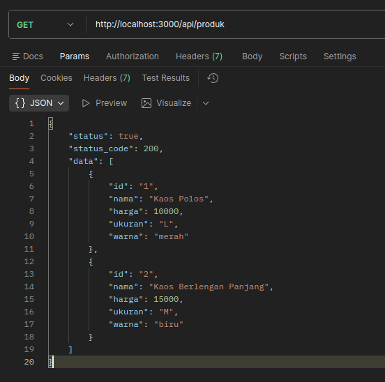
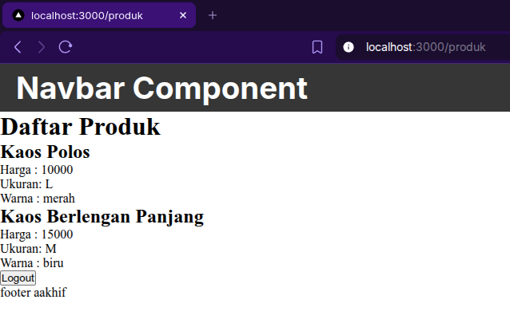

# D. Langkah Kerja Praktikum

## Langkah 1 – Menjalankan Project

Saya mencoba menjalankan project sebelumnya,

## Langkah 2 – Membuat API Produk

Saya membuat route api baru bernama `pages/api/produk`, dan hasilnya adalah seperti berikut,

## Langkah 3 – Fetch Data API di Frontend

Lalu saya mencoba melakukan fetch data dari api ke halaman produk project nextjs ini, dan berikut adalah hasilnya,

# E. Integrasi Firebase

## Langkah 5 – Setup Firebase

Saya mencoba membuat project Firebase baru seperti berikut,

Dan saya juga sudah selesai membuat collection baru seperti berikut,

