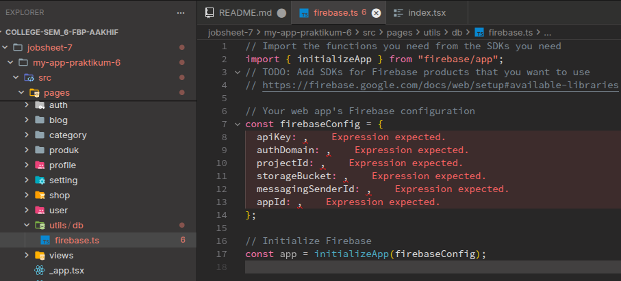
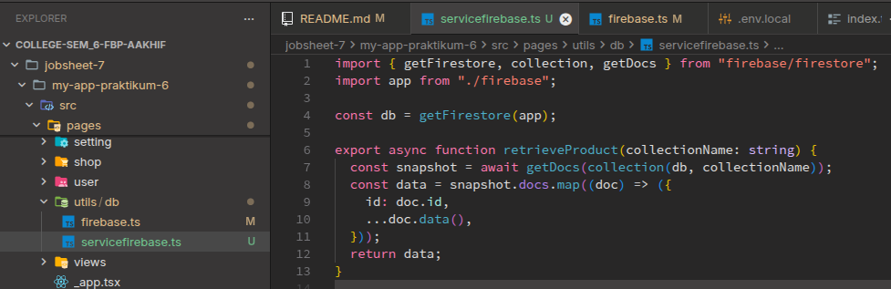
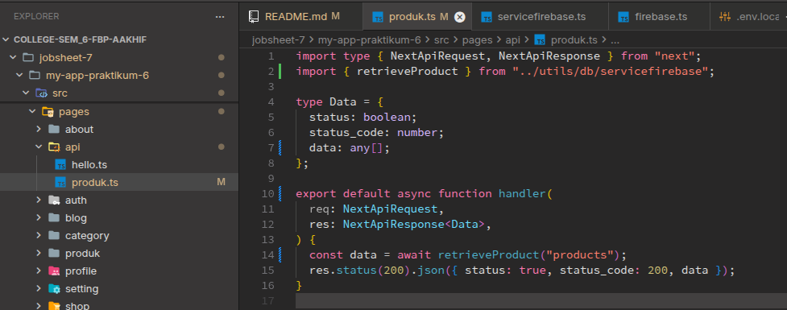
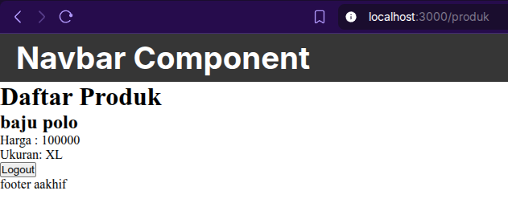

# D. Langkah Kerja Praktikum

## Langkah 1 – Menjalankan Project

Saya mencoba menjalankan project sebelumnya,

## Langkah 2 – Membuat API Produk

Saya membuat route api baru bernama `pages/api/produk`, dan hasilnya adalah seperti berikut,

## Langkah 3 – Fetch Data API di Frontend

Lalu saya mencoba melakukan fetch data dari api ke halaman produk project nextjs ini, dan berikut adalah hasilnya,

# E. Integrasi Firebase

## Langkah 5 – Setup Firebase

Saya mencoba membuat project Firebase baru seperti berikut,

Dan saya juga sudah selesai membuat collection baru seperti berikut,

## Langkah 6 – Install Firebase

Lalu saya melakukan instalasi firebase di project nextjs saya dengan menggunakan `npm install firebase`, tujuannya agar saya bisa menghubungkan project nextjs saya dengan Backend Firebase,

Dan saya juga sudah menambahkan firebase.ts ke dalam project saya di direktori `pages/utils/db/`

## Langkah 7 – Konfigurasi Environment Variable

Lalu agar saya bisa dengan aman menyimpan isi konfigurasi firebase, saya membuat ile `.env.local` di root project nextjs saya,

## Langkah 8 – Konfigurasi Firebase

Lalu akhirnya setelah saya membuat file `.env.local` saya anggil variabel didalamnya untuk saya gunakan di file `/pages/utils/db/firebase.ts`, hasilnya seperti berikut,

## Langkah 9 – Ambil Data dari Firestore

Setelah selesai melakukan setup, kini saya akan mencoba untuk mengambil data dari firestore database di collection yang sudah saya buat tadi. Yang saya lakukan adalah membuat file baru didalam direktori `/pages/utils/db/` bernama `servicefirebase.ts` seperti berikut,

## Langkah 10 – API Mengambil Data Firebase

Lalu saya mencoba memodifikasi file `produk.ts` didalam direktori `/pages/api/` untuk mengambil data dari firebase seperti berikut,

Lalu saya mencoba untuk melakukan GET data produk dari firebase menggunakan API `/api/produk/`, dan hasilnya adalah sebagai berikut,

Lalu setelah berhasil, saya mencoba memodifikasi halaman produk agar bisa menampilkan produk dari firebase, dan hasilnya adalah seperti berikut,

# F. Tugas Praktikum

### Tugas 1 (Wajib)

- Tambahkan minimal 3 data produk di Firestore
- Pastikan data tampil di halaman produk

Saya mencoba menambahkan data dari firestore contoh adalah beberapa data berikut,

Dan hasilnya di tampilan halaman produk seperti berikut,

### Tugas 2 (Wajib)

- Tambahkan field baru:
  - category
- Tampilkan category di frontend

Jadi saya sudah menambahkan collection baru bernama `category` untuk ditampilkan di halaman produk, hasilnya adalah seperti berikut,

