# C. Langkah Praktikum

Saya sudah memnyesuaikan isi field database firestore saya menjadi seperti berikut,

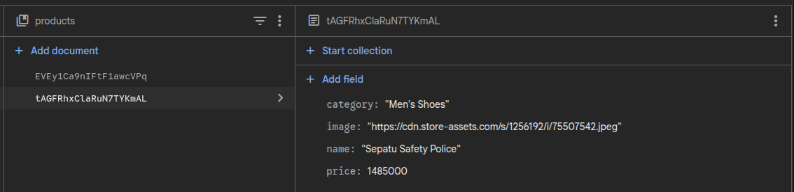

## Bagian 1 – Setup Data Produk

Saya sudah membuat file baru dengan nama `product.tsx` di direktori `pages/api/` yang memberikan response berupa:

- id
- name
- category
- price
- image

Dan hasilnya adalah seperti berikut,

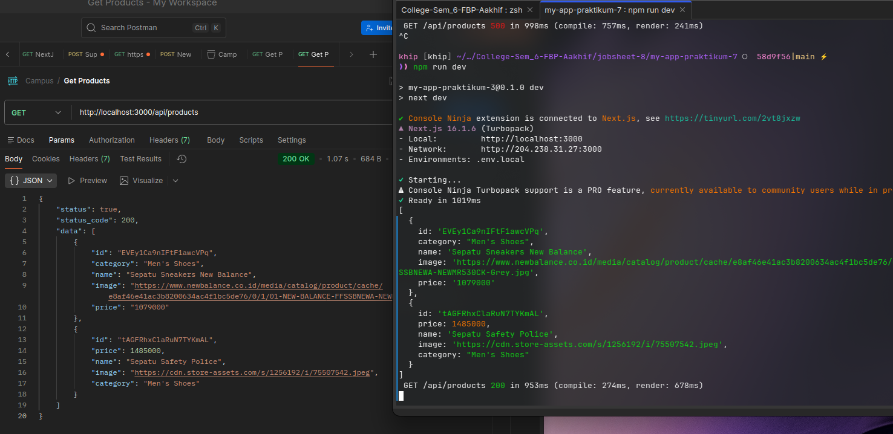

## Bagian 2 – Implementasi CSR dengan useEffect

Saya membuat file baru bernama `index.tsx` di direktori `pages/views/product/` untuk tampilan halaman product yang baru seperti berikut,

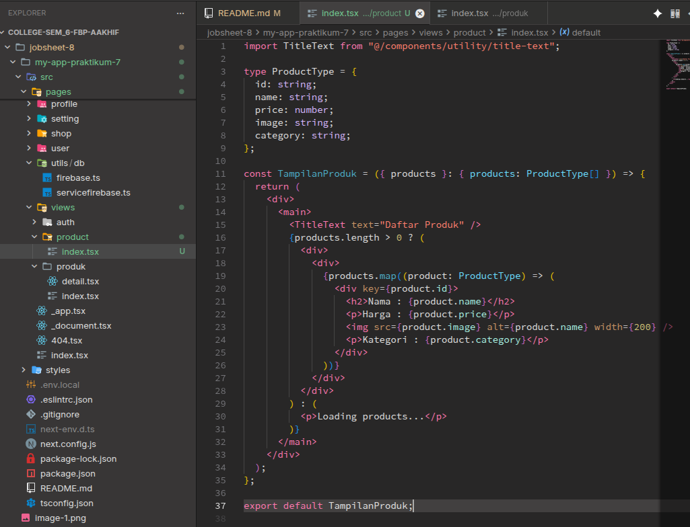

Lalu saya gunakan dan saya panggil views `product` yang saya buat di halaman produk, direktori `pages/produk/index.tsx`,

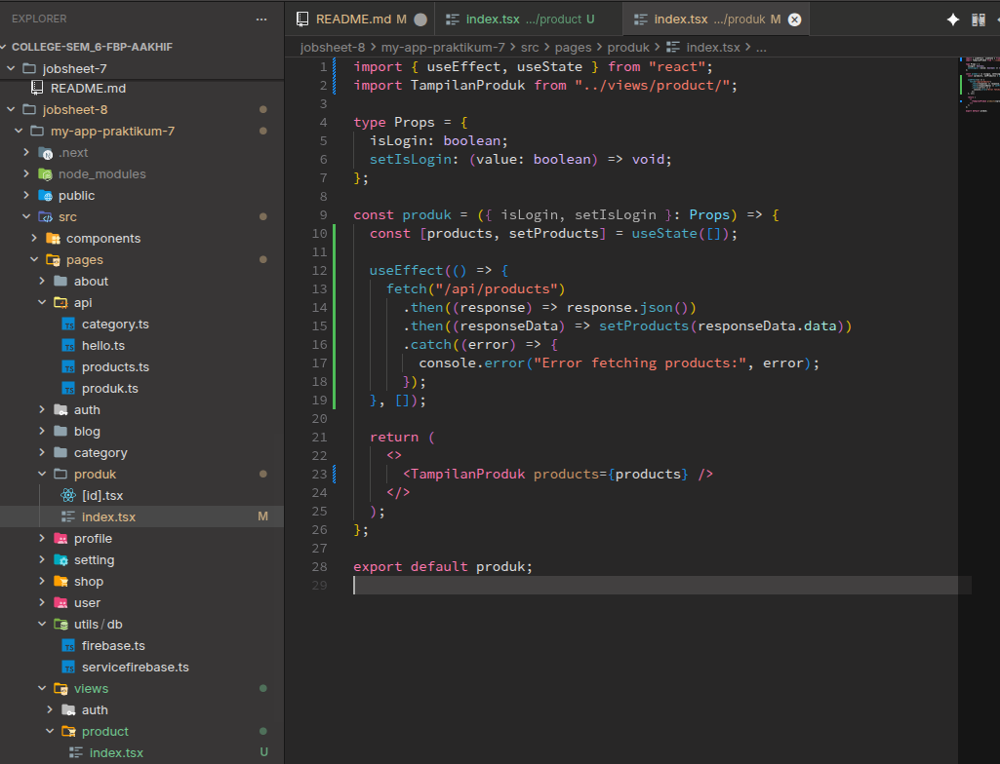

Dan berikut adalah hasilnya,

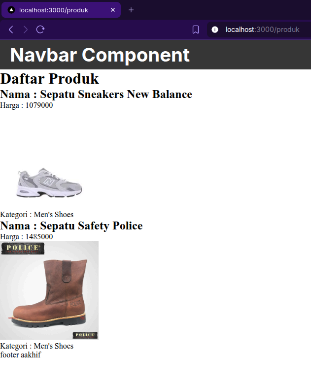

Lalu saya mencoba untuk melakukan styling menggunakan scss dengan cara membuat modul scss baru di direktori `pages/views/products/` bernama `product.module.scss`

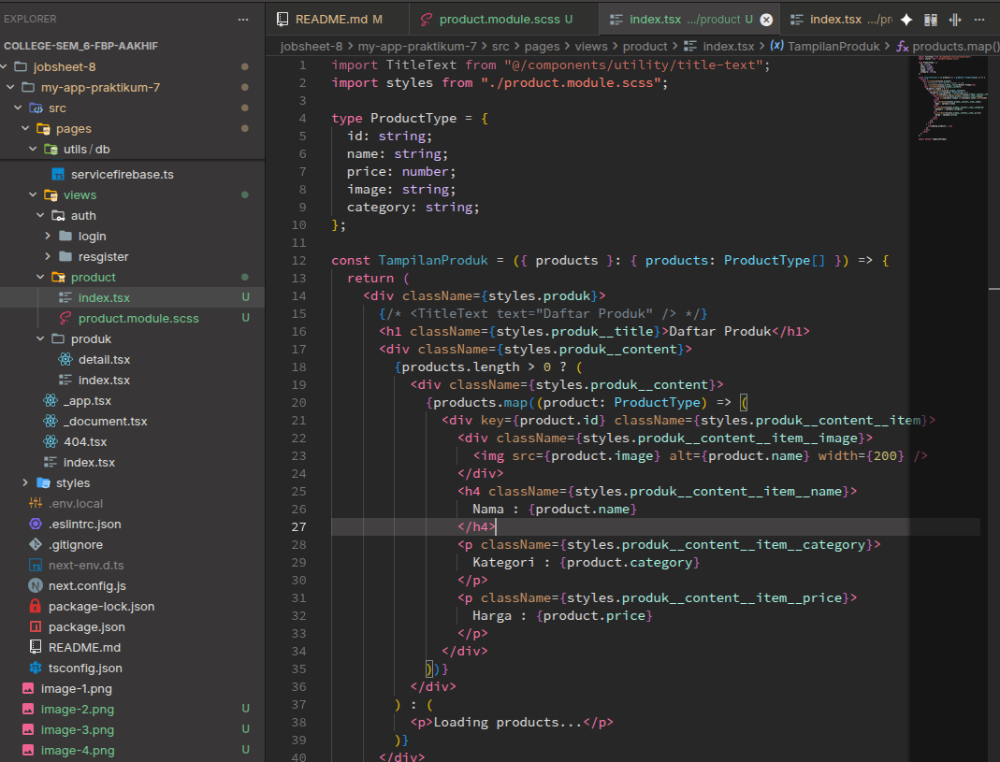

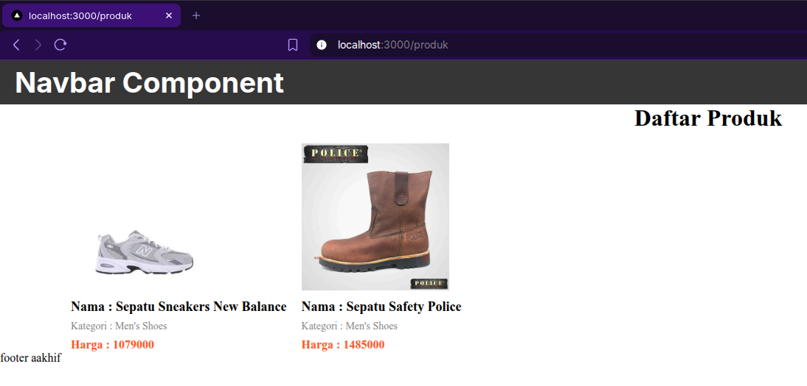

## Bagian 3 – Implementasi Skeleton Loading

Saya mencoba menambahkan kode untuk menampilkan skeleton loading, dengan memodifikasi file `index.tsx` dan `product.module.scss` dari direktori `pages/views/product/` dan hasilnya adalah seperti berikut,

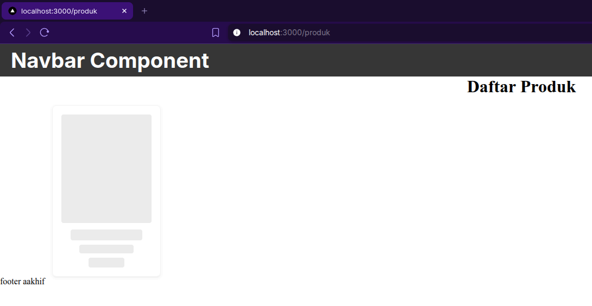

Karena disitu hanya skeletonnya saja yang ditampilkan, jadi sekarang saya memperbaiki lagi kode nya agar skeletonnya ditampilkan pada saat loading saja, dan hasilnya seperti ini,

## Bagian 5 – Implementasi SWR

Saya melakukan install SWR (Stale-While-Revalidate) melewati terminal seperti berikut,

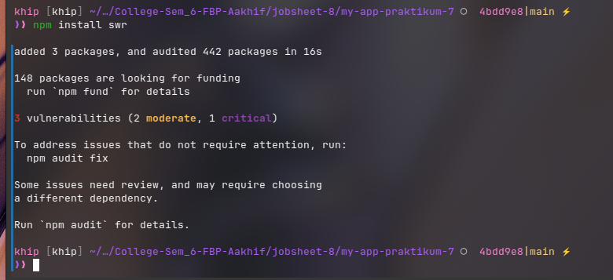

Lalu saya mengimplementasikan SWR di kode index.tsx dari direktori `pages/product/` saya seperti berikut,

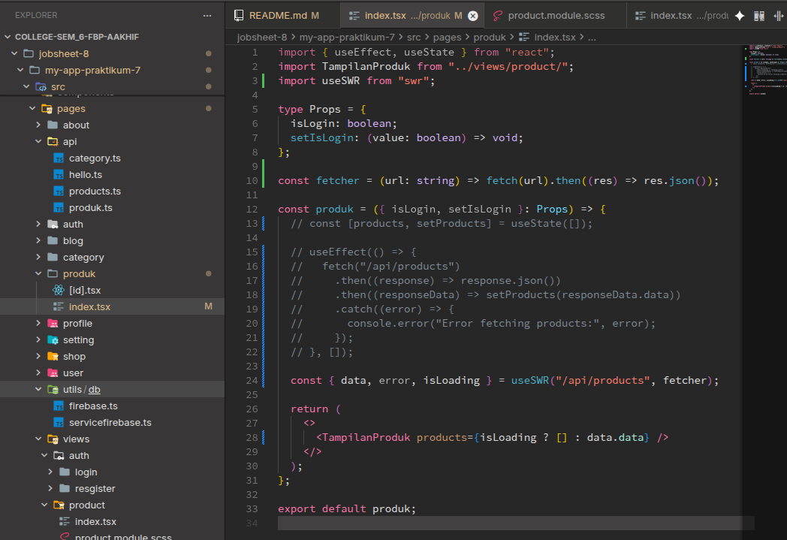

Lalu saya mencoba merapihkan pemanggilan swr dengan meletakkan fungsi `fetcher` di folder `pages/utils/swr/` seperti berikut,

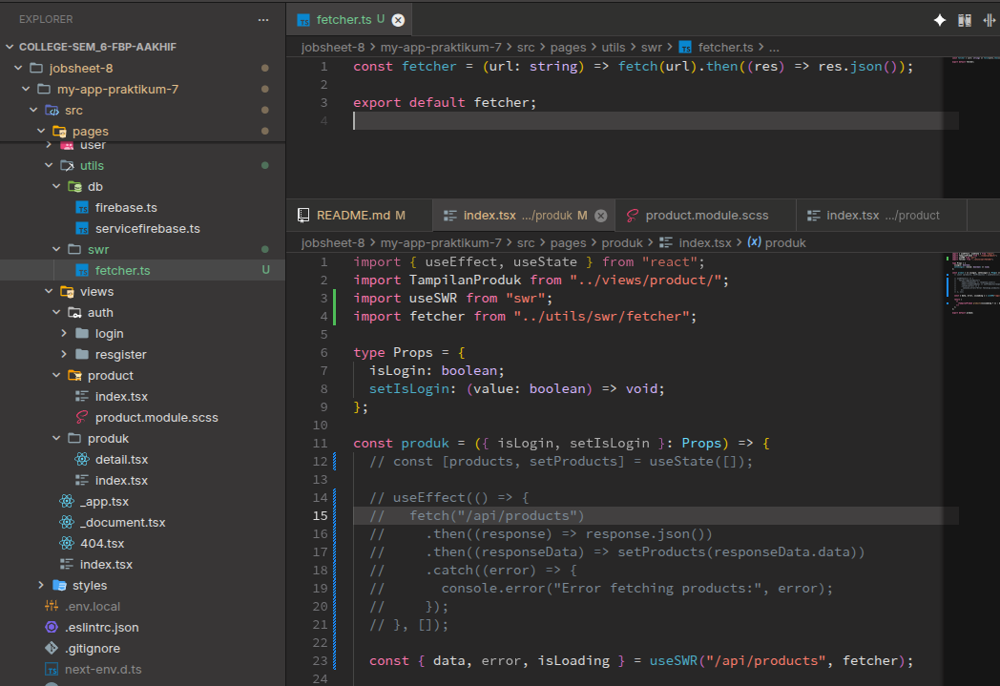

Jadi perbandingan antara useEffect manual dengan SWR adalah,

Menurut saya, selain karena dari struktur kode, handling error, state isLoading, dan response `data` nya lebih rapi menggunakan SWR (Stale While Revalidate), walaupun sedikit tidak terlihat, tapi library SWR mempunyai kemampuan untuk melakukan caching pada saat melakukan request data, tidak seperti useEffect yang dimana setiap kali `fetch()` dipanggil akan melakukan fetch data dari endpoint tersebut dari nol.
