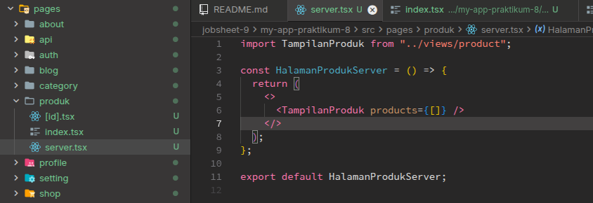
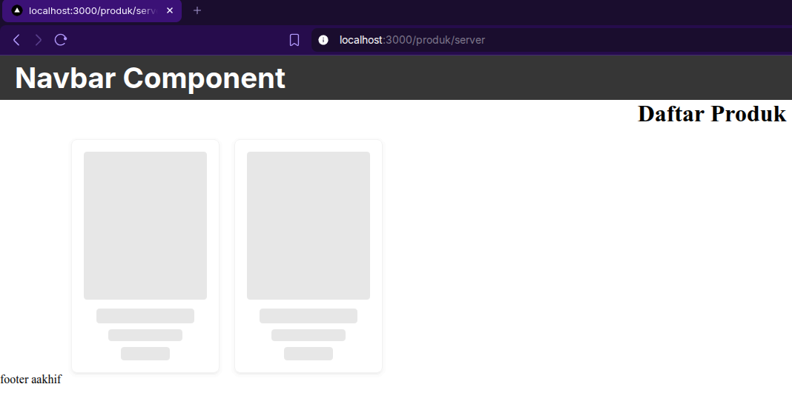
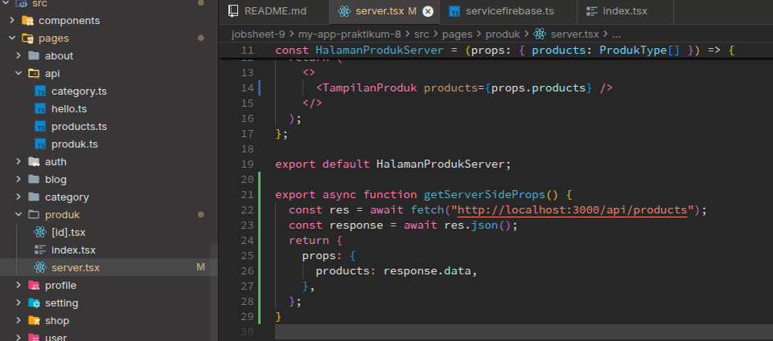
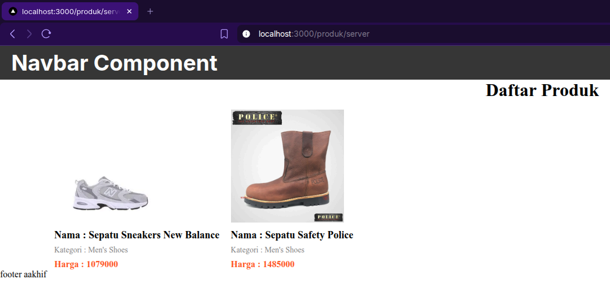
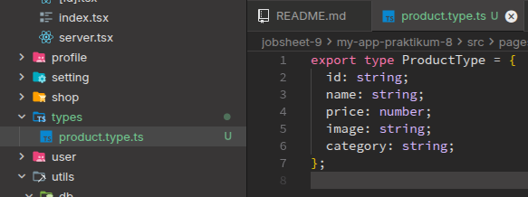
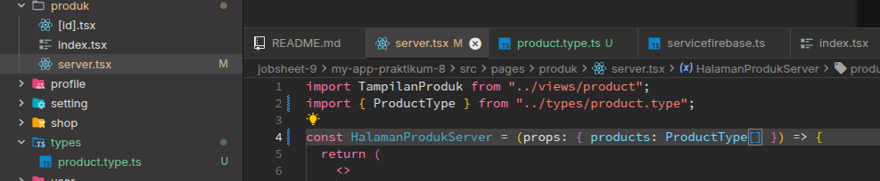
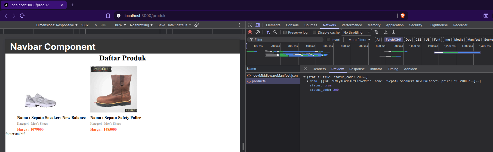
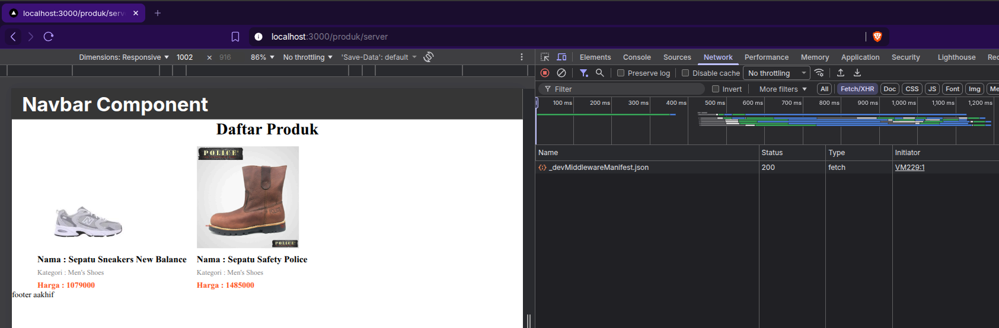

# C. Langkah Praktikum

## Bagian 1 – Setup Halaman SSR

Pada praktikum kali ini, saya igin mencoba membuat halaman dengan teknik rendering SSR, yang saya lakukan sekarang adalah membuat file baru i direktori `pages/produk/` dengan nama `server.tsx` seperti berikut,

Dan tampilan halaman web nya sebagai berikut,

Terlihat jika karena saya memberikan data array kosong, sehingga hasilnya akan skeleton loading terus menerus.

## Bagian 2 – Implementasi getServerSideProps pada server.tsx

Saya mencoba mengimplementasikan retrieve data menggunakan rendering server seperti berikut,

Sehingga tampilannya pada saat halaman direfresh seperti ini,

\_

Pada saat saya akses, tidak ada tampilan skeleton yang ditampilkan, karena pada saat halaman selesai di muat, data sudah siap untuk ditampilkan.

## Bagian 3 – Refactor Type ( produk type )

Saya mencoba untuk membuat folder `types` pada folder pages untuk meletakkan type dari product yang akan dipanggil berulang-ulang (seperti `models` di laravel), seperti berikut,

Setelah itu saya melakukan modifikasi pada file `server.tsx` yang tadi kita buat untuk menggunakan types product yang telah kita buat barusan seperti berikut,

## Bagian 4 – Uji Perbedaan SSR vs CSR

Sekarang saya igin melakukan uji pada halaman yang menggunakan SSR dan CSR,

### Uji 1 - Skeleton

Saya membuka halaman CSR dan melakukan refresh dan hasilnya seperti ini,

Lalu saya membuka halaman SSR dan melakukan refresh, dan hasilnya seperti ini,

### Uji 2 – Network Tab

Saya mencoba membandingkan SSR dan CSR menggunakan network tab dari inspect element, pertama-tama saya coba untuk melihat di mode **CSR** terlebih dahulu, dan hasilnya adalah seperti berikut,

Terlihat jika ada request yang dilakukan dari sisi client untuk halaman produk. Sekarang saya ingin mencoba menggunakan halaman **SSR**, dan hasilnya adalah sebagai berikut,

Terlihat jika tidak ada request yang dilakukan untuk menampilkan item product dari penggunaan halaman SSR.

# D. Tugas Praktikum

## Tugas Individu

### 1. Buat 2 halaman:

- /products (CSR)
- /products/server (SSR)

#### **Jawab**

Saya sudah melakukan pembuatan 2 halaman produk yang dimana masing-masing menggunakan implementasi CSR, dan SSR untuk melakukan pengambilan data.

### 2. Dokumentasikan:

- Screenshot CSR
- Screenshot SSR
- Perbedaan Network tab
- Perbedaan View Source

#### **Jawab**

Saya sudah melihat tampilan network (jejak get response) dari masing-masing halmaan dan berikut gambarnya,

